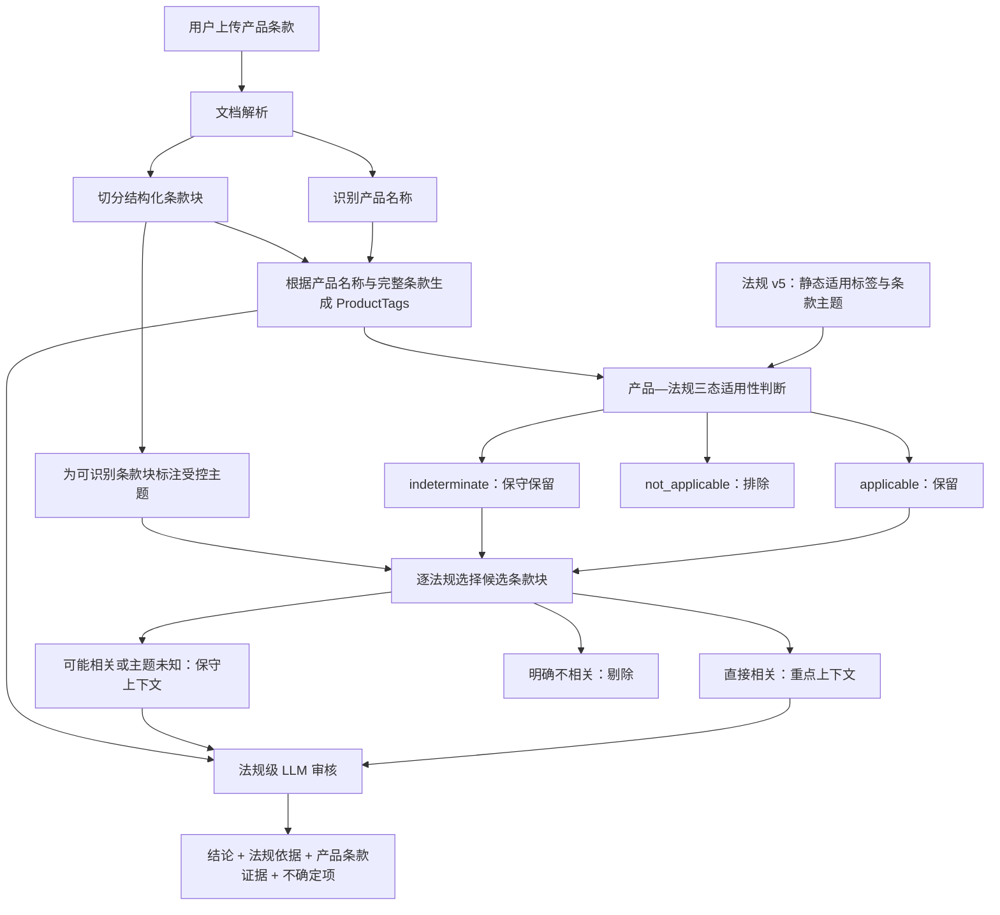

# 产品条款合规审核主逻辑

**状态**：架构基准稿，待用户确认
**适用范围**：保险产品条款审核
**关联设计**：

- `../035-compliance-tag-taxonomy/spec.md`
- `design.md`
- 项目根目录 `规则引擎重构验收表.md`

## 1. 文档目的

本文固定产品条款合规审核的主流程、数据含义和安全边界。后续增加规则、修改检索或调整 LLM 提示词时，都应先判断是否符合本文。

审核系统的核心任务是：

> 对用户上传的一个产品条款，找出所有可能适用的法规；针对每条法规，保留所有直接相关或可能相关的产品条款块；再由 LLM 结合产品事实、法规原文和条款证据作出合规判断。

系统的优化目标是在不漏检的前提下减少无关法规和无关条款内容，而不是追求最大程度过滤。

## 2. 固定概念

### 2.1 标签体系固定，标签值随对象而定

“标签固定”指：

- 标签字段、取值代码和业务含义固定；
- 产品和法规使用同一套受控代码；
- 条款主题层级和主题含义固定。

“标签值随对象而定”指：

- 不同产品具有不同产品标签值；
- 不同条款块可能具有不同条款主题；
- 每条法规的适用标签和条款主题在知识库构建时确定，审核时不临时改写。

### 2.2 产品标签

产品标签描述一个具体产品的事实，例如：

- 产品大类；
- 主要险种类型；
- 设计类型；
- 长期或短期；
- 个人或团体；
- 主险或附加险；
- 互联网专属；
- 费率可调；
- 税优健康险；
- 续保类型；
- 其他已经批准纳入标签体系的特殊属性。

每个自动识别值必须保留证据。无法确认时使用 `unknown` 或 `None`，不得猜测。

### 2.3 条款块主题

条款块主题回答“这段产品条款在讨论什么”，例如：

- 等待期；
- 保险责任；
- 续保；
- 责任免除；
- 费率调整；
- 诉讼时效。

可识别的条款块使用受控主题代码；无法可靠识别时不强行打具体主题标签。

未标主题不等于不相关。

### 2.4 法规适用标签

法规适用标签回答“这条法规限制哪些产品”。法规标签在 Excel 转换和知识库构建阶段确定，审核时直接读取。

法规同一维度可以允许多个值，不同维度共同构成适用条件：

- 同一维度多个值是 OR；
- 不同维度之间是 AND；
- 维度为空表示该维度没有限制；
- `涉及标签`只表示内容相关，不构成排除条件；
- `适用标签`及其“限定”语义才参与适用性判断。

**当前数据状态（v5）**：

- 125个法规条目带有 `适用标签语义=限定`；
- 0个法规条目带有 `涉及标签`。

因此，“涉及标签不参与排除”是转换器和匹配器已经支持的目标能力，但当前 v5 没有实际样本。它不能作为当前审核效果的既成事实。每个知识库版本投入审核前都必须统计两类标签数量；只有经过人工验收的 `适用标签` 才允许参与 `not_applicable` 排除。

### 2.5 法规条款主题

法规条款主题回答“应用这条法规时，产品条款的哪些部分最相关”。该主题与产品条款块使用同一套受控代码，并在法规知识库构建时固定。

法规条款主题不是产品适用条件，不能用它决定法规是否适用于产品。

## 3. 总体审核链路



## 4. 阶段一：文档解析

### 4.1 输入

- 一个用户上传的产品条款文件；
- 用户明确填写的产品名称（如有）。

### 4.2 输出

- 最终采用的产品名称；
- 产品名称证据和识别来源；
- 条款块列表；
- 每个条款块的标题、编号、正文和结构类型；
- 每个条款块的零个或多个主题标签；
- 无法识别的条款块仍完整保留。

### 4.3 名称优先级

1. 用户明确填写的正式产品名称；
2. 文档正文识别出的正式产品名称；
3. 文件名；
4. 无法确认时为空，不猜测。

### 4.4 条款块识别原则

- 标题和结构信号优先；
- 确定性别名其次；
- 需要语义推断但置信度不足时不打具体标签；
- 原始条款内容始终保留，主题识别失败不能造成内容丢失。

## 5. 阶段二：产品标签生成

产品标签从已批准的事实来源生成：

| 标签 | 主要事实来源 |
|---|---|
| 产品大类、主要险种类型 | 正式产品名称 |
| 个人/团体 | 正式产品名称 |
| 主险/附加险 | 正式产品名称 |
| 互联网专属 | 正式产品名称 |
| 费率可调 | 正式产品名称 |
| 通用长期/短期及具体期限形态 | 条款约定的保险期间；产品名称仅作缺失回退和一致性校验 |
| 健康险监管期限分类 | 条款约定的保险期间 + 是否含保证续保条款 |
| 税优健康险 | 条款中的明确税收优惠表述 |
| 续保类型 | 续保相关条款 |

产品名称确定主要分类，条款责任用于一致性检查，不静默改写主要分类。

期限相关事实按以下优先级处理：

1. 先从产品条款提取明确的保险期间，用于通用长期/短期和具体期限形态；
2. 对健康险单独计算监管期限分类：保险期间超过一年，或保险期间虽不超过一年但含保证续保条款，归为长期健康保险；保险期间不超过一年且不含保证续保条款，归为短期健康保险；
3. 保证续保期间是续保安排的事实证据，不替代产品本身保险期间；它与“是否保证续保”共同保留在证据中；
4. 产品名称中的“长期”“短期”始终用于一致性校验，但仅在条款期限事实缺失时作为期限标签的回退证据；
5. 名称与条款明确冲突时，以条款约定计算期限标签，同时输出名称—条款冲突警告，进入人工复核，不静默覆盖任一证据。

标签输出必须包含：

- 受控代码；
- 中文显示值；
- 原文证据；
- 证据来源；
- 置信度；
- 一致性警告。

## 6. 阶段三：产品标签过滤法规

### 6.1 三态判断

对每条法规逐维度比较：

| 情况 | 状态 | 行为 |
|---|---|---|
| 所有限定维度都匹配 | `applicable` | 保留并优先 |
| 至少一个限定维度明确冲突 | `not_applicable` | 排除 |
| 没有明确冲突，但产品事实未知 | `indeterminate` | 保守保留 |

### 6.2 安全原则

只排除确定不适用的法规。

- 错误保留法规只增加上下文和计算成本；
- 错误排除法规可能造成漏检；
- 因此 unknown 不能等同于 false；
- 安全回退不得恢复已经明确 `not_applicable` 的法规。

### 6.3 可追溯输出

每条候选法规应记录：

- 法规 `chunk_id`；
- 适用性状态；
- 匹配维度；
- 信息不足维度；
- 明确冲突维度；
- 使用的产品标签证据；
- 被保留或排除的原因。

## 7. 阶段四：逐法规选择产品条款块

法规通过产品适用性过滤后，系统针对每条法规单独选择产品条款块。

### 7.1 条款块分层

| 层级 | 定义 | 行为 |
|---|---|---|
| 直接相关 | 产品条款主题与法规主题精确匹配 | 必须提交给 LLM，排在前面 |
| 主题族相关 | 命中受控的同族 general 主题或显式关联主题 | 提交给 LLM |
| 结构关联 | 虽主题不同，但业务上是该法规判断的必要上下文 | 提交给 LLM |
| 主题未知 | 条款块未打标签，无法证明无关 | 保守保留，但排序靠后 |
| 明确不相关 | 受控主题与法规审核目标明确无关 | 可以剔除 |

### 7.2 不能只检查同标签条款块

同一法规可能需要多个条款块共同判断。例如短期健康险续保规则可能需要：

- 续保条款；
- 保险期间条款；
- 产品定义或特别约定；
- 未识别但包含重新投保安排的条款块。

因此主题匹配用于排序和安全缩小上下文，不是只保留完全相同标签。

### 7.3 明确不相关的定义

“明确不相关”必须来自受控关系，而不是简单的字符串不同。例如：

- `renewal.*` 法规与 `policy.beneficiary` 条款通常明确不相关；
- `renewal.*` 法规与 `coverage.period` 不能直接判为不相关；
- 未识别主题的条款不能判为不相关。

### 7.4 上下文预算

在上下文受限时按以下顺序装入：

1. 直接相关条款块；
2. 业务必要的结构关联条款块；
3. 同族相关条款块；
4. 主题未知条款块；
5. 其他可能相关条款块。

不得为了满足固定长度，删除法规判断必需的条款块。

## 8. 阶段五：确定性事实提取

确定性程序用于从候选条款块中提取可验证事实，例如：

- 等待期天数；
- 犹豫期天数；
- 是否存在续保或重新投保安排；
- 是否明确写“不保证续保”；
- 是否存在“自动续保”等禁止表述；
- 产品是否为费率可调；
- 首次费率调整年限；
- 后续费率调整间隔。

事实提取的输出是 LLM 审核证据，不应另建一套与法规过滤平行的审核系统。

提取失败表示“事实未知”，不能直接表示合规或违规。

第一版中，确定性程序只输出事实和证据，不直接输出 `compliant` 或 `non_compliant`。即使“等待期为270天”与“不得超过180天”可以机械比较，比较结果也作为法规级审核包中的强证据，由同一主链的 LLM 形成最终审核结论。

未来如果要允许确定性程序直接形成结论，必须另行形成业务验收方案，明确适用性、触发条件、单位、法规例外和证据门槛；不得在本次重构中隐式加入。

## 9. 阶段六：法规级 LLM 审核

### 9.1 一次审核的最小单元

一次 LLM 判断对应一个法规条款单元，而不是一个物理 chunk。法规条款单元使用以下稳定身份：

```text
kb_version + source_file + article_number/section_path
```

属于同一法规条款单元的多个 chunk 先按原文顺序合并到一个审核包，再执行一次 LLM 判断。物理 chunk ID 继续保留，用于证据定位，但不决定调用次数。

`article_number` 来自法规 chunk metadata。缺少 `article_number` 时使用 `section_path`，该字段来自 Excel 转换或文档解析生成的层级路径；两者都缺失时不得构造可审核单元，必须记录数据错误并标记 `incomplete`。

逻辑审核单元与传输层 HTTP 请求不是同一概念。每个法规条款单元始终是一个独立判断任务。为满足性能目标，一次 HTTP 请求可以携带3—5个主题和候选产品条款完全相同的独立任务；prompt 必须逐单元隔离，响应必须逐单元独立输出状态、理由和证据，模型不得跨单元引用证据或形成合并结论。

只有单个法规条款单元合并后仍超过上下文预算时，才允许分段调用。此时归并顺序固定为：

```text
non_compliant
> manual_review
> insufficient_information
> compliant
```

任一分段为 `non_compliant` 时，该法规条款单元不得归并为合规；所有分段都具有充分合规证据时才允许归并为 `compliant`。

### 9.2 输入包

每次调用包含：

- 产品名称；
- 产品标签及证据；
- 当前法规原文；
- 法规适用标签和适用性判断；
- 法规条款主题；
- 直接相关条款块；
- 可能相关或主题未知条款块；
- 确定性事实；
- 明确的输出格式和判断边界。

### 9.3 输出状态

- `compliant`：有充分条款证据证明符合；
- `non_compliant`：有充分法规与条款证据证明不符合；
- `insufficient_information`：候选内容不足以判断；
- `manual_review`：存在复杂例外、冲突或高风险语义，需要人工确认；

LLM 不得直接输出生效的 `not_applicable`。如果模型发现前置适用性判断可能使用了错误或遗漏的产品事实，应输出 `manual_review`，并在独立字段中记录“适用性争议”和新证据。该争议进入复核队列，不回写本次法规过滤结果。

### 9.4 输出证据

每个结论必须包含：

- 法规名称和 chunk；
- 法规要求摘要；
- 产品标签事实；
- 产品条款编号和原文片段；
- 判断理由；
- 置信度；
- 是否需要人工复核。

没有法规证据或产品条款证据时，不得输出确定性违规。

## 10. “规则”的重新定义

审核架构中的规则分为四类：

1. **适用性规则**：产品标签与法规标签三态匹配；
2. **条款路由规则**：决定哪些条款块直接相关、可能相关或明确不相关；
3. **事实提取规则**：提取天数、比例、固定表述和产品事实；
4. **LLM 判断规范**：约束模型如何使用法规和条款证据作出结论。

原 `rule_engine.py` 是旧实现，不是监管需求来源。新主链不得迁移其中固化的法规语义；只可将其用于影子对照和发现历史差异。事实提取器必须从法规原文对应的审核需求出发独立设计。旧代码中的纯解析算法如需复用，也必须重新验证其输入、输出和证据边界。

第一版的事实提取层和条款路由层都不形成最终合规结论，因此不存在第二条平行审核流程。

## 11. 降级与失败处理

| 故障 | 降级行为 |
|---|---|
| 产品名称识别失败 | 产品标签保持 unknown，保守保留相关法规 |
| 条款主题识别失败 | 条款块保留为主题未知 |
| 语义检索失败 | 使用注册法规候选，并标记 degraded |
| 向量或 BM25 不可用 | 不得静默解释为“没有适用法规” |
| 确定性事实提取失败 | 事实标记 unknown，交由 LLM |
| LLM 调用失败 | 返回审核未完成，不得输出“合规” |
| 小批量 HTTP 请求整体失败 | 批次内各独立单元分别标记 `manual_review` 和 `incomplete`；由 `lib/llm/` 既有错误处理决定是否重试，重试不得改变 task ID 和证据归属 |
| 上下文超过预算 | 按分层顺序压缩，并明确记录未提交的条款块 |

多个关键组件同时降级时，整份审核状态为 `incomplete`：

- RAG 引擎失败且产品名称也无法识别；
- LLM 失败且确定性事实也无法提取；
- 法规正文、产品条款证据或知识库版本任一无法追溯。

`incomplete` 状态下不得输出整份产品“合规”，已经完成且证据充分的法规条款单元可以作为局部结果展示，但必须与未完成范围同时展示。

## 12. 可观测性

每次审核至少记录：

- 解析出的产品名称；
- 产品标签、证据和警告；
- 条款块及主题；
- 法规候选总数；
- 因产品标签明确排除的法规；
- `applicable` 与 `indeterminate` 法规；
- 每条法规选入和排除的产品条款块；
- 条款路由原因；
- 确定性事实；
- LLM 输入所用法规和条款证据；
- 最终结论及降级状态。

每份报告还必须固定记录：

- `kb_version`；
- 条款主题体系版本；
- 条款主题关系配置版本；
- 组合后的法规条款单元 ID；
- 构成该单元的物理 chunk ID。

知识库版本变化时，不复用旧版本的 `not_applicable` 判断。历史报告保持原版本证据不变；需要应用新法规版本时必须创建一次新的审核运行。

## 13. 非目标

当前不处理：

- 产品说明书、精算报告等其他材料的统一审核；
- 仅凭模型猜测产品标签；
- 用条款主题反向决定产品分类；
- 用主题不一致作为唯一理由排除条款块；
- 用 LLM 临时改写法规静态标签；
- 在没有证据的情况下自动补齐法规要求；
- 将法规缺失或系统失败解释为产品合规。

## 14. 架构验收原则

后续实现必须满足：

1. 同一套 `ProductTags` 同时服务法规过滤和审核上下文；
2. 只有产品标签与法规标签明确冲突才排除法规；
3. 未识别条款块不会因为无主题而被丢弃；
4. 只有明确不相关的条款块可以剔除；
5. 法规级 LLM 审核能够获得直接相关和可能相关上下文；
6. 确定性规则不再形成独立、重复的审核链路；
7. 所有结论可以回溯到法规 chunk、产品标签证据和产品条款证据；
8. 任一关键组件失败时，用户能看到降级或未完成状态。
9. LLM不能直接推翻前置适用性判断，只能提出适用性争议供复核。
10. 第一版确定性程序只提供事实证据，最终法规结论来自同一条LLM审核主链。
