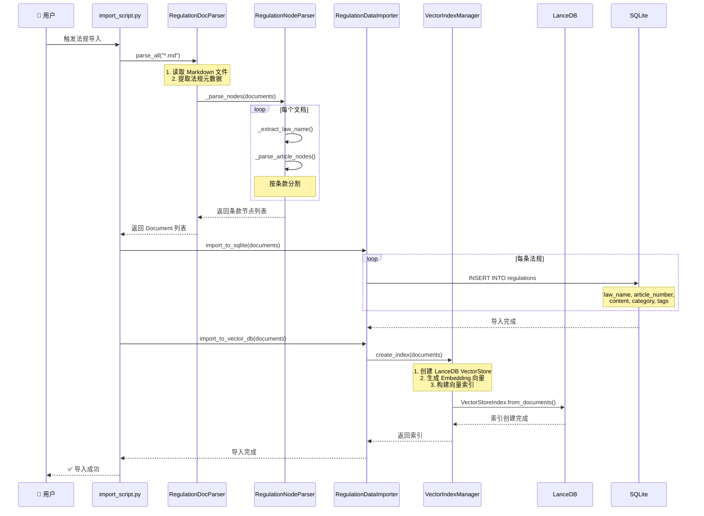
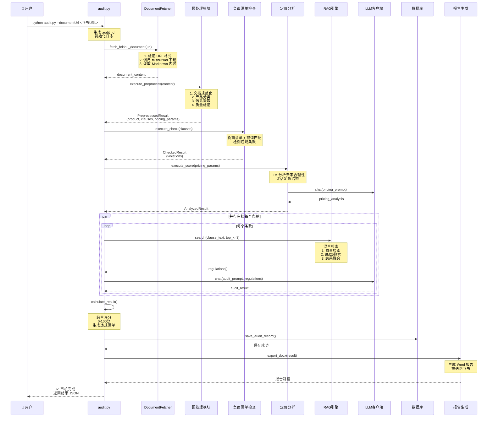
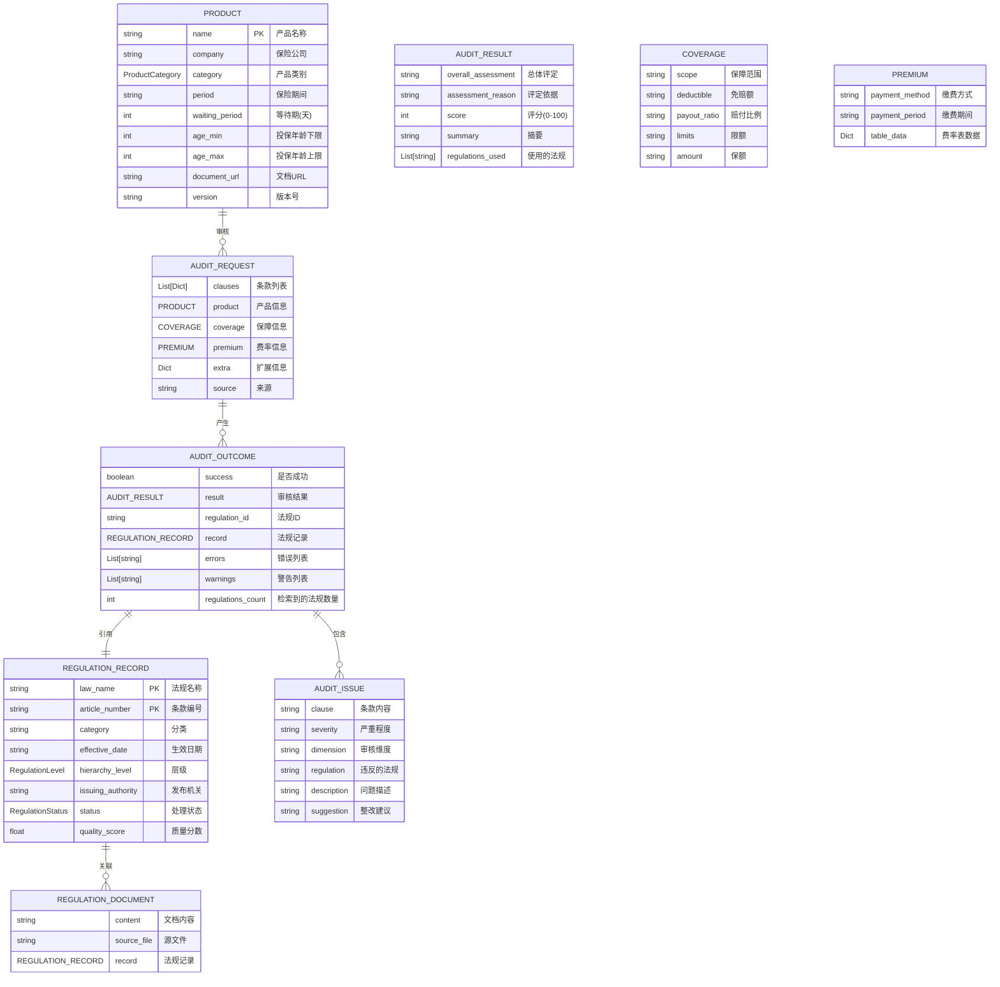
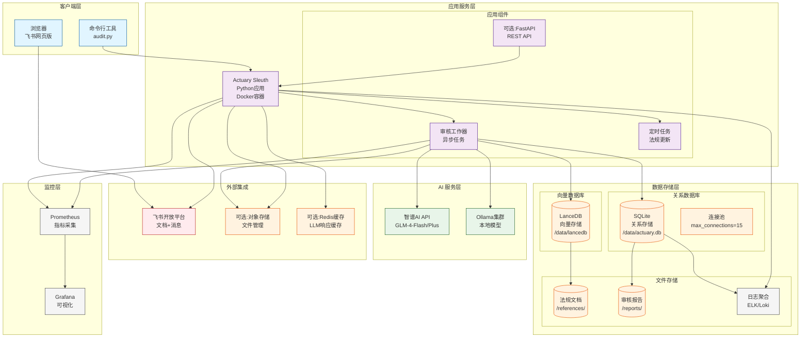

# Actuary Sleuth - 系统架构图

## 完整系统架构图

```mermaid
graph TB
    subgraph "用户交互层"
        User[👤 用户/审核员]
        CLI[命令行工具<br/>audit.py]
    end

    subgraph "接入层 - 飞书集成"
        FeishuAPI[飞书文档 API]
        FeishuPush[飞书消息推送]
    end

    subgraph "应用层 - 流程编排"
        Orchestrator[审核流程编排器<br/>audit.py:execute()]

        subgraph "预处理管道"
            Fetcher[文档获取器<br/>document_fetcher.py]
            Normalizer[文档规范化<br/>normalizer.py]
            Classifier[产品分类器<br/>classifier.py]
            Extractor[信息提取器<br/>fast/dynamic_extractor.py]
            Validator[质量验证器<br/>validator.py]
        end

        subgraph "审核管道"
            CheckModule[负面清单检查<br/>check.py]
            ScoreModule[定价分析<br/>scoring.py]
            Auditor[合规审核器<br/>auditor.py]
        end

        subgraph "报告生成"
            Reporter[报告生成器<br/>reporting/]
            DocxExporter[Word 导出<br/>docx_exporter.py]
        end
    end

    subgraph "核心服务层"
        subgraph "RAG 引擎"
            RAGEngine[RAG 查询引擎<br/>rag_engine.py]
            IndexMgr[向量索引管理器<br/>index_manager.py]
            DocParser[法规文档解析器<br/>doc_parser.py]
            DataImporter[法规数据导入器<br/>data_importer.py]
        end

        subgraph "混合检索系统"
            VectorRetriever[向量检索器<br/>语义相似度]
            KeywordRetriever[关键词检索器<br/>BM25算法]
            Fusion[结果融合器<br/>fusion.py]
            Tokenizer[中文分词器<br/>tokenizer.py]
        end

        subgraph "LLM 抽象层"
            LLMFactory[LLM 客户端工厂<br/>factory.py]
            ZhipuClient[智谱 AI 客户端<br/>zhipu.py]
            OllamaClient[Ollama 客户端<br/>ollama.py]
            Cache[LLM 响应缓存<br/>cache.py]
            Metrics[性能监控<br/>metrics.py]
        end
    end

    subgraph "数据存储层"
        subgraph "向量数据库"
            LanceDB[LanceDB<br/>向量数据库]
            VectorTable[(regulations_vectors<br/>向量表)]
        end

        subgraph "关系数据库"
            SQLite[SQLite<br/>关系数据库]
            ConnPool[连接池<br/>connection_pool.py]
            RegTable[(regulations<br/>法规表)]
            AuditTable[(audit_history<br/>审核历史)]
            NegativeTable[(negative_list<br/>负面清单)]
        end

        subgraph "文件存储"
            Markdown[法规文档<br/>Markdown格式]
            Reports[审核报告<br/>Word格式]
        end
    end

    subgraph "外部服务"
        ZhipuAPI[智谱 AI API<br/>GLM-4-Flash/Plus]
        OllamaSVC[Ollama 服务<br/>本地模型]
    end

    %% 连接关系
    User --> CLI
    CLI --> Orchestrator
    FeishuAPI --> Fetcher
    DocxExporter --> FeishuPush

    %% 预处理流程
    Orchestrator --> Fetcher
    Fetcher --> Normalizer
    Normalizer --> Classifier
    Classifier --> Extractor
    Extractor --> Validator
    Validator --> CheckModule

    %% 审核流程
    CheckModule --> ScoreModule
    ScoreModule --> Auditor
    Auditor --> Reporter
    Reporter --> DocxExporter

    %% RAG 引擎连接
    Auditor --> RAGEngine
    RAGEngine --> VectorRetriever
    RAGEngine --> KeywordRetriever
    VectorRetriever --> Fusion
    KeywordRetriever --> Fusion
    Fusion --> Tokenizer

    %% 数据导入
    DataImporter --> DocParser
    DocParser --> IndexMgr
    IndexMgr --> LanceDB
    DataImporter --> SQLite

    %% LLM 连接
    RAGEngine --> LLMFactory
    Auditor --> LLMFactory
    Extractor --> LLMFactory
    LLMFactory --> ZhipuClient
    LLMFactory --> OllamaClient
    ZhipuClient --> Cache
    ZhipuClient --> Metrics

    %% 外部 API 连接
    ZhipuClient --> ZhipuAPI
    OllamaClient --> OllamaSVC

    %% 数据库连接
    VectorRetriever --> LanceDB
    IndexMgr --> LanceDB
    LanceDB --> VectorTable

    Auditor --> SQLite
    CheckModule --> SQLite
    SQLite --> ConnPool
    ConnPool --> RegTable
    ConnPool --> AuditTable
    ConnPool --> NegativeTable

    %% 样式
    classDef userLayer fill:#e1f5ff,stroke:#01579b,stroke-width:2px
    classDef appLayer fill:#f3e5f5,stroke:#4a148c,stroke-width:2px
    classDef serviceLayer fill:#e8f5e9,stroke:#1b5e20,stroke-width:2px
    classDef dataLayer fill:#fff3e0,stroke:#e65100,stroke-width:2px
    classDef externalLayer fill:#ffebee,stroke:#b71c1c,stroke-width:2px

    class User,CLI userLayer
    class Orchestrator,Fetcher,Normalizer,Classifier,Extractor,Validator,CheckModule,ScoreModule,Auditor,Reporter,DocxExporter appLayer
    class RAGEngine,IndexMgr,DocParser,DataImporter,VectorRetriever,KeywordRetriever,Fusion,Tokenizer,LLMFactory,ZhipuClient,OllamaClient,Cache,Metrics serviceLayer
    class LanceDB,VectorTable,SQLite,ConnPool,RegTable,AuditTable,NegativeTable,Markdown,Reports dataLayer
    class ZhipuAPI,OllamaSVC,FeishuAPI,FeishuPush externalLayer
```

---

## 法规导入流程图



---

## 产品审核完整流程图



---

## 混合检索架构图

```mermaid
graph LR
    subgraph "输入"
        Query[用户查询<br/>query_text]
    end

    subgraph "向量化处理"
        Embed[Embedding模型<br/>embedding-3]
        Vector[查询向量<br/>768维]
    end

    subgraph "向量检索路径"
        VectorIndex[LanceDB<br/>向量索引]
        VectorSearch[向量相似度搜索<br/>Top-K=5]
        VectorResults[向量检索结果<br/>semantic_scores]
    end

    subgraph "关键词检索路径"
        Tokenize[中文分词器<br/>tokenizer.py]
        QueryTokens[查询tokens]
        DocStore[文档存储<br/>docstore]
        BM25[BM25算法<br/>k1=1.5, b=0.75]
        KeywordResults[关键词检索结果<br/>bm25_scores]
    end

    subgraph "结果融合"
        Normalize[分数归一化<br/>0-1区间]
        WeightFuse[加权融合<br/>α=0.7]
        Dedup[结果去重]
        Rank[重新排序]
    end

    subgraph "输出"
        FinalResults[最终结果<br/>Top-K=5]
        Sources[法规来源<br/>law_name + article_number]
    end

    Query --> Embed
    Embed --> Vector

    Query --> Tokenize
    Tokenize --> QueryTokens

    Vector --> VectorSearch
    VectorSearch --> VectorIndex
    VectorIndex --> VectorResults

    QueryTokens --> BM25
    BM25 --> DocStore
    DocStore --> KeywordResults

    VectorResults --> Normalize
    KeywordResults --> Normalize

    Normalize --> WeightFuse
    WeightFuse --> Dedup
    Dedup --> Rank
    Rank --> FinalResults

    FinalResults --> Sources

    style Query fill:#e1f5ff
    style Vector fill:#fff3e0
    style VectorResults fill:#c8e6c9
    style KeywordResults fill:#c8e6c9
    style FinalResults fill:#ffd54f
    style Sources fill:#ff8a65
```



---

## LLM 客户端架构图

```mermaid
graph TB
    subgraph "应用层调用"
        Audit[审核模块<br/>auditor.py]
        RAG[RAG引擎<br/>rag_engine.py]
        Preprocess[预处理<br/>preprocessing/]
    end

    subgraph "LLM 工厂层"
        Factory[LLMClientFactory<br/>factory.py]

        subgraph "场景配置"
            S1[法规导入<br/>glm-4-flash<br/>timeout=60s]
            S2[文档预处理<br/>配置文件模型<br/>timeout=120s]
            S3[审核场景<br/>glm-4-plus<br/>timeout=120s]
            S4[问答场景<br/>glm-4-flash<br/>timeout=60s]
        end
    end

    subgraph "LLM 抽象层"
        Base[BaseLLMClient<br/>base.py]

        subgraph "核心方法"
            M1[generate<br/>单轮生成]
            M2[chat<br/>多轮对话]
            M3[health_check<br/>健康检查]
            M4[chat_with_cache<br/>缓存聊天]
        end

        subgraph "装饰器"
            D1[@_track_timing<br/>性能监控]
            D2[@_circuit_breaker<br/>熔断器]
            D3[@_retry_with_backoff<br/>重试机制]
        end
    end

    subgraph "LLM 提供商实现"
        Zhipu[ZhipuClient<br/>zhipu.py]
        Ollama[OllamaClient<br/>ollama.py]
    end

    subgraph "缓存层"
        Cache[LLMCache<br/>cache.py]
        Redis[(可选:Redis缓存)]
    end

    subgraph "外部服务"
        ZhipuAPI[智谱AI API<br/>open.bigmodel.cn]
        OllamaSVC[Ollama服务<br/>localhost:11434]
    end

    %% 连接关系
    Audit --> Factory
    RAG --> Factory
    Preprocess --> Factory

    Factory --> S1
    Factory --> S2
    Factory --> S3
    Factory --> S4

    S1 --> Base
    S2 --> Base
    S3 --> Base
    S4 --> Base

    Base --> M1
    Base --> M2
    Base --> M3
    Base --> M4

    M1 --> D1
    M2 --> D1
    M1 --> D2
    M2 --> D2
    M1 --> D3
    M2 --> D3

    Base --> Zhipu
    Base --> Ollama

    M4 --> Cache
    Cache --> Redis

    D1 --> ZhipuAPI
    D1 --> OllamaSVC
    Zhipu --> ZhipuAPI
    Ollama --> OllamaSVC

    %% 样式
    classDef appLayer fill:#e1f5ff,stroke:#01579b
    classDef factoryLayer fill:#f3e5f5,stroke:#4a148c
    classDef abstractLayer fill:#e8f5e9,stroke:#1b5e20
    classDef implLayer fill:#fff3e0,stroke:#e65100
    classDef cacheLayer fill:#ffebee,stroke:#b71c1c
    classDef externalLayer fill:#f5f5f5,stroke:#424242

    class Audit,RAG,Preprocess appLayer
    class Factory,S1,S2,S3,S4 factoryLayer
    class Base,M1,M2,M3,M4,D1,D2,D3 abstractLayer
    class Zhipu,Ollama implLayer
    class Cache,Redis cacheLayer
    class ZhipuAPI,OllamaSVC externalLayer
```

---

## 数据模型关系图



---

## 部署架构图



---

## 性能优化架构图

```mermaid
graph LR
    subgraph "优化前"
        OldRequest[请求1] --> OldDB[(数据库)]
        OldRequest2[请求2] --> OldDB
        OldRequest3[请求3] --> OldDB
        OldRequest4[请求4] --> OldDB

        note1["⚠️ 问题:<br/>- 每次创建新连接<br/>- 无缓存机制<br/>- 串行处理"]
    end

    subgraph "优化后"
        subgraph "连接池层"
            Pool[SQLite连接池<br/>pool_size=5<br/>max_overflow=10]
        end

        subgraph "缓存层"
            L1Cache[L1: LLM响应缓存<br/>内存]
            L2Cache[L2: 向量索引缓存<br/>内存]
            L3Cache[L3: 查询结果缓存<br/>可选Redis]
        end

        subgraph "批量处理层"
            BatchExec[批量执行器<br/>executemany()]
            BatchTxn[批量事务<br/>一次提交]
        end

        subgraph "并发层"
            AsyncIO[异步IO<br/>asyncio]
            ThreadPool[线程池<br/>ThreadPoolExecutor]
        end

        subgraph "监控层"
            Metrics[性能监控<br/>@_track_timing]
            CircuitBreaker[熔断器<br/>@_circuit_breaker]
            Retry[重试机制<br/>@_retry_with_backoff]
        end
    end

    NewRequest1[请求1] --> Metrics
    NewRequest2[请求2] --> Metrics
    NewRequest3[请求3] --> Metrics
    NewRequest4[请求4] --> Metrics

    Metrics --> CircuitBreaker
    CircuitBreaker --> L1Cache

    L1Cache -- 缓存未命中 --> ThreadPool
    L1Cache -- 缓存命中 --> Response[响应]

    ThreadPool --> BatchExec
    BatchExec --> BatchTxn
    BatchTxn --> Pool

    Pool --> NewDB[(数据库)]
    NewDB --> Response

    L2Cache -.-> Pool
    L3Cache -.-> L1Cache

    Retry -.-> CircuitBreaker

    note2["✅ 优化效果:<br/>- 连接复用: 5-10倍性能提升<br/>- 缓存命中率: 30%+ API调用减少<br/>- 批量操作: 5-10倍导入性能<br/>- 并发处理: 支持10+并发请求"]

    style OldRequest fill:#ffcdd2
    style OldRequest2 fill:#ffcdd2
    style OldRequest3 fill:#ffcdd2
    style OldRequest4 fill:#ffcdd2
    style note1 fill:#ffebee

    style NewRequest1 fill:#c8e6c9
    style NewRequest2 fill:#c8e6c9
    style NewRequest3 fill:#c8e6c9
    style NewRequest4 fill:#c8e6c9
    style note2 fill:#e8f5e9
    style Response fill:#ffd54f
```

---

## 使用说明

这些架构图支持在以下环境中渲染：

1. **Markdown 编辑器**
   - Typora
   - VS Code (with Mermaid插件)
   - Obsidian
   - GitHub/GitLab (原生支持Mermaid)

2. **在线工具**
   - Mermaid Live Editor: https://mermaid.live
   - Mermaid Chart: https://www.mermaidchart.com

3. **文档平台**
   - GitHub README.md
   - GitLab Wiki
   - Notion (需Mermaid插件)
   - Confluence (需Mermaid插件)

### 导出为图片

```bash
# 使用 mermaid-cli
npm install -g @mermaid-js/mermaid-cli
mmdc -i ARCHITECTURE_DIAGRAM.md -o architecture.png

# 或使用在线工具
# https://mermaid.live/ → 导出 PNG/SVG
```

---

**文档创建日期**: 2026-03-24
**适用场景**: 技术文档、架构评审、求职展示
