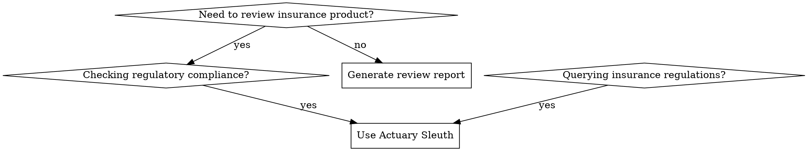

# Actuary Sleuth Skill

## Overview

Actuary Sleuth is an insurance product compliance audit system that helps actuaries review insurance clauses, check against negative lists, analyze pricing reasonableness, and query regulations efficiently.

面向精算师的专业产品评审辅助系统，帮助精算师更高效地评审保险产品条款。通过自动化检查和智能检索提升评审质量和效率，减少人工翻阅法规文件和负面清单的时间。

**🎯 核心特性：自动化审核 + 主动推送**
- 自动执行完整的合规性审核流程
- 自动生成结构化审核报告
- **自动创建飞书在线文档**
- **主动推送消息卡片到飞书**（包含审核摘要和报告链接）
- 用户无需额外操作，系统主动交付完整审核结果

## Tools

### audit_document

Audits an insurance product document for compliance issues.

**Script:** `scripts/audit.py`

**Parameters:**
- `documentContent` (string, required): The document content in Markdown format
- `documentUrl` (string, optional): The URL of the source document
- `auditType` (string, optional): Type of audit - "full" or "negative-only" (default: "full")

**Returns:**
```json
{
  "success": true,
  "audit_id": "AUD-20260215-001",
  "violations": [
    {
      "clause_index": 0,
      "clause_text": "...",
      "rule": "NL-001",
      "description": "免责条款未加粗标红",
      "severity": "high",
      "category": "格式违规",
      "remediation": "请将免责条款加粗并使用红色字体",
      "regulations": [
        {
          "law_name": "保险法",
          "article_number": "第十七条",
          "content": "..."
        }
      ]
    }
  ],
  "pricing": {
    "mortality": {
      "value": 0.0005,
      "benchmark": 0.00048,
      "deviation": 4.2,
      "reasonable": true
    },
    "interest": {
      "value": 0.035,
      "benchmark": 0.035,
      "deviation": 0.0,
      "reasonable": true
    },
    "expense": {
      "value": 0.15,
      "benchmark": 0.12,
      "deviation": 25.0,
      "reasonable": false
    }
  },
  "score": 75,
  "grade": "合格",
  "summary": {
    "high": 2,
    "medium": 1,
    "low": 0
  },
  "metadata": {
    "audit_type": "full",
    "document_url": "...",
    "timestamp": "2026-02-15T14:30:00"
  },
  "feishu_export": {
    "success": true,
    "document_url": "https://xxx.feishu.cn/docx/...",
    "document_id": "..."
  }
}
```

**🎯 重要特性：自动飞书导出 + 主动推送**
- 审核完成后，**系统会自动创建飞书在线文档**并导出完整审核报告
- **通过 Feishu Channel 主动推送消息卡片**给用户，包含：
  - 📊 审核摘要（评分、评级、违规统计）
  - 🚨 严重违规概览
  - 📝 飞书报告文档链接
- 用户无需额外指定，报告会自动生成并推送到飞书
- 如果导出失败，会在 `feishu_export` 字段中返回错误信息

### query_regulation

Queries insurance regulations and laws.

**Script:** `scripts/query.py`

**Parameters:**
- `query` (string, required): The query text - can be article number (e.g., "保险法第十六条") or keywords
- `searchType` (string, optional): Type of search - "exact", "semantic", or "hybrid" (default: "hybrid")

**Returns:**
```json
{
  "success": true,
  "query": "保险法第十六条",
  "search_type": "hybrid",
  "results": [
    {
      "type": "exact",
      "content": "订立保险合同，保险人就保险标的或者被保险人的有关情况提出询问的，投保人应当如实告知...",
      "law_name": "保险法",
      "article_number": "第十六条",
      "category": "如实告知义务",
      "score": 1.0
    }
  ],
  "count": 1
}
```

### check_negative_list

Checks product clauses against the negative list.

**Script:** `scripts/check.py`

**Parameters:**
- `clauses` (array, required): Array of clause texts to check

**Returns:**
```json
{
  "success": true,
  "violations": [
    {
      "clause_index": 0,
      "clause_text": "...",
      "rule": "NL-001",
      "description": "免责条款未加粗标红",
      "severity": "high",
      "category": "格式违规",
      "remediation": "请将免责条款加粗并使用红色字体"
    }
  ],
  "count": 1,
  "summary": {
    "high": 1,
    "medium": 0,
    "low": 0
  }
}
```

## Configuration

### scriptsPath
Path to Python scripts directory.
- **Default:** `./scripts`
- **Type:** string

### dataPath
Path to data directory containing SQLite and LanceDB databases.
- **Default:** `./data`
- **Type:** string

### pythonEnv
Python environment to use for script execution.
- **Default:** `python3`
- **Type:** string

### lancedbUri
URI for LanceDB vector database.
- **Default:** `./data/lancedb`
- **Type:** string

### ollamaHost
Host URL for Ollama LLM service.
- **Default:** `http://localhost:11434`
- **Type:** string

### ollamaModel
Model name for text generation.
- **Default:** `qwen2:7b`
- **Type:** string

### ollamaEmbedModel
Model name for text embeddings.
- **Default:** `nomic-embed-text`
- **Type:** string

## Requirements

### Network
- **feishu**: Access to Feishu API for document conversion

### File Permissions
- **read**: Read access to document files and reference materials
- **write**: Write access to data directory for database operations

### Dependencies
- **python3**: Python 3.10 or higher
- **sqlite3**: SQLite database (usually bundled with Python)
- **lancedb**: Vector database for semantic search
- **ollama**: Local LLM service for embeddings and generation

## When to Use



**Use when:**
- 审核新产品保险条款（需要检查负面清单、法规合规性）
- 查询保险监管法规（保险法、条款费率管理办法等）
- 检查产品是否违反负面清单（100+违规点）
- 计算定价合理性（死亡率、利率、费用率对比行业标准）

**💡 默认行为：自动审核 + 主动推送**
- 提供产品文档后，系统自动执行完整审核流程
- 审核完成后自动在飞书创建报告文档
- **主动推送消息卡片到飞书**（包含审核摘要和报告链接）
- 用户无需额外说明，系统默认执行完整交付流程

**NOT for:**
- 最终合规决策（应以监管部门官方解释为准）
- 复杂法律问题（需咨询专业法律意见）
- 监管政策解读（参考仅作辅助）

## Quick Reference

| 场景 | 输入 | 输出 | 优先级 |
|------|------|------|--------|
| 产品文档审核 | 飞书文档URL/Markdown | 结构化产品数据 + 违规检查结果 + **飞书报告文档链接** + **主动推送消息卡片** | P0 |
| 负面清单检查 | 产品条款 | 100+违规点检查结果 + 整改建议 | P0 |
| 法规快速查询 | 条款编号/关键词 | 完整条款内容 + 标准引用格式 | P0 |
| 定价合理性计算 | 定价参数 | 偏差分析 + 合理性判断 | P0 |
| 评审报告生成 | 审核结果 | 飞书在线文档 + 消息卡片推送 | P0 |
| 智能检索 | 自然语言描述 | 相关法规条款 | P1 |

## Core Workflow

### 完整评审流程

```
1. 接收产品文档（飞书URL或Markdown内容）
   ↓
2. 自动解析文档（提取结构、识别类型）
   ↓
3. 负面清单检查（100+违规点规则匹配）
   ↓
4. 定价合理性分析（对比行业标准）
   ↓
5. 法规匹配（相关条款引用）
   ↓
6. 计算综合评分和合规评级
   ↓
7. 生成结构化审核报告
   ↓
8. 🎯 自动创建飞书在线文档并导出报告
   ↓
9. 📢 通过 Feishu Channel 主动推送消息卡片
   ↓
10. 用户在飞书中收到审核结果通知
```

**📋 自动化输出说明**

**步骤8：飞书文档创建**
- 在飞书中创建新的审核报告文档
- 包含完整的审核结论、违规详情、整改建议等所有章节
- 支持在飞书中直接查看、分享或进一步编辑

**步骤9：主动推送消息卡片**
- 通过 Feishu Channel 向用户主动发送富文本消息卡片
- 卡片包含：
  - 🎯 **审核摘要**：评分、评级、违规总数
  - ⚠️ **严重违规预警**：高风险问题概览
  - 📊 **关键指标**：定价分析结果
  - 🔗 **报告链接**：完整的飞书在线文档URL
- 用户无需询问，系统主动推送审核结果

**用户无需额外说明"生成报告到飞书"，系统默认执行完整流程**

### 快速查询流程

```
1. 输入查询（条款编号/关键词/自然语言）
   ↓
2. 检索知识库（倒排索引/向量检索）
   ↓
3. 返回结果（完整条款 + 标准引用）
```

## Knowledge Base (references/)

本技能内置完整的精算审计法规知识库：

### 基础法规 (P0)
- `01_保险法相关监管规定.md` - 保险法核心条款
- `02_负面清单.md` - 22个违规点详细说明
- `03_条款费率管理办法.md` - 费用率监管规定
- `04_信息披露规则.md` - 信息披露要求

### 产品开发规范 (P0)
- `05_健康保险产品开发.md` - 健康险开发规范
- `06_普通型人身保险.md` - 普通型产品规定
- `07_分红型人身保险.md` - 分红型产品规定
- `08_短期健康保险.md` - 短期健康险规定
- `09_意外伤害保险.md` - 意外险规定
- `10_互联网保险产品.md` - 互联网产品规范
- `11_税优健康险.md` - 税优健康险规定
- `12_万能型人身保险.md` - 万能险规定
- `13_其他险种产品.md` - 其他险种规定
- `14_综合监管规定.md` - 综合监管要求

### 参考手册
- `产品开发相关法律法规手册2025.12.md` - 完整法规手册（661KB）

## Implementation Notes

### 技术架构（建议）

**核心模块:**
1. **知识库管理器** - 文档解析、索引构建、查询接口
2. **自动化评审引擎** - 负面清单规则引擎、定价合理性计算
3. **报告生成器** - Word/PDF生成、数据可视化

### 负面清单检查要点

22个违规点涵盖：
- 条款表述（冗长、不统一、不集中）
- 免责条款（位置不显著、表述不清）
- 保险责任（模糊表述、范围不明）
- 理赔条件（设置不合理障碍）
- 定价合理性（死亡率、利率、费用率异常）

### 定价合理性判断标准

- **死亡率**: 对比中国生命表（2025）
- **利率**: 符合监管预定利率上限
- **费用率**: 不超过条款费率管理办法规定
- **准备金**: 符合精算规定要求

## Common Mistakes

| 错误 | 后果 | 正确做法 |
|------|------|----------|
| 直接使用自动化结果作为最终决策 | 合规风险 | 自动化结果仅供参考，需人工复核 |
| 忽略法规版本 | 使用过时规定 | 定期检查references/目录更新情况 |
| 过度依赖评分系统 | 误判风险 | 评分仅作参考，需结合专业判断 |
| 未记录审计过程 | 无法追溯 | 保存完整审计日志 |

## Real-World Impact

**质量保障**：
- 标准化评分体系，确保评审一致性
- 完整追溯记录，支持审计和合规检查
- 多维度评估（精算合理性、风险控制、合规性）

## Limitations

1. 本技能仅作为评审辅助工具
2. 实际决策应以监管部门官方解释为准
3. 复杂问题应咨询专业法律和精算意见
4. 监管规定可能更新，请定期检查最新版本
5. 评分和建议仅供参考，最终判断需专业人员

## Related Documentation

- 需求文档: `精算审核需求梳理.md`
- 法规手册: `references/产品开发相关法律法规手册2025.12.md`

---

## Usage Examples

### 示例1：基本审核流程（默认主动推送）

**用户输入：**
```
请审核这个保险产品：https://xxx.feishu.cn/docx/xxxxx
```

**系统执行：**
1. 自动获取飞书文档内容
2. 执行完整合规性审核
3. 生成结构化报告
4. 创建飞书报告文档
5. **主动推送消息卡片到飞书**

**用户收到（飞书消息卡片）：**
```
📊 保险产品审核报告

━━━━━━━━━━━━━━━━━━━━━━━━━━━━━━
【综合评分】75 分 - 合格
━━━━━━━━━━━━━━━━━━━━━━━━━━━━━━

🔴 高危违规 (2项)
  1. 条款中对于保险人向投保人、被保险人和受益人应尽义务表述不严谨
  2. 免责条款未加粗标红

🟡 中危违规 (1项)
  1. 条款文字冗长，重点不突出

✅ 定价分析合理

📝 完整报告：https://xxx.feishu.cn/docx/xxxxx
━━━━━━━━━━━━━━━━━━━━━━━━━━━━━━
审核时间: 2026-02-17 14:30
```

### 示例2：查询法规

**用户输入：**
```
查询保险法关于如实告知的规定
```

**系统返回：**
```
📖 保险法 第十六条

订立保险合同，保险人就保险标的或者被保险人的有关情况提出询问的，投保人应当如实告知。

投保人故意或者因重大过失未履行前款规定的如实告知义务，足以影响保险人决定是否同意承保或者提高保险费率的，保险人有权解除合同。

━━━━━━━━━━━━━━━━━━━━━━━━━━━━━━
分类: 如实告知义务 | 生效日期: 2009-10-01
```

### 示例3：负面清单检查

**用户输入：**
```
检查这些条款是否违规：
"本产品条款解释权归保险公司所有"
```

**系统返回：**
```
⚠️ 违规检测结果

━━━━━━━━━━━━━━━━━━━━━━━━━━━━━━
发现 1 项违规：

🔴 严重违规
1. 条款中包含"解释权归保险公司所有"表述
   - 规则编号: NL-0XX
   - 类别: 产品条款表述
   - 建议: 删除该表述，违反《合同法》相关规定

━━━━━━━━━━━━━━━━━━━━━━━━━━━━━━
```
