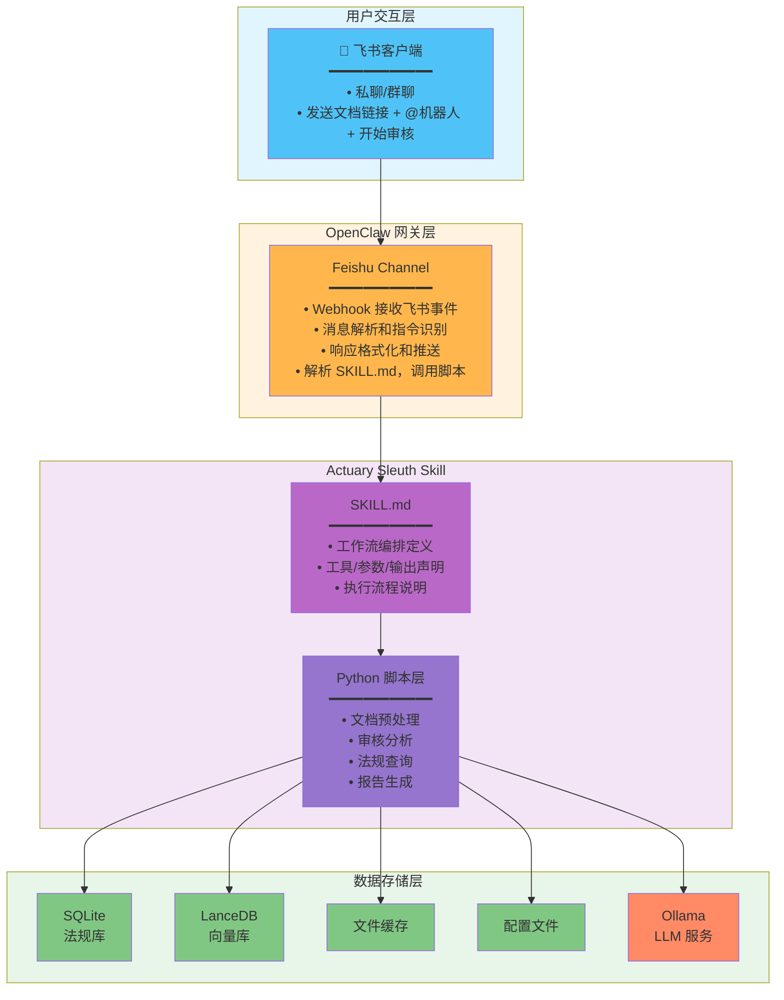
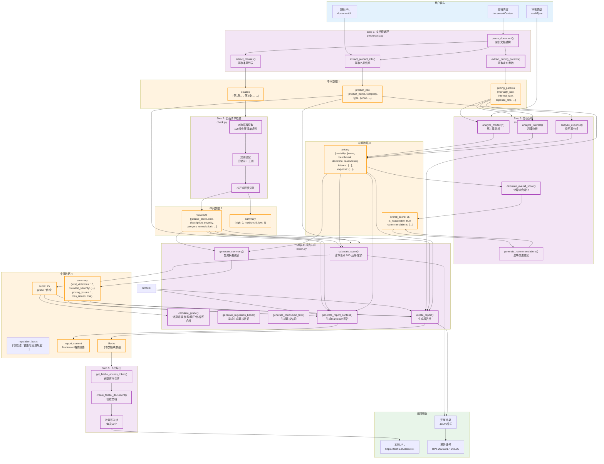
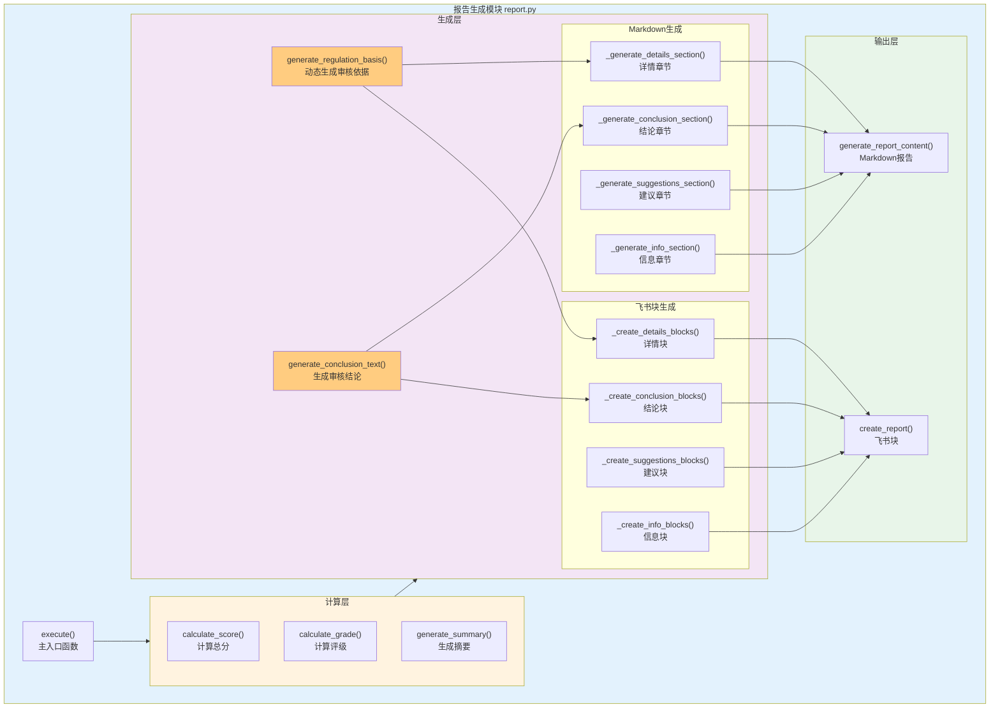

# Actuary Sleuth Skill - 完整技术方案 v3.0

**版本**: v3.0
**日期**: 2026-02-15
**架构**: SKILL.md 工作流编排 + Python 脚本实现

---

## 一、系统概述

### 1.1 项目定位

Actuary Sleuth 是一个基于 SKILL.md 工作流编排规范的精算审核系统，通过飞书 Channel 与用户交互，实现保险产品文档的自动化审核。

### 1.2 核心能力

| 功能 | 描述 |
|------|------|
| 文档审核 | 审核保险产品条款，检查负面清单和法规合规性 |
| 法规查询 | 支持条款编号精确查询和语义检索 |
| 报告生成 | 自动生成结构化审核报告并推送到飞书 |

### 1.3 技术栈

| 组件 | 技术 |
|------|------|
| 工作流编排 | SKILL.md 规范 |
| 业务逻辑 | Python 3.10+ |
| 向量检索 | LanceDB + Ollama embeddings |
| 结构化存储 | SQLite |
| LLM | Ollama (qwen2:7b) |
| 文档转换 | feishu2md |
| OCR | PaddleOCR |

---

## 二、系统架构

### 2.1 整体架构图



### 2.2 职责边界

| 层级 | 职责 |
|------|------|
| **Feishu Channel** | 消息收发、指令解析、响应格式化、SKILL.md 解析和脚本调用 |
| **SKILL.md** | 工作流编排、工具定义、执行声明 |
| **Python 脚本** | 文档处理、审核分析、报告生成 |

---

## 三、目录结构

```
/root/.openclaw/workspace/skills/actuary-sleuth/
├── SKILL.md                 # 工作流编排规范（核心）
├── skill.json              # Skill 配置清单
├── scripts/               # Python 脚本（功能实现）
│   ├── template.py       # 脚本模板（统一接口）
│   ├── preprocess.py     # 文档预处理
│   ├── audit.py         # 审核引擎
│   ├── query.py         # 法规查询
│   ├── check.py         # 负面清单检查
│   ├── report.py        # 报告生成
│   ├── scoring.py       # 评分模块
│   ├── lib/             # Python 库
│   │   ├── db.py        # 数据库操作
│   │   ├── vector_store.py # 向量检索
│   │   ├── ollama.py     # LLM 调用
│   │   └── feishu2md.py # 文档转换
│   ├── init_db.py       # 初始化数据库
│   ├── import_regs.py   # 导入法规数据
│   ├── build_vectors.py # 构建向量索引
│   ├── config/          # 配置文件
│   │   └── settings.json
│   └── requirements.txt # Python 依赖
│
├── data/                # 数据目录
│   ├── actuary.db      # SQLite 数据库
│   └── lancedb/        # LanceDB 向量库
│
└── references/          # 法规知识库
    ├── 01_保险法相关监管规定.md
    ├── 02_负面清单.md
    └── ...
```

---

## 四、工作流编排与配置

### 4.1 SKILL.md 结构

SKILL.md 是工作流编排规范文件，定义了技能的工作流程、工具接口和执行声明。

#### 4.1.1 基本元数据

```yaml
---
name: actuary-sleuth
description: Use when reviewing insurance product clauses for compliance, checking against regulatory negative lists, calculating pricing reasonableness, or querying insurance regulations and laws. Use for精算师日常评审工作 including新产品条款审核、法规查询、负面清单检查、定价合理性计算和评审报告生成.
---
```

#### 4.1.2 工具定义（Tools）

| 工具名 | 功能 | 执行脚本 |
|--------|------|----------|
| `audit_document` | 审核保险产品文档 | `scripts/audit.py` |
| `query_regulation` | 查询保险法规 | `scripts/query.py` |
| `check_negative_list` | 检查负面清单 | `scripts/check.py` |

**audit_document 工具**：
- 输入：文档内容(Markdown)、文档URL、审核类型
- 输出：审核报告(JSON)
- 流程：预处理 → 负面清单检查 → 法规检索 → 报告生成

**query_regulation 工具**：
- 输入：查询词、搜索类型
- 输出：法规内容列表(JSON)
- 支持精确查询、语义检索、混合搜索

**check_negative_list 工具**：
- 输入：产品条款数组
- 输出：违规点列表(JSON)
- 包含违规描述、严重程度、整改建议

#### 4.1.3 配置参数（Configuration）

| 参数 | 说明 | 默认值 |
|------|------|--------|
| `scriptsPath` | Python 脚本路径 | ./scripts |
| `dataPath` | 数据目录路径 | ./data |
| `pythonEnv` | Python 环境 | python3 |

#### 4.1.4 依赖要求（Requirements）

- 网络权限：feishu
- 文件权限：read, write
- 依赖：python3, sqlite3, lancedb, ollama

### 4.2 skill.json 配置

```json
{
  "id": "actuary-sleuth",
  "name": "Actuary Sleuth",
  "version": "3.0.0",
  "readme": "SKILL.md",
  "config": {
    "scriptsPath": "./scripts",
    "dataPath": "./data",
    "pythonEnv": "python3",
    "lancedbUri": "./data/lancedb",
    "ollamaHost": "http://localhost:11434",
    "ollamaModel": "qwen2:7b",
    "ollamaEmbedModel": "nomic-embed-text"
  }
}
```

### 4.3 知识库

本技能内置完整的精算审核法规知识库：

#### 基础法规（P0）
- `01_保险法相关监管规定.md` - 保险法核心条款
- `02_负面清单.md` - 22个违规点详细说明
- `03_条款费率管理办法.md` - 费用率监管规定
- `04_信息披露规则.md` - 信息披露要求

#### 产品开发规范（P0）
- `05_健康保险产品开发.md` - 健康险开发规范
- `06_普通型人身保险.md` - 普通型产品规定
- `07_分红型人身保险.md` - 分红型产品规定
- `08_短期健康保险.md` - 短期健康险规定
- `09_意外伤害保险.md` - 意外险规定
- `10_互联网保险产品.md` - 互联网产品规范
- `11_税优健康险.md` - 税优健康险规定
- `12_万能型人身保险.md` - 万能险规定
- `13_其他险种产品.md` - 其他险种规定
- `14_综合监管规定.md` - 综合监管要求

### 4.4 使用场景

| 场景 | 输入 | 输出 | 优先级 |
|------|------|------|--------|
| 产品文档审核 | Word文档 | 结构化产品数据 + 违规检查结果 | P0 |
| 负面清单检查 | 产品条款 | 22个违规点检查结果 + 整改建议 | P0 |
| 法规快速查询 | 条款编号/关键词 | 完整条款内容 + 标准引用格式 | P0 |
| 定价合理性计算 | 定价参数 | 偏差分析 + 合理性判断 | P0 |
| 评审报告生成 | 审核结果 | Word/PDF格式报告 | P0 |
| 智能检索 | 自然语言描述 | 相关法规条款 | P1 |

---

## 五、Python 脚本实现

### 5.1 统一接口模板

```python
#!/usr/bin/env python3
# -*- coding: utf-8 -*-
"""
Actuary Sleuth Script Template
统一脚本接口规范
"""
import argparse
import json
import sys
from pathlib import Path

# 添加 lib 目录到路径
sys.path.insert(0, str(Path(__file__).parent / 'lib'))

def main():
    parser = argparse.ArgumentParser(description='Actuary Sleuth Script')
    parser.add_argument('--input', required=True, help='JSON input file')
    parser.add_argument('--config', default='./config/settings.json', help='Config file')
    args = parser.parse_args()

    # 读取输入
    with open(args.input, 'r', encoding='utf-8') as f:
        params = json.load(f)

    # 执行业务逻辑
    try:
        result = execute(params)
        # 输出结果（JSON格式）
        print(json.dumps(result, ensure_ascii=False, indent=2))
        return 0
    except Exception as e:
        # 错误输出
        error_result = {
            "success": False,
            "error": str(e),
            "error_type": type(e).__name__
        }
        print(json.dumps(error_result, ensure_ascii=False), file=sys.stderr)
        return 1

def execute(params):
    """具体业务逻辑实现 - 子类必须覆盖"""
    raise NotImplementedError("Subclasses must implement execute()")

if __name__ == '__main__':
    sys.exit(main())
```

### 5.2 audit.py（审核引擎）

```python
#!/usr/bin/env python3
# -*- coding: utf-8 -*-
"""
审核引擎 - 主入口
"""
from template import main
from lib import preprocess, check, query, scoring, report

def execute(params):
    """执行完整审核流程"""
    # 1. 文档预处理
    doc = preprocess.process(params['documentContent'])

    # 2. 负面清单检查
    violations = check.negative_list(doc['clauses'])

    # 3. 法规合规检查
    audit_type = params.get('auditType', 'full')
    if audit_type != 'negative-only':
        for v in violations:
            v['regulations'] = query.search_regulations(v['description'])

    # 4. 定价分析
    pricing = None
    if 'pricing_data' in doc and audit_type == 'full':
        pricing = scoring.analyze_pricing(doc['pricing_data'])

    # 5. 计算综合评分
    score = scoring.calculate_score(violations, pricing)

    # 6. 生成报告
    return report.generate({
        'violations': violations,
        'pricing': pricing,
        'score': score,
        'document': doc,
        'metadata': {
            'audit_type': audit_type,
            'document_url': params.get('documentUrl', ''),
            'timestamp': datetime.now().isoformat()
        }
    })

if __name__ == '__main__':
    from datetime import datetime
    main()
```

### 5.3 query.py（法规查询）

```python
#!/usr/bin/env python3
# -*- coding: utf-8 -*-
"""
法规查询脚本
"""
from template import main
from lib import db, vector_store, ollama

def execute(params):
    """执行法规查询"""
    query_text = params['query']
    search_type = params.get('searchType', 'hybrid')

    results = []

    # 精确查询
    if search_type in ['exact', 'hybrid']:
        exact = db.find_regulation(query_text)
        if exact:
            results.append({
                'type': 'exact',
                'content': exact['content'],
                'law_name': exact['law_name'],
                'article_number': exact['article_number'],
                'category': exact['category'],
                'score': 1.0
            })

    # 语义检索
    if search_type in ['semantic', 'hybrid']:
        query_vec = ollama.embed(query_text)
        semantic = lancedb.search(query_vec, top_k=5)
        for item in semantic:
            results.append({
                'type': 'semantic',
                'content': item['content'],
                'law_name': item['metadata']['law_name'],
                'article_number': item['metadata']['article_number'],
                'score': item['score']
            })

    # 排序返回
    results.sort(key=lambda x: x['score'], reverse=True)

    return {
        'success': True,
        'query': query_text,
        'search_type': search_type,
        'results': results[:5],
        'count': len(results[:5])
    }

if __name__ == '__main__':
    main()
```

### 5.4 check.py（负面清单检查）

```python
#!/usr/bin/env python3
# -*- coding: utf-8 -*-
"""
负面清单检查脚本
"""
from template import main
from lib import db

def execute(params):
    """执行负面清单检查"""
    clauses = params['clauses']

    # 获取负面清单规则
    rules = db.get_negative_list()

    # 执行检查
    violations = []
    for idx, clause in enumerate(clauses):
        for rule in rules:
            if match_rule(clause, rule):
                violations.append({
                    'clause_index': idx,
                    'clause_text': clause[:100] + '...' if len(clause) > 100 else clause,
                    'rule': rule['rule_number'],
                    'description': rule['description'],
                    'severity': rule['severity'],
                    'category': rule['category'],
                    'remediation': rule['remediation']
                })

    return {
        'success': True,
        'violations': violations,
        'count': len(violations),
        'summary': group_by_severity(violations)
    }

def match_rule(clause, rule):
    """规则匹配逻辑"""
    # 关键词匹配
    keywords = rule.get('keywords', [])
    for keyword in keywords:
        if keyword in clause:
            return True

    # 正则表达式匹配
    import re
    patterns = rule.get('patterns', [])
    for pattern in patterns:
        if re.search(pattern, clause):
            return True

    return False

def group_by_severity(violations):
    """按严重程度分组"""
    summary = {
        'high': sum(1 for v in violations if v['severity'] == 'high'),
        'medium': sum(1 for v in violations if v['severity'] == 'medium'),
        'low': sum(1 for v in violations if v['severity'] == 'low')
    }
    return summary

if __name__ == '__main__':
    main()
```

---

## 六、Python 库模块

### 6.1 lib/db.py（数据库操作）

```python
#!/usr/bin/env python3
# -*- coding: utf-8 -*-
"""
数据库操作模块
"""
import sqlite3
import json
from pathlib import Path

DB_PATH = Path(__file__).parent.parent.parent / 'data' / 'actuary.db'

def get_connection():
    """获取数据库连接"""
    conn = sqlite3.connect(DB_PATH)
    conn.row_factory = sqlite3.Row
    return conn

def find_regulation(article_number):
    """精确查找法规条款"""
    conn = get_connection()
    cur = conn.cursor()

    cur.execute('''
        SELECT * FROM regulations
        WHERE article_number = ?
    ''', (article_number,))

    row = cur.fetchone()
    conn.close()

    if row:
        return dict(row)
    return None

def search_regulations(keyword):
    """关键词搜索法规"""
    conn = get_connection()
    cur = conn.cursor()

    cur.execute('''
        SELECT * FROM regulations
        WHERE content LIKE ? OR article_number LIKE ?
        LIMIT 20
    ''', (f'%{keyword}%', f'%{keyword}%'))

    rows = cur.fetchall()
    conn.close()

    return [dict(row) for row in rows]

def get_negative_list():
    """获取负面清单"""
    conn = get_connection()
    cur = conn.cursor()

    cur.execute('SELECT * FROM negative_list ORDER BY severity DESC')
    rows = cur.fetchall()
    conn.close()

    return [dict(row) for row in rows]

def save_audit_record(record):
    """保存审核记录"""
    conn = get_connection()
    cur = conn.cursor()

    cur.execute('''
        INSERT INTO audit_history (id, user_id, document_url, violations, score)
        VALUES (?, ?, ?, ?, ?)
    ''', (
        record['id'],
        record.get('user_id', ''),
        record.get('document_url', ''),
        json.dumps(record.get('violations', []), ensure_ascii=False),
        record.get('score', 0)
    ))

    conn.commit()
    conn.close()
```

### 6.2 lib/vector_store.py（向量检索）

```python
#!/usr/bin/env python3
# -*- coding: utf-8 -*-
"""
向量检索模块
"""
import lancedb
from pathlib import Path

DB_URI = str(Path(__file__).parent.parent.parent / 'data' / 'lancedb')

class VectorDB:
    _instance = None
    _tables = {}

    @classmethod
    def connect(cls):
        """连接 LanceDB"""
        if cls._instance is None:
            cls._instance = lancedb.connect(DB_URI)
        return cls._instance

    @classmethod
    def get_table(cls, table_name='regulations_vectors'):
        """获取表"""
        if table_name not in cls._tables:
            db = cls.connect()
            try:
                cls._tables[table_name] = db.open_table(table_name)
            except:
                # 表不存在，返回 None
                return None
        return cls._tables[table_name]

    @classmethod
    def search(cls, query_vector, top_k=5, table_name='regulations_vectors'):
        """向量搜索"""
        table = cls.get_table(table_name)
        if table is None:
            return []

        results = table.vectorSearch(query_vector).limit(top_k).to_pydict()

        return [
            {
                'content': r['chunk_text'],
                'metadata': r['metadata'],
                'score': 1 / (1 + r.get('_distance', 0))
            }
            for r in results
        ]

    @classmethod
    def add_vectors(cls, data, table_name='regulations_vectors'):
        """添加向量"""
        db = cls.connect()

        # 检查表是否存在
        existing_tables = db.table_names()
        if table_name not in existing_tables:
            # 创建新表
            import pyarrow as pa
            schema = pa.schema([
                pa.field('id', pa.string()),
                pa.field('regulation_id', pa.string()),
                pa.field('chunk_text', pa.string()),
                pa.field('vector', pa.list_(pa.float32())),
                pa.field('metadata', pa.string())
            ])
            table = db.create_table(table_name, schema=schema)
        else:
            table = db.open_table(table_name)

        table.add(data)
        cls._tables[table_name] = table
```

### 6.3 lib/ollama.py（LLM 调用）

```python
#!/usr/bin/env python3
# -*- coding: utf-8 -*-
"""
LLM 调用模块
"""
import requests
import json

OLLAMA_HOST = 'http://localhost:11434'
EMBED_MODEL = 'nomic-embed-text'
CHAT_MODEL = 'qwen2:7b'

def embed(text):
    """生成文本向量"""
    try:
        response = requests.post(
            f'{OLLAMA_HOST}/api/embeddings',
            json={
                'model': EMBED_MODEL,
                'prompt': text
            },
            timeout=30
        )
        response.raise_for_status()
        return response.json()['embedding']
    except Exception as e:
        raise Exception(f"Ollama embed error: {str(e)}")

def generate(prompt, system=None):
    """生成文本"""
    data = {
        'model': CHAT_MODEL,
        'prompt': prompt,
        'stream': False
    }

    if system:
        data['system'] = system

    try:
        response = requests.post(
            f'{OLLAMA_HOST}/api/generate',
            json=data,
            timeout=120
        )
        response.raise_for_status()
        return response.json()['response']
    except Exception as e:
        raise Exception(f"Ollama generate error: {str(e)}")

def analyze_compliance(clause, regulations):
    """分析条款合规性"""
    prompt = f"""作为保险精算专家，请判断以下条款是否违规：

【条款内容】
{clause}

【相关法规】
{chr(10).join(regulations[:3])}

请返回JSON格式（仅返回JSON，不要其他内容）：
{{
    "is_violation": true或false,
    "reason": "违规原因或合规说明",
    "severity": "high或medium或low",
    "suggestion": "整改建议"
}}"""

    try:
        result = generate(prompt)
        # 尝试解析 JSON
        # 移除可能的 markdown 代码块标记
        result = result.strip()
        if result.startswith('```'):
            result = result.split('\n', 1)[1]
        if result.endswith('```'):
            result = result.rsplit('\n', 1)[0]
        if result.startswith('json'):
            result = result[4:]

        return json.loads(result)
    except:
        # 解析失败，返回默认结果
        return {
            "is_violation": False,
            "reason": "无法解析",
            "severity": "low",
            "suggestion": "请人工复核"
        }
```

### 6.4 lib/feishu2md.py（文档转换）

```python
#!/usr/bin/env python3
# -*- coding: utf-8 -*-
"""
飞书文档转换模块
"""
import subprocess
import tempfile
from pathlib import Path

def convert_feishu_to_markdown(document_url):
    """将飞书文档转换为 Markdown"""
    try:
        # 调用 feishu2md 工具
        result = subprocess.run(
            ['feishu2md', document_url],
            capture_output=True,
            text=True,
            timeout=60
        )

        if result.returncode == 0:
            return result.stdout
        else:
            raise Exception(f"feishu2md error: {result.stderr}")

    except FileNotFoundError:
        # feishu2md 未安装，使用备用方案
        return convert_fallback(document_url)

def convert_fallback(document_url):
    """备用转换方案"""
    # 这里可以实现一个简单的转换逻辑
    # 或者提示用户手动转换
    raise NotImplementedError(
        "请安装 feishu2md 工具或手动将文档转换为 Markdown 格式"
    )
```

---

## 七、数据模型

### 7.1 SQLite 表结构

```sql
-- 法规库表
CREATE TABLE IF NOT EXISTS regulations (
    id TEXT PRIMARY KEY,
    law_name TEXT NOT NULL,
    article_number TEXT,
    content TEXT NOT NULL,
    category TEXT,
    tags TEXT,
    effective_date TEXT,
    created_at TEXT DEFAULT CURRENT_TIMESTAMP
);
CREATE INDEX IF NOT EXISTS idx_article ON regulations(law_name, article_number);

-- 负面清单表
CREATE TABLE IF NOT EXISTS negative_list (
    id INTEGER PRIMARY KEY,
    rule_number TEXT UNIQUE,
    description TEXT NOT NULL,
    severity TEXT,
    category TEXT,
    remediation TEXT,
    keywords TEXT,
    patterns TEXT,
    version TEXT,
    effective_date TEXT
);

-- 审核历史表
CREATE TABLE IF NOT EXISTS audit_history (
    id TEXT PRIMARY KEY,
    user_id TEXT,
    document_url TEXT,
    document_type TEXT,
    violations TEXT,
    score REAL,
    created_at TEXT DEFAULT CURRENT_TIMESTAMP
);
```

### 7.2 LanceDB 表结构

```python
# 法规向量表
regulations_vectors = {
    'id': str,              # 唯一标识
    'regulation_id': str,   # 关联法规ID
    'chunk_text': str,      # 文本分块
    'vector': list(float),  # 768维向量
    'metadata': str         # 元数据（JSON字符串）
}
```

---

## 八、数据处理流程

### 8.1 完整数据流图



### 8.2 数据结构详解

#### 8.2.1 产品信息数据结构 (product_info)

```json
{
  "product_name": "XX终身寿险",
  "insurance_company": "XX人寿保险股份有限公司",
  "product_type": "寿险",
  "insurance_period": "终身",
  "payment_method": "年交",
  "age_range": "出生满28天至65周岁",
  "occupation_class": "1-6类"
}
```

#### 8.2.2 违规记录数据结构 (violations)

```json
[
  {
    "clause_index": 5,
    "clause_text": "第6条 本产品保证年化收益率...",
    "rule": "N001",
    "description": "条款中包含'保证收益'字样，违反监管规定",
    "severity": "high",
    "category": "销售误导",
    "remediation": "删除'保证收益'相关表述，改为'演示收益'"
  }
]
```

#### 8.2.3 定价分析数据结构 (pricing)

```json
{
  "mortality": {
    "value": 0.0005,
    "benchmark": 0.0005,
    "deviation": 0.0,
    "reasonable": true,
    "note": "死亡率/发生率符合行业标准"
  },
  "interest": {
    "value": 0.035,
    "benchmark": 0.035,
    "deviation": 0.0,
    "reasonable": true,
    "note": "预定利率符合监管规定"
  },
  "expense": {
    "value": 0.12,
    "benchmark": 0.12,
    "deviation": 0.0,
    "reasonable": true,
    "note": "费用率符合监管规定"
  }
}
```

#### 8.2.4 评分计算逻辑

```python
# 基础分 100
score = 100

# 违规扣分
for violation in violations:
    if severity == 'high':    score -= 20
    elif severity == 'medium': score -= 10
    elif severity == 'low':    score -= 5

# 定价问题扣分
for category in ['mortality', 'interest', 'expense']:
    if not pricing[category]['reasonable']:
        score -= 10

# 最终分数范围 [0, 100]
```

#### 8.2.5 报告摘要数据结构 (summary)

```json
{
  "total_violations": 10,
  "violation_severity": {
    "high": 2,
    "medium": 5,
    "low": 3
  },
  "pricing_issues": 1,
  "has_critical_issues": true
}
```

### 8.3 飞书块数据结构

```json
[
  {
    "block_type": 2,
    "text": {
      "elements": [{
        "text_run": {
          "content": "保险产品精算审核报告",
          "style": {
            "bold": true,
            "text_size": "largest"
          }
        }
      }]
    }
  },
  {
    "block_type": 2,
    "text": {
      "elements": [{
        "text_run": {
          "content": "表1-1：关键指标汇总表",
          "style": {
            "bold": true
          }
        }
      }]
    }
  },
  {
    "block_type": 2,
    "text": {
      "elements": [{
        "text_run": {
          "content": "序号 | 指标项 | 结果 | 说明",
          "style": {
            "bold": true,
            "font_family": "Courier New"
          }
        }
      }]
    }
  }
]
```

---

## 九、报告生成

### 9.1 报告生成原则

| 原则 | 说明 | 示例 |
|------|------|------|
| **动态生成** | 所有内容基于实际审核结果 | 无违规则不显示违规表格 |
| **结论先行** | 审核结论放在最前面 | 一、审核结论 |
| **问题导向** | 有问题才展示对应章节 | 无定价问题则省略定价分析 |
| **依据明确** | 每个问题都有法规依据 | 违规描述+法规条款+整改建议 |

### 9.2 报告结构（动态）

```
保险产品精算审核报告
├── 产品基本信息
│   ├── 产品名称、保险公司
│   ├── 产品类型、审核日期
│   └── 报告编号
│
├── 一、审核结论（始终显示）
│   ├── 审核意见（不推荐/条件推荐/需补充材料/推荐）
│   ├── 核心问题摘要（1-2句话）
│   └── 关键指标汇总表
│       ├── 综合评分
│       ├── 合规评级
│       ├── 违规总数
│       └── 定价评估
│
├── 二、问题详情及依据（有问题时显示）
│   ├── 审核依据（动态生成）
│   │   ├── 基础法规（保险法等）
│   │   ├── 产品类型专项法规（健康险管理办法等）
│   │   └── 违规相关法规引用
│   ├── 违规统计表
│   ├── 严重违规明细（如有）
│   ├── 中等违规明细（如有）
│   └── 定价问题分析（如有）
│
├── 三、修改建议（有问题时显示）
│   ├── P0级整改事项（如有严重违规）
│   └── P1级整改事项（如有中等违规）
│
└── 四、报告信息（始终显示）
    ├── 报告编号/生成时间/系统版本
    └── 免责声明
```

### 9.3 报告生成函数架构



### 9.4 审核依据动态生成

```python
def generate_regulation_basis(violations, product_info):
    """
    动态生成审核依据

    基于产品类型和违规情况，动态生成适用的法规依据列表
    """
    basis = []

    # 1. 基础法规（始终适用）
    basis.append("《中华人民共和国保险法》")

    # 2. 根据产品类型添加专项法规
    type_regulations = {
        '寿险': '《人身保险公司保险条款和保险费率管理办法》',
        '健康险': '《健康保险管理办法》',
        '意外险': '《意外伤害保险管理办法》',
        '万能险': '《万能型人身保险管理办法》',
    }

    product_type = product_info.get('product_type', '').lower()
    for key, regulation in type_regulations.items():
        if key in product_type:
            basis.append(regulation)
            break

    # 3. 提取违规记录中引用的法规
    for v in violations:
        if v.get('regulation_citation'):
            basis.append(v['regulation_citation'])

    return basis
```

### 9.5 审核结论生成

```python
def generate_conclusion_text(score, summary):
    """
    生成审核结论文本

    基于评分和违规情况，动态生成审核意见和说明
    """
    high_count = summary['violation_severity']['high']

    if high_count > 0:
        return "不推荐上会", f"存在{high_count}项严重违规，触及监管红线"
    elif score >= 90:
        return "推荐通过", "产品符合所有监管要求"
    elif score >= 75:
        return "条件推荐", "存在中等问题，建议整改后提交"
    elif score >= 60:
        return "需补充材料", "存在问题，需补充说明材料"
    else:
        return "不予推荐", "产品合规性不足"
```

### 9.6 条件渲染逻辑

```python
def generate_report_content(violations, pricing_analysis, product_info, score, grade, summary):
    """
    动态生成报告内容

    只在有数据时显示对应章节
    """
    lines = []

    # 审核结论（始终显示）
    lines.extend(_generate_conclusion_section(score, grade, summary))

    # 问题详情（有问题时显示）
    if summary.get('has_issues', False):
        lines.extend(_generate_details_section(violations, pricing_analysis, product_info, summary))

    # 修改建议（有问题时显示）
    if summary.get('has_issues', False):
        lines.extend(_generate_suggestions_section(violations, summary))

    # 报告信息（始终显示）
    lines.extend(_generate_info_section(report_id))

    return '\n'.join(lines)
```

### 9.7 报告模板示例

#### 无问题报告模板

```markdown
# 保险产品精算审核报告

产品名称：XX终身寿险
保险公司：XX人寿保险股份有限公司
审核日期：2026年02月17日
报告编号：RPT-20260217-143020

## 一、审核结论

**审核意见**：推荐通过

**说明**：产品符合所有监管要求，未发现违规问题。

| 指标项 | 结果 | 说明 |
|--------|------|------|
| 综合评分 | 95分 | 产品优秀，建议快速通过 |
| 合规评级 | 优秀 | 基于违规数量和严重程度评定 |
| 违规总数 | 0项 | 无违规 |
| 定价评估 | 合理 | 0项定价参数需关注 |

## 四、报告信息

报告编号：RPT-20260217-143020
生成时间：2026年02月17日 14:30
审核系统：Actuary Sleuth v3.0

免责声明：本报告由AI精算审核系统生成，仅供内部参考...
```

#### 有问题报告模板

```markdown
## 一、审核结论

**审核意见**：不推荐上会

**说明**：存在2项严重违规，触及监管红线，需完成整改后重新审核。

## 二、问题详情及依据

**审核依据**：
1. 《中华人民共和国保险法》
2. 《健康保险管理办法》
3. 保险法第十七条（免责条款）

### 2.1 违规统计

| 级别 | 数量 | 占比 |
|------|------|------|
| 严重 | 2项 | 20% |
| 中等 | 5项 | 50% |

### 2.2 严重违规明细

| 规则 | 违规描述 | 涉及条款 | 法规依据 | 整改建议 |
|------|----------|----------|----------|----------|
| N001 | 包含保证收益表述 | 第6条 | 保险法第十七条 | 改为演示收益 |

## 三、修改建议

### 3.1 P0级整改事项（必须立即整改）

1. 删除第6条中"保证收益"相关表述
2. 补充第15条犹豫期起算日期

## 四、报告信息
...
```

---

## 十、核心流程

### 10.1 审核流程

```python
def execute_audit(input_data):
    """执行完整审核流程"""

    # 1. 文档预处理
    doc = preprocess.process(input_data['document_content'])
    # 输出: {clauses, sections, pricing_data, ...}

    # 2. 负面清单检查
    violations = check.negative_list(doc['clauses'])
    # 输出: [{rule, description, severity, remediation}, ...]

    # 3. 法规合规检查
    for v in violations:
        v['regulations'] = query.search_regulations(v['description'])

    # 4. 定价分析
    pricing = scoring.analyze_pricing(doc['pricing_data'])
    # 输出: {mortality, interest, expense, reasonableness}

    # 5. 计算评分
    score = scoring.calculate_score(violations, pricing)
    # 输出: 0-100 分

    # 6. 生成报告
    return report.generate({
        'violations': violations,
        'pricing': pricing,
        'score': score,
        'document': doc
    })
```

### 10.2 查询流程

```python
def search_regulation(query, search_type='hybrid'):
    """执行法规查询"""

    results = []

    # 精确查询
    if search_type in ['exact', 'hybrid']:
        exact = db.find_regulation(query)
        if exact:
            results.append({...})

    # 语义检索
    if search_type in ['semantic', 'hybrid']:
        query_vec = ollama.embed(query)
        semantic = lancedb.search(query_vec, top_k=5)
        results.extend(semantic)

    # 排序返回
    results.sort(key=lambda x: x['score'], reverse=True)
    return results[:5]
```

---

## 十一、初始化脚本

### 11.1 scripts/init_db.py

```python
#!/usr/bin/env python3
# -*- coding: utf-8 -*-
"""
初始化数据库
"""
import sqlite3
from pathlib import Path

DB_PATH = Path(__file__).parent.parent / 'data' / 'actuary.db'

def init_database():
    """初始化数据库表"""
    conn = sqlite3.connect(DB_PATH)

    # 创建法规表
    conn.execute('''
        CREATE TABLE IF NOT EXISTS regulations (
            id TEXT PRIMARY KEY,
            law_name TEXT NOT NULL,
            article_number TEXT,
            content TEXT NOT NULL,
            category TEXT,
            tags TEXT,
            effective_date TEXT,
            created_at TEXT DEFAULT CURRENT_TIMESTAMP
        )
    ''')
    conn.execute('''
        CREATE INDEX IF NOT EXISTS idx_article
        ON regulations(law_name, article_number)
    ''')

    # 创建负面清单表
    conn.execute('''
        CREATE TABLE IF NOT EXISTS negative_list (
            id INTEGER PRIMARY KEY,
            rule_number TEXT UNIQUE,
            description TEXT NOT NULL,
            severity TEXT,
            category TEXT,
            remediation TEXT,
            keywords TEXT,
            patterns TEXT,
            version TEXT,
            effective_date TEXT
        )
    ''')

    # 创建审核历史表
    conn.execute('''
        CREATE TABLE IF NOT EXISTS audit_history (
            id TEXT PRIMARY KEY,
            user_id TEXT,
            document_url TEXT,
            document_type TEXT,
            violations TEXT,
            score REAL,
            created_at TEXT DEFAULT CURRENT_TIMESTAMP
        )
    ''')

    conn.commit()
    conn.close()
    print(f"Database initialized: {DB_PATH}")

if __name__ == '__main__':
    init_database()
```

### 11.2 scripts/import_regs.py

```python
#!/usr/bin/env python3
# -*- coding: utf-8 -*-
"""
导入法规数据
"""
import sqlite3
import re
from pathlib import Path

DB_PATH = Path(__file__).parent.parent / 'data' / 'actuary.db'
REFS_PATH = Path(__file__).parent.parent / 'references'

def import_markdown_file(file_path):
    """导入单个 Markdown 法规文件"""
    with open(file_path, 'r', encoding='utf-8') as f:
        content = f.read()

    # 解析法规名称
    law_name = file_path.stem

    # 解析条款
    articles = parse_articles(content)

    # 写入数据库
    conn = sqlite3.connect(DB_PATH)
    cur = conn.cursor()

    for article in articles:
        cur.execute('''
            INSERT OR REPLACE INTO regulations
            (id, law_name, article_number, content, category)
            VALUES (?, ?, ?, ?, ?)
        ''', (
            f"{law_name}_{article['number']}",
            law_name,
            article['number'],
            article['content'],
            article.get('category', '')
        ))

    conn.commit()
    conn.close()
    print(f"Imported {len(articles)} articles from {file_path.name}")

def parse_articles(content):
    """解析 Markdown 文件中的条款"""
    articles = []

    # 匹配条款标题（如：第十六条、16.）
    pattern = r'^(#{1,3}\s*)?(第[一二三四五六七八九十百千]+条|[\d]+\.?)\s*(.*)$'

    current_article = None

    for line in content.split('\n'):
        match = re.match(pattern, line.strip())
        if match:
            # 保存上一条
            if current_article:
                articles.append(current_article)

            # 开始新条款
            current_article = {
                'number': match.group(2),
                'title': match.group(3),
                'content': ''
            }
        elif current_article:
            # 追加内容
            current_article['content'] += line + '\n'

    # 保存最后一条
    if current_article:
        articles.append(current_article)

    return articles

def import_all_references():
    """导入所有参考资料"""
    refs_path = REFS_PATH
    if not refs_path.exists():
        print(f"References directory not found: {refs_path}")
        return

    for md_file in refs_path.glob('*.md'):
        import_markdown_file(md_file)

if __name__ == '__main__':
    import_all_references()
```

### 11.3 scripts/build_vectors.py

```python
#!/usr/bin/env python3
# -*- coding: utf-8 -*-
"""
构建向量索引
"""
import sqlite3
from pathlib import Path
from lib import lancedb, ollama

DB_PATH = Path(__file__).parent.parent / 'data' / 'actuary.db'

def build_vector_index():
    """构建法规向量索引"""
    # 读取所有法规
    conn = sqlite3.connect(DB_PATH)
    cur = conn.cursor()

    cur.execute('SELECT id, law_name, article_number, content FROM regulations')
    regulations = cur.fetchall()
    conn.close()

    print(f"Building vectors for {len(regulations)} regulations...")

    vectors_data = []
    for reg_id, law_name, article_number, content in regulations:
        # 生成分块向量
        chunks = split_content(content)

        for idx, chunk in enumerate(chunks):
            # 生成向量
            vector = ollama.embed(chunk)

            vectors_data.append({
                'id': f"{reg_id}_{idx}",
                'regulation_id': reg_id,
                'chunk_text': chunk,
                'vector': vector,
                'metadata': {
                    'law_name': law_name,
                    'article_number': article_number
                }
            })

        print(f"Processed: {law_name} - {article_number}")

    # 写入 LanceDB
    lancedb.add_vectors(vectors_data)
    print(f"Built {len(vectors_data)} vectors")

def split_content(content, max_length=500):
    """将内容分块"""
    chunks = []
    current_chunk = ""

    for paragraph in content.split('\n\n'):
        if len(current_chunk) + len(paragraph) > max_length:
            if current_chunk:
                chunks.append(current_chunk.strip())
            current_chunk = paragraph
        else:
            current_chunk += "\n\n" + paragraph if current_chunk else paragraph

    if current_chunk:
        chunks.append(current_chunk.strip())

    return chunks

if __name__ == '__main__':
    build_vector_index()
```

---

## 十二、部署说明

### 12.1 环境要求

| 组件 | 版本要求 |
|------|----------|
| Python | 3.10+ |
| Ollama | 最新版 |
| SQLite | 系统自带 |

### 12.2 Python 依赖

```
# scripts/requirements.txt
lancedb>=0.5.0
requests>=2.28.0
pyarrow>=14.0.0
paddleocr>=2.7.0
feishu2md>=0.1.0
```

### 12.3 安装步骤

```bash
# 1. 进入 Skill 目录
cd /root/.openclaw/workspace/skills/actuary-sleuth

# 2. 创建虚拟环境（可选）
python3 -m venv venv
source venv/bin/activate

# 3. 安装 Python 依赖
pip install -r scripts/requirements.txt

# 4. 确认 Ollama 运行
ollama list

# 5. 初始化数据库
python3 scripts/init_db.py

# 6. 导入法规数据
python3 scripts/import_regs.py

# 7. 构建向量索引
python3 scripts/build_vectors.py

# 8. 测试脚本
python3 scripts/query.py '{"query":"保险法第十六条"}'

# 9. 重新加载 Skill
openclaw skills reload
```

---

## 十三、交互示例

### 13.1 审核交互

```
用户: @actuary 审核 https://xxx.feishu.cn/doc/xxxxx

机器人: 🔍 正在审核文档，请稍候...

[约30秒后]

机器人: 📊 审核报告

━━━━━━━━━━━━━━━━━━━━━━━━━━━━━━
【综合评分】75 分 - 合格
━━━━━━━━━━━━━━━━━━━━━━━━━━━━━━

🔴 高危违规 (2)
  1. 免责条款未加粗标红
     - 位置: 第十五条
     - 法规: 保险法第十七条
     - 建议: 请将免责条款加粗并使用红色字体

  2. 犹豫期描述不完整
     - 位置: 第二十条
     - 法规: 人身保险业务监管办法第X条
     - 建议: 补充犹豫期起算日期

🟡 中危违规 (1)
  1. 费率表展示方式需优化
     - 位置: 费率表
     - 建议: 建议增加费率说明

✅ 定价分析合理

━━━━━━━━━━━━━━━━━━━━━━━━━━━━━━
审核时间: 2026-02-15 14:30
审核编号: AUD-20260215-001
```

### 13.2 查询交互

```
用户: @actuary 查询 保险法第十六条

机器人: 📖 保险法 第十六条

订立保险合同，保险人就保险标的或者被保险人的有关情况提出询问的，投保人应当如实告知。

投保人故意或者因重大过失未履行前款规定的如实告知义务，足以影响保险人决定是否同意承保或者提高保险费率的，保险人有权解除合同。

投保人故意不履行如实告知义务的，保险人对于合同解除前发生的保险事故，不承担赔偿或者给付保险金的责任，并不退还保险费。

━━━━━━━━━━━━━━━━━━━━━━━━━━━━━━
分类: 如实告知义务 | 生效日期: 2009-10-01
```

---

## 十四、总结

### 14.1 核心特点

1. **工作流编排与实现分离**: SKILL.md 定义工作流，Python 脚本实现功能
2. **无胶水层**: SKILL.md 直接声明脚本，被解析后直接调用
3. **本地化部署**: 所有数据存储和处理在本地
4. **标准化接口**: 统一的 Python 脚本接口规范
5. **可扩展性**: 易于添加新的审核规则和法规数据

### 14.2 技术优势

| 优势 | 说明 |
|------|------|
| 简洁 | 无需 JS 代码，SKILL.md + Python 脚本即可 |
| 高效 | 直接脚本调用，无中间层开销 |
| 可维护 | Python 脚本独立，便于调试和扩展 |
| 灵活 | 支持混合检索（精确+语义） |
| 本地化 | 数据不出内网，安全可控 |

### 14.3 后续优化方向

1. 增加更多审核规则和法规数据
2. 优化定价分析算法
3. 支持更多文档格式
4. 增加审核历史分析功能
5. 支持批量审核
