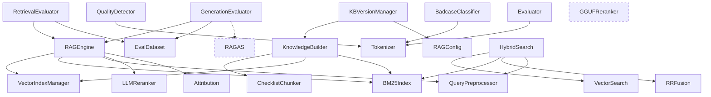

# Actuary Sleuth RAG Engine - 代码库深度研究报告

生成时间: 2026-04-03
分析范围: `scripts/lib/rag_engine/` 及其评估体系
参考文章: 《腾讯面试官冷笑：你说优化后召回率提升了15%，这个数字怎么来的？》

---

## 执行摘要

本项目是一个面向**保险法规审核**的 RAG（检索增强生成）系统，核心功能是将保险监管法规文档构建为知识库，通过混合检索（向量 + BM25）+ RRF 融合 + Rerank 精排，结合 LLM 生成带引用标注的专业回答。

**核心发现**：

1. **评估体系架构完整**：实现了分层评估（检索评估 + 生成评估 + 质量检测 + Badcase 分类），与文章推荐的"分两层评估"理念一致
2. **评估数据集规模偏小**：仅 30 条内置样本，文章建议 200-300 条；缺少线上 badcase 沉淀机制
3. **相关性判断偏弱**：`_is_relevant()` 基于简单关键词匹配，缺少语义相关性判断，容易产生误判
4. **轻量级指标精度不足**：bigram overlap 作为 faithfulness 的代理指标过于粗糙，与 RAGAS 真实评估差距大
5. **缺少 A/B 对比框架**：没有版本间评估对比机制，无法量化优化效果
6. **测试集构建流程缺失**：没有 LLM 自动生成 + 人工筛选的数据集构建 pipeline

---

## 一、项目概览

### 1.1 目录结构

```
scripts/lib/rag_engine/
├── __init__.py              # 公共 API 导出
├── config.py                # RAGConfig, HybridQueryConfig
├── rag_engine.py            # RAGEngine 统一引擎（线程安全）
├── retrieval.py             # 向量检索 + 混合检索入口
├── fusion.py                # RRF 融合 + 去重
├── bm25_index.py            # BM25 关键词索引
├── index_manager.py         # LanceDB 向量索引管理
├── builder.py               # KB 构建编排
├── chunker.py               # ChecklistChunker 分块器
├── preprocessor.py          # Excel → Markdown 预处理
├── query_preprocessor.py    # Query 归一化/扩写/LLM 重写
├── reranker.py              # LLM 批量 Rerank
├── gguf_reranker.py         # 本地 jina-reranker-v3 GGUF 精排
├── evaluator.py             # 检索评估 + 生成评估（核心）
├── eval_dataset.py          # 评估数据集（30 条默认）
├── attribution.py           # 引用解析 [来源X] → Citation
├── quality_detector.py      # 三维度质量评分
├── badcase_classifier.py    # Badcase 三分类
├── version_manager.py       # KB 多版本管理（SQLite）
├── llamaindex_adapter.py    # LlamaIndex LLM/Embedding 适配
├── tokenizer.py             # jieba 中文分词
├── exceptions.py            # 自定义异常
├── data/
│   ├── insurance_dict.txt   # 自定义词典
│   ├── stopwords.txt        # 停用词
│   ├── synonyms.json        # 同义词映射
│   └── kb/v4/               # 当前 KB 版本（562 chunks）
│       ├── lancedb/
│       ├── bm25_index.pkl
│       └── version_meta.json
└── tools/                   # llama.cpp fork（GGUF reranker）
```

### 1.2 模块依赖关系



---

## 二、评估体系深度分析（重点）

### 2.1 当前评估架构总览

当前系统实现了**四层评估**：

```
┌─────────────────────────────────────────────────┐
│  1. RetrievalEvaluator — 检索阶段评估            │
│     Precision@K, Recall@K, MRR, NDCG, 冗余率     │
├─────────────────────────────────────────────────┤
│  2. GenerationEvaluator — 生成阶段评估           │
│     RAGAS (faithfulness/relevancy/correctness)   │
│     或 轻量级 token 覆盖率（fallback）            │
├─────────────────────────────────────────────────┤
│  3. QualityDetector — 运行时质量检测              │
│     faithfulness + retrieval_relevance + 完整性   │
├─────────────────────────────────────────────────┤
│  4. BadcaseClassifier — 错误分类 + 合规风险评估    │
│     retrieval_failure / hallucination / gap      │
└─────────────────────────────────────────────────┘
```

### 2.2 检索评估：RetrievalEvaluator

**文件**: `scripts/lib/rag_engine/evaluator.py:262-383`

#### 2.2.1 相关性判断机制 — `_is_relevant()`

```python
# evaluator.py:153-184
def _is_relevant(result, evidence_docs, evidence_keywords) -> bool:
    # 判断逻辑（三层）：
    # 1. 关键词匹配：content 中匹配 ≥ min(2, len(long_keywords)) 个关键词
    # 2. 文件名匹配：source_file 在 evidence_docs 中 + content 含关键词
    # 3. 法规名匹配：law_name 包含 evidence_doc stem + content 含关键词
```

**问题分析**：

| 问题 | 严重性 | 说明 |
|------|--------|------|
| 纯字符子串匹配 | P1 | `kw in content` 无法区分"等待期"和"等待期间"，也无法处理同义表达 |
| 缺少语义相关性 | P1 | "免赔额" 和 "免赔" 含义相同但匹配不到 |
| evidence_docs 基于文件名 | P2 | 如果 chunk 文件名格式变化（如 `05_` 前缀去掉），匹配全部失败 |
| 硬编码阈值 `min(2, ...)` | P2 | 对于只有 1 个关键词的 sample，任意含该关键词的不相关 chunk 也会被判为 relevant |

**与文章标准对比**：

> 文章强调："支持证据 — 记录文档 ID、Chunk ID、页码"，当前系统使用 `evidence_docs`（文件名）+ `evidence_keywords`，没有 Chunk 级别的证据标注。

#### 2.2.2 Recall 计算

```python
# evaluator.py:304
recall = min(sum(relevance) / len(sample.evidence_docs), 1.0)
```

**问题**：Recall 的分母是 `evidence_docs` 的数量（即文档数），而非证据 chunk 的数量。一个文档可能有多个相关 chunk，Recall 可能被高估。

**正确做法**（文章标准）：Recall 分母应是所有证据 chunk 的总数，而非文档数。

#### 2.2.3 指标完整性对比

| 指标 | 文章推荐 | 当前实现 | 状态 |
|------|----------|----------|------|
| Precision@K | ✅ | ✅ `precision_at_k` | 已实现 |
| Recall@K | ✅ | ✅ `recall_at_k` | 已实现（分母有偏差） |
| MRR | ✅ | ✅ `mrr` | 已实现 |
| NDCG | ✅ | ✅ `ndcg` | 已实现 |
| 冗余率 | ✅ | ✅ `redundancy_rate` | 已实现 |
| Context Relevance | — | ✅ `context_relevance` | 额外指标 |
| 按题型分组 | ✅ | ✅ `by_type` | 已实现 |

**结论**：检索评估指标覆盖全面，与文章推荐一致。但相关性判断的准确性是关键瓶颈。

### 2.3 生成评估：GenerationEvaluator

**文件**: `scripts/lib/rag_engine/evaluator.py:386-643`

#### 2.3.1 双模式设计

```
GenerationEvaluator
├── RAGAS 模式（可选）
│   ├── faithfulness → RAGAS 内部 LLM 判断
│   ├── answer_relevancy → RAGAS 语义相似度
│   └── answer_correctness → RAGAS 对比参考答案
│
└── 轻量级模式（fallback，无 LLM）
    ├── faithfulness → bigram 覆盖率（0.6 * 句级 + 0.4 * 整体）
    ├── answer_relevancy → Jaccard token 相似度
    └── answer_correctness → bigram overlap（ground_truth → answer）
```

#### 2.3.2 轻量级 Faithfulness 实现

```python
# evaluator.py:612-637
@staticmethod
def _compute_faithfulness(contexts, answer):
    # 1. 将 answer 按句号/问号/感叹号分割
    # 2. 对每个句子计算 bigram 与 context bigrams 的覆盖率
    # 3. 覆盖率 ≥ 0.3 的句子视为 "有证据支撑"
    # 4. 最终 = 0.6 * 句级覆盖率 + 0.4 * 整体 bigram overlap
```

**问题分析**：

| 问题 | 严重性 | 说明 |
|------|--------|------|
| Bigram 作为忠实度代理过于粗糙 | P0 | "不得销售" → bigram {不得, 得销, 销售}，但 "不得购买" 也有 {不得}，会产生虚假高覆盖 |
| 阈值 0.3 过低 | P1 | 一个 10 个 bigram 的句子只需 3 个匹配就被视为"有证据支撑"，容易漏检幻觉 |
| 无法检测语义改写 | P0 | LLM 将"保险公司"改写为"承保方"，bigram 完全不匹配，但语义正确 |
| 句子分割依赖标点 | P2 | 中文 LLM 回答可能缺少标点，导致句子过长，覆盖率高估 |

**与文章标准对比**：

> 文章推荐："把答案拆成若干事实陈述，逐一检查是否能在检索到的 Chunk 中找到依据。找不到依据的就是幻觉。"

当前实现用 bigram overlap 替代了"事实陈述级检查"，精度远低于 LLM-as-a-Judge 或 RAGAS。

#### 2.3.3 轻量级 Correctness 实现

```python
# evaluator.py:639-643
@staticmethod
def _compute_correctness(answer, ground_truth):
    return _bigram_overlap(_token_bigrams(ground_truth), _token_bigrams(answer))
```

**问题**：方向是 `ground_truth → answer`，即"标准答案的 bigram 在回答中出现了多少"。这意味着：
- 回答包含更多正确信息 → 分数更高 ✅
- 但回答中多余的错误信息不影响分数 ❌
- 回答使用了不同措辞表达相同含义 → 分数偏低 ❌

#### 2.3.4 RAGAS 集成

```python
# evaluator.py:403-417
try:
    from ragas import evaluate as ragas_evaluate
    from ragas.metrics import faithfulness, answer_relevancy, answer_correctness
    self._ragas_available = True
except ImportError:
    logger.info("RAGAS 未安装，将使用轻量级指标进行生成评估。")
```

**观察**：
- RAGAS 通过 try/except 可选安装，设计合理
- RAGAS 模式下 `evaluate_batch()` 会对每个 question_type 单独跑一次 RAGAS 评估（`evaluator.py:528-546`），这意味着 4 个题型 = 4 次 RAGAS 调用 + 1 次全量调用 = **5 次 LLM 评估**，成本较高
- RAGAS 评估结果缺少人工抽检校准机制

### 2.4 评估数据集：eval_dataset.py

**文件**: `scripts/lib/rag_engine/eval_dataset.py`

#### 2.4.1 数据集规模和分布

| 题型 | 数量 | ID 前缀 | 难度分布 |
|------|------|---------|----------|
| FACTUAL（事实题） | 12 | f001-f012 | easy: 9, medium: 3 |
| MULTI_HOP（多跳推理） | 8 | m001-m008 | medium: 4, hard: 4 |
| NEGATIVE（否定性查询） | 6 | n001-n006 | easy: 4, medium: 2 |
| COLLOQUIAL（口语化查询） | 4 | c001-c004 | easy: 2, medium: 2 |
| **总计** | **30** | | |

#### 2.4.2 与文章标准对比

| 维度 | 文章推荐 | 当前状态 | 差距 |
|------|----------|----------|------|
| 总样本量 | 200-300 条 | 30 条 | **差 6-10 倍** |
| 每场景样本 | ≥ 50 条 | 最多 12 条 | **差 4 倍** |
| 难度覆盖 | 简单/多跳/否定/口语 | ✅ 四种题型 | 覆盖充分 |
| 标注方式 | LLM 生成 + 人工筛选 | 人工编写 | 质量高但扩展性差 |
| 证据标注 | Chunk ID + 页码 | 文件名 + 关键词 | **精度不足** |
| 交叉验证 | 20% 抽样 | 无 | **缺失** |
| 持续迭代 | badcase 沉淀 | 无自动机制 | **缺失** |
| 数据集持久化 | JSON 文件 | ✅ `eval_dataset.json` | 已实现 |

#### 2.4.3 数据集加载机制

```python
# eval_dataset.py:50-69
def load_eval_dataset(path=None):
    # 1. 尝试加载外部 JSON 文件
    # 2. 文件不存在 → 回退到 create_default_eval_dataset()
    # 3. 支持 list 格式和 {"samples": [...]} 格式
```

设计合理：允许用户扩展数据集，同时有内置 fallback。

#### 2.4.4 数据质量抽样

以 `m001` 为例检查标注质量：

```python
EvalSample(
    id="m001",
    question="买了两份意外险，发生意外后都能赔吗？",
    ground_truth="意外伤害保险属于定额给付型保险，被保险人从多份意外伤害保险中获得的保险金总和可以超过实际损失...",
    evidence_docs=["09_意外伤害保险.md", "01_保险法相关监管规定.md"],
    evidence_keywords=["意外伤害保险", "定额给付", "保险金", "多份"],
    question_type=MULTI_HOP,
    difficulty="medium",
)
```

**观察**：
- `ground_truth` 内容准确，覆盖了核心信息点 ✅
- `evidence_docs` 标注了两个文档，符合多跳推理特征 ✅
- `evidence_keywords` 选取合理 ✅
- 但 `evidence_keywords` 缺少 Chunk 级别的精确标注 ❌

### 2.5 质量检测：QualityDetector

**文件**: `scripts/lib/rag_engine/quality_detector.py`

```python
# quality_detector.py:60-82
def detect_quality(query, answer, sources, faithfulness_score=None):
    faithfulness = faithfulness_score or 0.0
    retrieval_relevance = compute_retrieval_relevance(query, sources)  # bigram overlap
    completeness = compute_info_completeness(query, answer)            # 数字匹配

    overall = 0.4 * faithfulness + 0.3 * retrieval_relevance + 0.3 * completeness
```

**问题分析**：

1. **权重固定**：0.4 / 0.3 / 0.3 不可配置，不同场景可能需要不同权重
2. **信息完整性检测过于简单**（`quality_detector.py:40-57`）：
   - 用正则提取数字实体（如 "90天"、"120%"）
   - 检查 answer 中是否包含 query 提到的数字
   - 无法检测语义完整性（如 query 问"有哪些"，answer 只回答了 1 个）
3. **检索相关性重复实现**：`compute_retrieval_relevance()` 和 evaluator 中的 `_compute_context_relevance()` 逻辑几乎相同（都是 bigram overlap），违反 DRY 原则

### 2.6 Badcase 分类：BadcaseClassifier

**文件**: `scripts/lib/rag_engine/badcase_classifier.py`

三分类逻辑：

```
classify_badcase(query, docs, answer, unverified_claims)
├── 检索结果为空 → knowledge_gap
├── 有 unverified_claims → hallucination
├── 答案含"未找到"等短语 → 检查字符重叠
│   ├── 重叠 > 2 → retrieval_failure
│   └── 重叠 ≤ 2 → knowledge_gap
├── bigram overlap < 0.2 → hallucination
└── 默认 → retrieval_failure
```

**问题分析**：

| 问题 | 严重性 | 位置 |
|------|--------|------|
| 死代码 | P3 | `badcase_classifier.py:71-77` — `unverified_claims` 检查重复了 37-43 行的逻辑，永远不会执行到 |
| 字符重叠判断粗糙 | P1 | `overlap > 2` — 只检查 query 和 content 有多少个相同字符，2 个字符的阈值太低，"保险"就占了 2 个 |
| 默认归类为 retrieval_failure | P2 | 无法识别的 case 默认归为检索失败，可能掩盖其他类型的错误 |
| 合规风险评估过于简单 | P2 | `assess_compliance_risk()` 只检查金额和关键词模式，无法评估实际合规影响 |

---

## 三、核心架构分析

### 3.1 检索流水线

```
User Query
    │
    ▼
QueryPreprocessor.preprocess()
    ├── _normalize(): 术语归一化（同义词替换）
    ├── _rewrite_with_llm(): LLM 重写（> 8 字符才触发）
    └── _expand(): 同义词扩写
    │
    ▼
hybrid_search() [并行 ThreadPoolExecutor]
    ├── vector_search() → List[NodeWithScore]
    └── bm25_index.search() → List[(Node, score)]
    │
    ▼ (如有扩写 query)
    ├── 额外 vector_search × N
    └── 额外 bm25_search × N
    │
    ▼
reciprocal_rank_fusion()
    ├── RRF 评分: weight / (k + rank + 1)
    ├── 按 (law_name, article_number) 去重
    └── 每条款保留 ≤ max_chunks_per_article
    │
    ▼
LLMReranker.rerank()
    ├── 截取 max_candidates=20 个
    ├── LLM 批量排序（单次调用）
    └── 返回 top_k=5 个
    │
    ▼
Final Results: List[Dict[str, Any]]
```

### 3.2 问答生成流水线

```
User Question
    │
    ▼
_hybrid_search() → Top K Results
    │
    ▼
_build_qa_prompt()
    ├── 格式: "1. 【LawName】ArticleNumber\nContent"
    ├── 截断: max_context_chars = 12000
    └── Prompt: _QA_PROMPT_TEMPLATE（含引用要求）
    │
    ▼
LLM.generate(prompt) → Answer
    │
    ▼
parse_citations(answer, sources)
    ├── 解析 [来源X] → Citation 列表
    ├── 检测未引用的事实性陈述 → unverified_claims
    └── 识别未被引用的 source → uncited_sources
    │
    ▼
Result {
    answer, sources, citations,
    unverified_claims,
    faithfulness_score? (可选)
}
```

### 3.3 线程安全设计

```python
# rag_engine.py:56-93
class ThreadLocalSettings:
    """线程本地 Settings 管理"""
    def set(self, llm, embed_model):
        # 备份全局 Settings，设置线程本地配置
    def apply(self):
        # 将线程本地配置应用到全局 Settings
    def reset(self):
        # 恢复全局默认配置
```

**观察**：`ThreadLocalSettings` 解决了 LlamaIndex 全局 `Settings` 的线程安全问题，但 `apply()` 修改的是全局对象而非线程本地，在多线程并发时可能产生竞态条件。

---

## 四、评估体系与文章标准对比总结

### 4.1 对照清单

| 文章建议 | 当前状态 | 差距评级 |
|----------|----------|----------|
| **测试集构建** | | |
| 200-300 条样本 | 30 条 | 🔴 严重不足 |
| LLM 生成 + 人工筛选 | 纯人工编写 | 🟡 扩展性差 |
| 标注参考答案 | ✅ ground_truth | 🟢 已实现 |
| 标注支持证据（Chunk ID） | 仅文件名 + 关键词 | 🔴 精度不足 |
| 覆盖 4 种题型 | ✅ factual/multi_hop/negative/colloquial | 🟢 已实现 |
| 难度分层 | ✅ easy/medium/hard | 🟢 已实现 |
| 交叉验证 | 无 | 🔴 缺失 |
| Badcase 持续沉淀 | 无自动机制 | 🔴 缺失 |
| **检索评估** | | |
| Precision@K | ✅ | 🟢 已实现 |
| Recall@K | ✅（分母有偏差） | 🟡 需修正 |
| MRR | ✅ | 🟢 已实现 |
| NDCG | ✅ | 🟢 已实现 |
| 冗余率 | ✅ | 🟢 已实现 |
| **生成评估** | | |
| 答案正确性 | ✅（RAGAS + 轻量级） | 🟢 已实现 |
| 忠实度 | ✅（RAGAS + 轻量级） | 🟡 轻量级精度不足 |
| 答案相关性 | ✅（RAGAS + 轻量级） | 🟢 已实现 |
| **工具选型** | | |
| RAGAS 集成 | ✅ 可选安装 | 🟢 已实现 |
| 人工抽检校准 | 无 | 🔴 缺失 |
| 线上监控 | 无 | 🔴 缺失 |
| **流程** | | |
| A/B 对比 | 无 | 🔴 缺失 |
| 分层评估 | ✅ 检索 + 生成分开 | 🟢 已实现 |
| 问题定位（检索差 vs 生成差） | 部分支持 | 🟡 未系统化 |

### 4.2 当前评估体系的核心短板

1. **数据集规模**（P0）：30 条不足以支撑统计显著的评估结论。文章强调 200+ 条，且需要持续迭代
2. **证据标注粒度**（P0）：缺少 Chunk ID 级别的证据标注，Recall 和 Precision 的计算基础不可靠
3. **轻量级指标精度**（P1）：bigram overlap 作为忠实度和正确性的代理指标，与真实语义判断差距大
4. **评估自动化程度**（P1）：缺少从 badcase 到测试集的自动沉淀 pipeline
5. **A/B 对比框架**（P1）：无法在优化前后用同一测试集对比指标变化

---

## 五、其他潜在问题分析

### 5.1 问题分类汇总

| 类型 | 数量 | 严重性 |
|------|------|--------|
| 评估准确性 | 5 | P0-P1 |
| 代码质量 | 3 | P2-P3 |
| 设计缺陷 | 2 | P1-P2 |

### 5.2 详细问题列表

#### 问题 5.2.1: `_is_relevant()` 纯字符匹配导致误判

- **文件**: `evaluator.py:149-184`
- **类型**: ⚡ 评估准确性
- **严重程度**: P0

**问题描述**: 相关性判断完全基于字符子串匹配（`kw in content`），无法处理同义表达、近义词、语义等价。

**影响分析**: 可能导致检索评估指标（Precision/Recall/MRR/NDCG）全部失真，使优化决策基于错误的数据。

**建议修复**: 引入 embedding 相似度作为辅助判断条件，或使用 RAGAS 的 context_relevance 指标替代自定义的相关性判断。

#### 问题 5.2.2: Recall 分母应为证据 Chunk 数而非文档数

- **文件**: `evaluator.py:304`
- **类型**: ⚡ 评估准确性
- **严重程度**: P1

**当前代码**:
```python
recall = min(sum(relevance) / len(sample.evidence_docs), 1.0)
```

**影响分析**: 对于有多个相关 chunk 的文档，Recall 可能被高估。例如：文档 A 有 3 个相关 chunk，检索到了 1 个，但 Recall = 1/1 = 100%。

**建议修复**: 将 `evidence_docs` 改为 `evidence_chunks`（chunk 级别的证据标注），或至少在文档内检查 chunk 级别的覆盖率。

#### 问题 5.2.3: BadcaseClassifier 中存在不可达代码

- **文件**: `badcase_classifier.py:71-77`
- **类型**: ⚠️ 代码质量
- **严重程度**: P3

**当前代码**: `if unverified_claims:` 在第 37 行已经检查过并 return，第 71-77 行的相同检查永远不会执行。

**建议修复**: 删除第 71-77 行的重复代码。

#### 问题 5.2.4: `compute_retrieval_relevance()` 和 `_compute_context_relevance()` 逻辑重复

- **文件**: `quality_detector.py:14-37` vs `evaluator.py:244-259`
- **类型**: ⚠️ 代码质量
- **严重程度**: P2

**问题描述**: 两个函数都实现了 query bigram 与 context bigram 的重叠度计算，逻辑几乎相同。

**建议修复**: 提取到公共工具函数，统一复用。

#### 问题 5.2.5: ThreadLocalSettings.apply() 修改全局对象

- **文件**: `rag_engine.py:79-83`
- **类型**: 🏗️ 设计缺陷
- **严重程度**: P2

**问题描述**: `apply()` 将线程本地的 LLM/Embed 配置写入全局 `Settings`，在多线程并发请求时可能产生竞态条件。

**影响分析**: 高并发场景下，线程 A 的配置可能被线程 B 覆盖，导致使用错误的模型。

#### 问题 5.2.6: LLM Reranker 解析排序结果脆弱

- **文件**: `reranker.py:94-114`
- **类型**: ⚠️ 代码质量
- **严重程度**: P2

**问题描述**: `_parse_ranking()` 用正则 `\d+` 提取所有数字作为排序索引。如果 LLM 输出包含其他数字（如法规条文号），会产生错误解析。

**当前代码**:
```python
numbers = re.findall(r'\d+', response.strip())
```

**影响分析**: LLM 输出 "根据第3条规定，2,1,4,5,3" 会被解析为 [3, 2, 1, 4, 5, 3]，导致排序错误。

#### 问题 5.2.7: 轻量级 faithfulness 对语义改写不敏感

- **文件**: `evaluator.py:612-637`
- **类型**: ⚡ 评估准确性
- **严重程度**: P1

**问题描述**: 使用 bigram overlap 计算 faithfulness，无法处理 LLM 的合理语义改写（如"保险公司"→"承保方"、"等待期"→"观察期"）。

**影响分析**: 可能将正确的回答误判为低忠实度，产生大量 false positive 的"幻觉"警告。

---

## 六、系统流程走查

### 6.1 端到端评估流程

```
1. load_eval_dataset() → List[EvalSample] (30 条)
       │
2a. RetrievalEvaluator.evaluate_batch()
   ├── for each sample:
   │   ├── rag_engine.search(question, top_k=5)
   │   ├── _is_relevant() × 5 判断每个结果
   │   └── 计算 precision, recall, mrr, ndcg, redundancy
   └── 汇总 → RetrievalEvalReport
       │
2b. GenerationEvaluator.evaluate_batch()
   ├── for each sample:
   │   ├── rag_engine.ask(question) → answer + sources
   │   ├── RAGAS 模式: evaluate(dataset) → 3 个指标
   │   └── 轻量级模式: bigram overlap → 3 个指标
   └── 汇总 → GenerationEvalReport (含 by_type)
       │
3. RAGEvalReport
   ├── retrieval: RetrievalEvalReport
   ├── generation: GenerationEvalReport
   └── failed_samples: List (recall < 0.5)
```

**涉及文件**:
- `evaluator.py`: 评估器核心逻辑
- `eval_dataset.py`: 数据集加载
- `rag_engine.py:search()`: 检索入口
- `rag_engine.py:ask()`: 问答入口
- `retrieval.py`: 混合检索实现
- `fusion.py`: RRF 融合
- `reranker.py`: Rerank 精排

---

## 七、测试覆盖分析

### 7.1 测试文件清单

| 测试文件 | 覆盖模块 | 用例数（估算） |
|----------|----------|---------------|
| `test_evaluator.py` | evaluator.py, eval_dataset.py | ~35 |
| `test_retrieval.py` | retrieval.py | ~10 |
| `test_qa_engine.py` | rag_engine.py | ~8 |
| `test_fusion.py` | fusion.py | ~8 |
| `test_bm25_index.py` | bm25_index.py | ~6 |
| `test_tokenizer.py` | tokenizer.py | ~6 |
| `test_preprocessor.py` | preprocessor.py | ~4 |
| `test_qa_prompt.py` | rag_engine.py (prompt) | ~4 |
| `test_badcase_classifier.py` | badcase_classifier.py | ~6 |
| `test_jina_adapter.py` | llamaindex_adapter.py | ~4 |
| `test_resource_cleanup.py` | 资源清理 | ~3 |

### 7.2 评估模块测试覆盖

| 组件 | 覆盖率估算 | 备注 |
|------|-----------|------|
| `EvalSample` 数据模型 | 90% | 序列化/反序列化完整 |
| `RetrievalEvaluator` | 85% | mock RAG engine，覆盖各分支 |
| `GenerationEvaluator` (轻量级) | 80% | faithfulness/correctness 测试充分 |
| `GenerationEvaluator` (RAGAS) | 30% | 需要 API key，标记为 `@pytest.mark.ragas` |
| `_is_relevant()` | 85% | 多种匹配场景覆盖 |
| `QualityDetector` | 0% | **无独立测试** |
| `BadcaseClassifier` | 有独立测试文件 | ~6 个用例 |
| `Attribution` | 无独立测试 | 在 qa_prompt 测试中部分覆盖 |

### 7.3 测试建议

1. **QualityDetector 缺少独立测试** — 需要补充 `detect_quality()` 的边界测试
2. **RAGAS 集成测试依赖 API key** — 可考虑 mock RAGAS 返回值
3. **缺少端到端评估流程测试** — `run_retrieval_evaluation()` 未被测试覆盖
4. **缺少评估数据集标注质量测试** — 如验证 evidence_docs 与实际 KB 文件的对应关系

---

## 八、技术债务

### 8.1 已识别的技术债务

1. **评估数据集规模不足**（P0）— 30 条 → 需扩展到 200+ 条
2. **证据标注缺少 Chunk 级精度**（P0）— 影响所有检索评估指标的可靠性
3. **`_is_relevant()` 纯字符匹配**（P0）— 需引入语义相关性判断
4. **轻量级指标精度不足**（P1）— bigram overlap 需替换或增强
5. **BadcaseClassifier 死代码**（P3）— 第 71-77 行重复逻辑
6. **Bigram 重叠逻辑重复**（P2）— quality_detector 和 evaluator 中重复实现
7. **ThreadLocalSettings 竞态风险**（P2）— 高并发场景下可能出问题
8. **Reranker 排序解析脆弱**（P2）— 正则提取数字可能误匹配

### 8.2 优先级建议

| 优先级 | 项目 | 原因 |
|--------|------|------|
| P0 | 扩展评估数据集到 200+ 条 | 评估结论的统计显著性基础 |
| P0 | 引入 Chunk 级别的证据标注 | Recall/Precision 的计算基础 |
| P0 | 增强 `_is_relevant()` 语义判断 | 所有检索指标的准确性依赖 |
| P1 | RAGAS 作为默认评估模式 | 替代不准确的轻量级指标 |
| P1 | 建立 Badcase → 测试集沉淀机制 | 持续改进的闭环 |
| P1 | 添加 A/B 对比框架 | 量化优化效果 |
| P2 | 代码清理（死代码、重复逻辑） | 可维护性 |

---

## 九、改进建议

### 9.1 评估体系改进

1. **数据集扩展方案**：
   - 使用 LLM 读取 KB 文档自动生成 QA 对（500 条初始）
   - 人工筛选保留 200+ 条高质量样本
   - 建立标注规范：每个样本包含 Chunk ID 级别的 evidence
   - 抽样 20% 做交叉验证

2. **相关性判断增强**：
   - 保留关键词匹配作为快速筛选
   - 增加 embedding 余弦相似度作为辅助判断（阈值 > 0.7）
   - 对边界 case 引入 LLM 判断

3. **评估自动化 pipeline**：
   - 每次 KB 版本更新后自动运行评估
   - 评估结果持久化到数据库，支持历史对比
   - 线上 badcase 自动加入测试集

4. **A/B 对比框架**：
   - 记录每次优化前后的评估报告
   - 自动计算指标变化（Δ Precision, Δ Recall 等）
   - 只有统计显著提升才允许上线

### 9.2 架构改进

1. **评估模块解耦**：将评估相关的所有组件（evaluator, quality_detector, badcase_classifier, attribution）整合为独立的评估子模块
2. **指标注册机制**：允许注册自定义评估指标，而非硬编码在 evaluator 中
3. **评估报告持久化**：将评估结果保存到数据库，支持趋势分析

---

## 十、总结

### 10.1 主要发现

1. RAG 引擎的**检索流水线设计合理**（混合检索 + RRF + Rerank），与业界最佳实践一致
2. **评估体系架构完整**，实现了文章推荐的所有核心指标（Precision/Recall/MRR/NDCG/Faithfulness 等）
3. **评估数据集是最大短板**：30 条样本远不足以支撑统计显著的评估结论
4. **相关性判断的准确性是关键瓶颈**：纯字符匹配无法满足语义相关性判断需求
5. **轻量级指标作为 RAGAS 不可用时的 fallback 设计合理**，但精度不足以替代 RAGAS

### 10.2 关键风险

- **评估指标可能失真**：由于相关性判断和轻量级指标的局限性，当前评估报告中的数字可能不能真实反映系统质量
- **优化决策可能基于错误数据**：如果 Precision/Recall 计算不准确，可能导致错误的优化方向
- **无法量化优化效果**：缺少 A/B 对比框架，无法科学证明优化是否有效

### 10.3 下一步行动

1. **[P0]** 将评估数据集扩展到 200+ 条，引入 Chunk 级证据标注
2. **[P0]** 增强 `_is_relevant()` 引入 embedding 相似度
3. **[P1]** 将 RAGAS 设为默认评估模式，轻量级指标仅作为开发调试用
4. **[P1]** 建立评估报告持久化和 A/B 对比机制
5. **[P2]** 代码清理：删除死代码、合并重复逻辑
