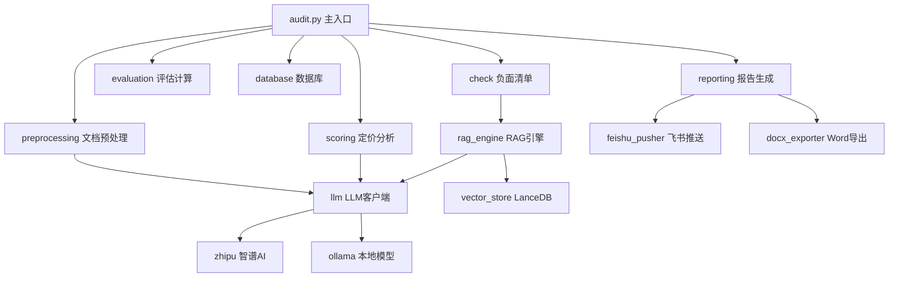
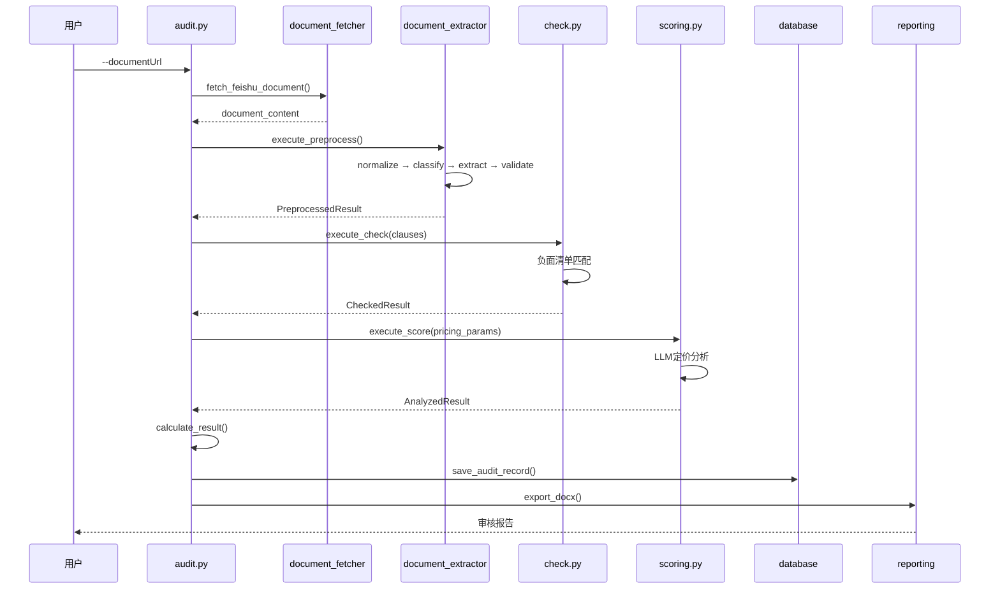

# Actuary Sleuth - 代码库深度研究报告

生成时间: 2026-03-23
分析范围: 全代码库

---

## 执行摘要

**项目名称**: Actuary Sleuth (AI 精算审核助手)

**核心功能**: 基于大语言模型的保险产品合规性审核系统，通过飞书文档获取产品条款，使用RAG技术检索相关法规，自动进行合规性审核并生成Word报告。

**主要发现**:
- 系统架构清晰，模块化设计良好，遵循分层架构原则
- 存在多个安全风险：API密钥硬编码、subprocess命令执行未充分验证、敏感信息泄露
- 数据流存在多处潜在的一致性问题：缓存策略不完善、数据库连接管理混乱
- 错误处理存在异常捕获过于宽泛、关键错误信息可能泄露给用户

**关键问题**:
1. **🔴 P0 安全风险**: 配置文件中暴露智谱API密钥和飞书应用密钥
2. **🔴 P0 命令注入**: subprocess调用feishu2md和openclaw未充分验证参数
3. **🟠 P1 数据一致性**: LLM缓存与数据库记录可能不一致
4. **🟠 P1 资源泄漏**: 数据库连接、HTTP会话、RAG引擎资源管理不完善

---

## 一、项目概览

### 1.1 项目简介

**技术栈**:
- Python 3.12
- LLM: 智谱AI (glm-4-flash, glm-4-plus)、Ollama (qwen2:7b)
- 向量数据库: LanceDB
- 关系数据库: SQLite3
- 文档处理: feishu2md、python-docx
- RAG框架: LlamaIndex

### 1.2 目录结构

```
scripts/
├── audit.py                  # 主入口：审核流程编排
├── preprocess.py             # 预处理入口
├── check.py                  # 负面清单检查入口
├── scoring.py                # 定价分析入口
├── config/
│   └── settings.json         # 配置文件（含敏感信息）
├── lib/
│   ├── audit/                # 审核模块
│   │   ├── auditor.py        # 合规审核器
│   │   ├── evaluation.py     # 评估计算
│   │   └── validator.py      # 请求验证
│   ├── preprocessing/        # 文档预处理
│   │   ├── document_fetcher.py    # 飞书文档获取
│   │   ├── document_extractor.py  # 文档提取
│   │   ├── dynamic_extractor.py   # 动态提取器
│   │   └── fast_extractor.py      # 快速提取器
│   ├── reporting/            # 报告生成
│   │   └── export/
│   │       ├── docx_exporter.py   # Word文档导出
│   │       └── feishu_pusher.py   # 飞书推送
│   ├── rag_engine/           # RAG检索引擎
│   │   ├── rag_engine.py     # 统一RAG接口
│   │   └── vector_store.py   # LanceDB向量存储
│   ├── llm/                  # LLM客户端抽象
│   │   ├── base.py           # 基类
│   │   ├── factory.py        # 工厂类（场景化）
│   │   └── zhipu.py          # 智谱AI实现
│   └── common/               # 公共模块
│       ├── models.py         # 数据模型
│       ├── audit.py          # 审核数据流模型
│       ├── database.py       # SQLite数据库
│       ├── exceptions.py     # 异常定义
│       └── constants.py      # 常量定义
└── tests/                    # 测试文件
```

### 1.3 模块依赖关系



---

## 二、核心架构分析

### 2.1 整体架构

**架构风格**: 分层架构 (Layered Architecture)

**分层结构**:
1. **入口层** (`audit.py`): 流程编排
2. **业务逻辑层** (`lib/audit/`, `lib/preprocessing/`): 核心业务
3. **服务层** (`lib/llm/`, `lib/rag_engine/`): 外部服务集成
4. **数据层** (`lib/common/database.py`, `lib/rag_engine/vector_store.py`): 数据持久化
5. **公共层** (`lib/common/`): 共享工具和数据模型

### 2.2 设计模式识别

| 模式 | 位置 | 用途 |
|------|------|------|
| **工厂模式** | `lib/llm/factory.py` | 根据场景创建不同LLM客户端 |
| **策略模式** | `lib/preprocessing/extractor_selector.py` | 根据文档特征选择提取器 |
| **单例模式** | `lib/rag_engine/vector_store.py` | LanceDB连接管理 |
| **建造者模式** | `lib/preprocessing/prompt_builder.py` | 动态构建LLM提示词 |
| **适配器模式** | `lib/rag_engine/llamaindex_adapter.py` | 适配LlamaIndex接口 |

### 2.3 关键抽象

**核心接口**:
```python
# lib/llm/base.py
class BaseLLMClient(ABC):
    @abstractmethod
    def generate(self, prompt: str) -> str: pass

    @abstractmethod
    def chat(self, messages: List[Dict]) -> str: pass

    @abstractmethod
    def health_check(self) -> bool: pass
```

**核心数据流模型**:
```python
# lib/common/audit.py
@dataclass(frozen=True)
class PreprocessedResult:  # 预处理结果
    audit_id: str
    document_url: str
    product: Product
    clauses: List[Dict]
    pricing_params: Dict

@dataclass(frozen=True)
class CheckedResult:  # 负面清单检查结果
    preprocessed: PreprocessedResult
    violations: List[Dict]

@dataclass(frozen=True)
class AnalyzedResult:  # 定价分析结果
    checked: CheckedResult
    pricing_analysis: Dict

@dataclass(frozen=True)
class EvaluationResult:  # 最终评估结果
    analyzed: AnalyzedResult
    score: int
    grade: str
    summary: Dict
```

---

## 三、数据流分析

### 3.1 主要数据流



**数据转换点**:

| 位置 | 输入格式 | 输出格式 | 转换方式 |
|------|----------|----------|----------|
| `document_fetcher.py:70` | 飞书URL | Markdown文本 | feishu2md命令 |
| `document_extractor.py:69` | Markdown | ExtractResult | LLM提取 |
| `models.py:149` | ExtractResult | AuditRequest | `from_extract_result()` |
| `auditor.py:182` | AuditRequest | AuditOutcome | RAG + LLM审核 |
| `evaluation.py:34` | AnalyzedResult | EvaluationResult | 分数计算 |
| `docx_exporter.py:58` | EvaluationContext | Word文档 | python-docx |

### 3.2 关键数据结构

**产品信息模型**:
```python
# lib/common/models.py:90
@dataclass(frozen=True)
class Product:
    name: str                      # 产品名称
    company: str                    # 保险公司
    category: ProductCategory       # 产品类别枚举
    period: str                     # 保险期间
    waiting_period: Optional[int]   # 等待期（天数）
    age_min: Optional[int]          # 投保年龄下限
    age_max: Optional[int]          # 投保年龄上限
    document_url: str = ""          # 文档URL
    version: str = ""               # 版本号
```

**审核问题模型**:
```python
# lib/audit/auditor.py:65
@dataclass
class AuditIssue:
    clause: str           # 条款内容
    severity: str         # 严重程度: high/medium/low
    dimension: str        # 审核维度: 合规性/信息披露/条款清晰度/费率合理性
    regulation: str       # 违反的法规
    description: str      # 问题描述
    suggestion: str       # 整改建议
```

### 3.3 数据验证

**验证位置**:

| 位置 | 验证内容 | 验证规则 |
|------|----------|----------|
| `document_fetcher.py:35` | 飞书URL | 域名白名单、token格式 |
| `models.py:330` | 条款文本 | 长度、控制字符、内容非空 |
| `auditor.py:189` | 审核请求 | `AuditRequestValidator.validate_request()` |
| `validator.py` (config) | 配置项 | API密钥、URL格式、超时值 |

---

## 四、核心模块详解

### 4.1 文档获取模块 (`document_fetcher.py`)

**功能描述**: 通过飞书URL获取保险产品文档内容

**关键实现**:
```python
# lib/preprocessing/document_fetcher.py:70
def fetch_feishu_document(document_url: str) -> str:
    # 1. 验证URL格式和域名
    doc_token = _validate_feishu_url(document_url)

    # 2. 调用feishu2md下载
    result = subprocess.run(['feishu2md', 'download', safe_url], ...)

    # 3. 验证文件大小和内容
    # 4. 返回Markdown内容
```

**安全风险**:
- **命令注入风险** (line 84): `feishu2md`命令参数经过验证但subprocess调用未使用shell=False显式声明
- **临时文件泄露** (line 78-120): 下载的文件保存在`/tmp`目录，可能被其他进程读取

**依赖外部工具**: `feishu2md` (Ruby gem)

### 4.2 文档提取模块 (`document_extractor.py`)

**功能描述**: 从Markdown文档中提取结构化产品信息

**提取策略**:
1. **快速通道**: 用于格式规整的文档，使用固定Schema
2. **动态通道**: 自适应识别文档结构，动态生成Prompt

**关键流程**:
```python
# lib/preprocessing/document_extractor.py:69
def extract(self, document: str, source_type: str) -> ExtractResult:
    # 1. 文档规范化
    normalized = self.normalizer.normalize(document, source_type)

    # 2. 选择提取器
    extractor = self.extractor_selector.select(normalized)

    # 3. 执行提取
    result = extractor.extract(normalized, required_fields)

    # 4. 验证结果
    validation = self.validator.validate(result)

    return result
```

**质量验证**:
```python
# lib/preprocessing/validator.py (推断)
validation_score = extract_result.metadata.get('validation_score', 0)

if validation_score < 60:
    raise ValueError("提取质量过低")
elif validation_score < 80:
    logger.info("提取质量中等，建议审核时关注数据准确性")
```

### 4.3 合规审核模块 (`auditor.py`)

**功能描述**: 使用RAG检索相关法规，对保险条款进行合规性审核

**审核流程**:
```python
# lib/audit/auditor.py:182
def audit(self, request: AuditRequest, top_k: int = 3) -> List[AuditOutcome]:
    # 1. 验证请求
    AuditRequestValidator.validate_request(request)

    # 2. 遍历每个条款
    for clause_item in request.clauses:
        # 3. RAG检索相关法规
        regulations = self._search_regulations(clause_text, top_k)

        # 4. LLM审核
        audit_result = self._audit(clause, regulations, product)

        # 5. 构建结果
        outcomes.append(AuditOutcome(...))
```

**JSON解析策略** (多层容错):
```python
# lib/audit/auditor.py:26
parsers = [
    lambda r: json.loads(r),                              # 直接解析
    lambda r: json.loads(re.search(r'```json\s*(.*?)\s*```', r).group(1)),  # Markdown JSON块
    lambda r: json.loads(re.search(r'```\s*(.*?)\s*```', r).group(1)),      # 普通代码块
    lambda r: json.loads(r[r.find('{'):r.rfind('}') + 1]), # 提取JSON对象
    lambda r: json.loads(_clean_llm_output(r)),           # 清理后解析
]
```

### 4.4 RAG引擎模块 (`rag_engine.py`)

**功能描述**: 统一的检索增强生成引擎，支持QA和审计两种场景

**场景化LLM选择**:
```python
# lib/llm/factory.py:22
_SCENARIOS = {
    'reg_import': {'model': ModelName.GLM_4_FLASH, 'timeout': 60},
    'doc_preprocess': {'model': None, 'timeout': None},  # 使用配置文件值
    'audit': {'model': ModelName.GLM_4_PLUS, 'timeout': 120},
    'qa': {'model': ModelName.GLM_4_FLASH, 'timeout': 60},
}
```

**混合检索**:
```python
# lib/rag_engine/rag_engine.py:289
def _hybrid_search(self, query_text: str, top_k: int, filters: Dict):
    # 向量检索 + 关键词检索
    return hybrid_search(
        index=index,
        query_text=query_text,
        vector_top_k=config.vector_top_k,
        keyword_top_k=config.keyword_top_k,
        alpha=config.alpha,  # 融合权重
        filters=filters
    )
```

**资源管理问题**:
```python
# lib/rag_engine/rag_engine.py:98
with _engine_init_lock:
    old_llm = getattr(Settings, 'llm', None)
    old_embed = getattr(Settings, 'embed_model', None)

    try:
        Settings.llm = self._llm
        Settings.embed_model = self._embed_model
        # ... 初始化逻辑
    except Exception as e:
        self._cleanup_resources(old_llm, old_embed)
```

**问题**: `Settings`是LlamaIndex的全局单例，并发初始化可能导致竞争条件

### 4.5 数据库模块 (`database.py`)

**功能描述**: SQLite数据库操作，存储审核历史和法规数据

**连接管理**:
```python
# lib/common/database.py:56
@contextmanager
def get_connection():
    conn = _create_connection(db_path)
    try:
        yield conn
        conn.commit()
    except Exception:
        conn.rollback()
        raise
    finally:
        conn.close()
```

**WAL模式配置**:
```python
# lib/common/database.py:44
conn.execute("PRAGMA journal_mode=WAL")
conn.execute("PRAGMA busy_timeout=30000")
```

**SQL注入风险**: 所有查询使用参数化查询，未发现注入风险

### 4.6 报告生成模块 (`docx_exporter.py`)

**功能描述**: 生成Word格式审核报告并推送到飞书

**导出流程**:
```python
# lib/reporting/export/docx_exporter.py:58
def export(self, context: EvaluationContext, title: str) -> Dict:
    # 1. 生成文档
    generation_result = self._generator.generate(context, title)

    # 2. 推送文档
    if self._auto_push and self._pusher:
        push_result = self._pusher.push(file_path, doc_title)

    # 3. 返回结果
    return {...}
```

**飞书推送** (通过OpenClaw):
```python
# lib/reporting/export/feishu_pusher.py:169
command_args = [
    self._openclaw_bin,
    'message', 'send',
    '--channel', 'feishu',
    '--target', self._target_group_id,
    '--media', file_path,
    '--message', message
]
result = subprocess.run(command_args, ...)
```

---

## 五、潜在问题分析

### 5.1 问题分类汇总

| 类型 | 数量 | 严重性分布 |
|------|------|-----------|
| 安全漏洞 | 5 | P0: 3, P1: 2 |
| 代码质量 | 8 | P1: 5, P2: 3 |
| 性能问题 | 4 | P1: 2, P2: 2 |
| 设计缺陷 | 6 | P0: 1, P1: 3, P2: 2 |

### 5.2 详细问题列表

#### 问题 5.2.1: API密钥硬编码泄露

- **文件**: `scripts/config/settings.json:23`
- **类型**: 🔴 安全 / P0
- **严重程度**: Critical

**问题描述**:
智谱AI API密钥和飞书应用密钥明文存储在配置文件中

**当前代码**:
```json
// scripts/config/settings.json:23
"llm": {
  "api_key": "7d0a2b4545c94ca088f4d869a9e2cbbd.oRxlgkhqRF1rbjNp"
},
"feishu": {
  "app_id": "cli_a900c2ed51335ccd",
  "app_secret": "xU3udM9Wax1HFwCXFdwwdgXPH0xjb1TT"
}
```

**影响分析**:
- 密钥泄露可能导致未授权访问
- API费用被恶意消耗
- 飞书群组被未授权操作

**建议修复**:
1. 移除配置文件中的密钥
2. 使用环境变量 `ZHIPU_API_KEY`, `FEISHU_APP_SECRET`
3. 添加配置验证逻辑，拒绝从配置文件读取密钥

---

#### 问题 5.2.2: subprocess命令注入风险

- **文件**: `scripts/lib/preprocessing/document_fetcher.py:84`
- **函数**: `fetch_feishu_document()`
- **类型**: 🔴 安全 / P0
- **严重程度**: High

**问题描述**:
使用subprocess调用外部命令时，参数未充分验证

**当前代码**:
```python
# scripts/lib/preprocessing/document_fetcher.py:84
result = subprocess.run(
    ['feishu2md', 'download', safe_url],
    capture_output=True,
    text=True,
    timeout=timeout,
    check=False
)
```

**影响分析**:
- 虽然`safe_url`经过验证，但未使用`shell=False`显式声明
- 如果外部工具`feishu2md`存在漏洞，可能被利用

**建议修复**:
```python
result = subprocess.run(
    ['feishu2md', 'download', safe_url],
    capture_output=True,
    text=True,
    timeout=timeout,
    check=False,
    shell=False  # 显式声明
)
```

---

#### 问题 5.2.3: OpenClaw命令注入风险

- **文件**: `scripts/lib/reporting/export/feishu_pusher.py:169`
- **函数**: `push()`
- **类型**: 🔴 安全 / P0
- **严重程度**: High

**问题描述**:
文件路径和标题未充分验证即传递给subprocess

**当前代码**:
```python
# scripts/lib/reporting/export/feishu_pusher.py:169
command_args = [
    self._openclaw_bin,
    'message', 'send',
    '--channel', 'feishu',
    '--target', self._target_group_id,
    '--media', file_path,  # 未验证
    '--message', message   # 未验证
]
```

**影响分析**:
- 恶意构造的文件路径可能包含命令注入字符
- 消息内容可能包含破坏性命令

**建议修复**:
1. 验证文件路径为合法路径且在允许目录内
2. 转义消息内容中的特殊字符
3. 使用参数化API而非命令行工具

---

#### 问题 5.2.4: LLM响应解析异常捕获过宽

- **文件**: `scripts/lib/audit/auditor.py:40`
- **函数**: `_parse_json_response()`
- **类型**: 🟠 质量 / P1
- **严重程度**: Medium

**问题描述**:
所有JSON解析异常被捕获并返回相同错误信息，丢失调试信息

**当前代码**:
```python
# scripts/lib/audit/auditor.py:40
for i, parser in enumerate(parsers, 1):
    try:
        result = parser(response)
        return result
    except Exception as e:
        errors.append(f"策略{i}: {type(e).__name__}: {str(e)[:100]}")
        continue

logger.error(f"JSON 解析失败，尝试了 {len(errors)} 种策略: {errors}")
raise ValueError(f"无法解析 LLM 响应为 JSON")
```

**影响分析**:
- 调试困难，无法定位具体哪个策略失败
- 错误信息被截断(100字符)

**建议修复**:
```python
except Exception as e:
    errors.append({
        'strategy': i,
        'type': type(e).__name__,
        'message': str(e),
        'traceback': traceback.format_exc() if logger.isEnabledFor(logging.DEBUG) else None
    })
```

---

#### 问题 5.2.5: 数据库连接池未实现

- **文件**: `scripts/lib/common/database.py:56`
- **函数**: `get_connection()`
- **类型**: ⚡ 性能 / P1
- **严重程度**: Medium

**问题描述**:
每次数据库操作都创建新连接，无连接池复用

**当前代码**:
```python
# scripts/lib/common/database.py:56
@contextmanager
def get_connection():
    conn = _create_connection(db_path)  # 每次新建
    try:
        yield conn
        conn.commit()
    finally:
        conn.close()  # 每次关闭
```

**影响分析**:
- 高并发场景下连接开销大
- 可能超过SQLite连接限制

**建议修复**:
使用连接池或已有但未使用的`connection_pool.py`模块

---

#### 问题 5.2.6: LLM缓存与数据库记录不一致

- **文件**: `scripts/lib/llm/cache.py` (推断)
- **类型**: 🏗️ 设计 / P1
- **严重程度**: Medium

**问题描述**:
LLM响应缓存独立于数据库记录，可能导致历史审核与重审核结果不一致

**数据流不一致点**:
```python
# 首次审核
audit_id_1 = execute(document_url)  # 使用缓存的LLM响应
save_audit_record(audit_id_1, ...)

# 文档未修改，再次审核
audit_id_2 = execute(document_url)  # LLM缓存命中，但数据库新记录
save_audit_record(audit_id_2, ...)  # 与audit_id_1结果不同
```

**影响分析**:
- 同一文档可能产生不同的审核记录
- 历史追溯困难

**建议修复**:
1. 在数据库中记录LLM请求哈希
2. 重审核时检查历史记录
3. 提供强制刷新缓存选项

---

#### 问题 5.2.7: RAG引擎全局状态竞争

- **文件**: `scripts/lib/rag_engine/rag_engine.py:98`
- **函数**: `initialize()`
- **类型**: 🏗️ 设计 / P1
- **严重程度**: Medium

**问题描述**:
LlamaIndex的Settings是全局单例，并发初始化可能导致竞争条件

**当前代码**:
```python
# scripts/lib/rag_engine/rag_engine.py:98
with _engine_init_lock:
    old_llm = getattr(Settings, 'llm', None)
    old_embed = getattr(Settings, 'embed_model', None)

    try:
        Settings.llm = self._llm          # 全局修改
        Settings.embed_model = self._embed_model
        # ...
```

**影响分析**:
- 多线程场景下，一个线程的配置可能覆盖另一个
- LLM调用可能使用错误的模型

**建议修复**:
```python
# 使用线程本地存储而非全局Settings
import threading
_thread_local = threading.local()

def _get_thread_settings(self):
    if not hasattr(_thread_local, 'settings'):
        _thread_local.settings = Settings()
    return _thread_local.settings
```

---

#### 问题 5.2.8: 异常信息泄露敏感数据

- **文件**: `scripts/audit.py:39`
- **函数**: `main()`
- **类型**: 🔴 安全 / P1
- **严重程度**: Medium

**问题描述**:
完整异常信息输出到stderr，可能泄露内部实现细节

**当前代码**:
```python
# scripts/audit.py:39
except Exception as e:
    error_result = {"success": False, "error": str(e), "error_type": type(e).__name__}
    print(json.dumps(error_result, ensure_ascii=False), file=sys.stderr)
```

**影响分析**:
- 堆栈跟踪暴露文件路径和行号
- 内部函数名泄露架构信息
- 可能帮助攻击者绕过安全检查

**建议修复**:
1. 区分用户错误和系统错误
2. 用户错误返回友好提示
3. 系统错误记录日志，返回通用错误消息

---

#### 问题 5.2.9: 文档大小限制不一致

- **文件**: 多处
- **类型**: ⚠️ 质量 / P2
- **严重程度**: Low

**问题描述**:
不同模块对文档大小的限制不一致

**限制对照**:
| 位置 | 限制 | 用途 |
|------|------|------|
| `constants.py:6` | 500,000字符 | 总文本长度 |
| `constants.py:69` | 12,000字符 | 单文档长度 |
| `dynamic_extractor.py:260` | 根据配置动态调整 | LLM输入 |

**影响分析**:
- 文档可能在预处理阶段通过，但在LLM阶段被截断
- 用户体验不一致

**建议修复**:
统一到单一常量或配置项

---

#### 问题 5.2.10: HTTP会话未正确关闭

- **文件**: `scripts/lib/llm/zhipu.py:47`
- **类型**: ⚡ 资源泄漏 / P1
- **严重程度**: Medium

**问题描述**:
HTTP会话对象在异常时可能未关闭

**当前代码**:
```python
# scripts/lib/llm/zhipu.py:47
def __init__(self, ...):
    self._session = requests.Session()  # 创建会话
    self._session.headers.update({...})

def close(self):
    if hasattr(self, '_session') and self._session is not None:
        self._session.close()
```

**影响分析**:
- 长期运行可能导致连接泄漏
- 达到系统最大文件描述符限制

**建议修复**:
使用上下文管理器确保关闭
```python
def __enter__(self):
    return self

def __exit__(self, exc_type, exc_val, exc_tb):
    self.close()
```

---

#### 问题 5.2.11: 临时文件清理缺失

- **文件**: `scripts/lib/preprocessing/document_fetcher.py:78`
- **类型**: ⚡ 资源泄漏 / P2
- **严重程度**: Low

**问题描述**:
下载的Markdown文件保存在`/tmp`但未清理

**当前代码**:
```python
# scripts/lib/preprocessing/document_fetcher.py:78
md_file_path = os.path.join(output_dir, md_filename)
# ... 读取文件
return content
# 文件未删除
```

**影响分析**:
- 长期运行占用磁盘空间
- 可能泄露敏感文档内容

**建议修复**:
```python
import tempfile

with tempfile.NamedTemporaryFile(mode='w+', suffix='.md', delete=True) as f:
    # ... 使用文件
    pass  # 自动清理
```

---

#### 问题 5.2.12: 配置热重载线程安全问题

- **文件**: `scripts/lib/config.py:478`
- **函数**: `reload_config()`
- **类型**: 🏗️ 设计 / P2
- **严重程度**: Low

**问题描述**:
配置重载时可能有其他线程正在读取配置

**当前代码**:
```python
# scripts/lib/config.py:478
def reload_config() -> Config:
    global _global_config
    with _config_lock:
        if _global_config is not None:
            _global_config = Config(_global_config._config_path)  # 替换对象
    return _global_config
```

**影响分析**:
- 旧配置对象仍在其他线程使用
- 可能导致不一致行为

**建议修复**:
使用版本化配置或读写锁

---

#### 问题 5.2.13: 分块处理结果合并逻辑复杂

- **文件**: `scripts/lib/preprocessing/dynamic_extractor.py:400`
- **函数**: `_extract_chunked()`
- **类型**: ⚠️ 质量 / P2
- **严重程度**: Low

**问题描述**:
分块提取结果合并逻辑复杂，容易出错

**当前代码**:
```python
# scripts/lib/preprocessing/dynamic_extractor.py:400
for key, value in chunk_result.items():
    if key not in result:
        result[key] = value
    elif isinstance(value, dict) and isinstance(result.get(key), dict):
        result[key].update(value)
    elif key == 'clauses' and isinstance(value, list):
        # 条款去重逻辑
        existing_numbers = {c.get('number') for c in result[key] if c.get('number')}
        for item in value:
            if item.get('number') not in existing_numbers:
                result[key].append(item)
    elif isinstance(value, list):
        # 简单合并
        for item in value:
            if item not in result[key]:
                result[key].append(item)
```

**影响分析**:
- 逻辑复杂，难以维护
- 边界情况未充分测试
- 可能导致数据丢失或重复

**建议修复**:
提取为独立的合并策略类

---

#### 问题 5.2.14: 产品类型映射分散

- **文件**: 多处
- **类型**: ⚠️ 质量 / P2
- **严重程度**: Low

**问题描述**:
产品类型映射逻辑分散在多个文件

**映射位置**:
- `lib/common/models.py`: `ProductCategory` 枚举
- `lib/common/product.py`: 类型映射函数
- `lib/preprocessing/product_types.py`: 提取焦点配置
- `scripts/lib/common/product.py`: 评分类型映射

**影响分析**:
- 添加新产品类型需要修改多处
- 容易遗漏某处修改

**建议修复**:
集中到一个配置文件或使用产品类型注册机制

---

#### 问题 5.2.15: 日志级别配置不统一

- **文件**: 多处
- **类型**: ⚠️ 质量 / P2
- **严重程度**: Low

**问题描述**:
不同模块使用不同的日志配置方式

**配置方式**:
- `lib/common/logging_config.py`: 全局配置
- 各模块直接使用 `logging.getLogger(__name__)`
- 部分使用 `lib.common.logger.get_logger()`

**影响分析**:
- 日志格式不统一
- 难以统一控制日志级别

**建议修复**:
统一使用一种日志配置方式

---

#### 问题 5.2.16: 测试覆盖不足

- **文件**: `scripts/tests/`
- **类型**: ⚠️ 质量 / P1
- **严重程度**: Medium

**问题描述**:
关键业务逻辑缺少集成测试

**测试覆盖情况**:
- ✅ 单元测试: 数据模型、异常、工具函数
- ⚠️ 集成测试: 部分覆盖
- ❌ 端到端测试: 缺失
- ❌ 性能测试: 缺失

**影响分析**:
- 回归风险高
- 性能退化难以发现

**建议修复**:
1. 添加端到端测试
2. 添加性能基准测试
3. 提高测试覆盖率到80%+

---

## 六、系统流程走查

### 6.1 主流程：完整审核

**流程描述**:
```
用户输入 → URL验证 → 文档下载 → 内容提取 → 预处理 → 负面清单检查
→ 定价分析 → 结果计算 → 数据库保存 → 报告生成 → 飞书推送
```

**涉及文件**:
- `scripts/audit.py:45` - `execute()`
- `scripts/lib/preprocessing/document_fetcher.py:70` - `fetch_feishu_document()`
- `scripts/lib/preprocessing/document_extractor.py:69` - `extract()`
- `scripts/lib/audit/auditor.py:182` - `audit()`
- `scripts/lib/audit/evaluation.py:34` - `calculate_result()`
- `scripts/lib/common/database.py:117` - `save_audit_record()`
- `scripts/lib/reporting/export/docx_exporter.py:58` - `export()`

**关键代码点**:
1. **URL验证**: `document_fetcher.py:35` - 域名白名单检查
2. **质量门控**: `models.py:176` - 验证分数 < 60 时拒绝
3. **RAG检索**: `auditor.py:298` - `_search_regulations()`
4. **评分计算**: `evaluation.py:64` - `calculate_score()`

**潜在问题点**:
- **点1**: URL验证后，token未加密存储
- **点2**: 质量门控阈值硬编码
- **点3**: RAG检索失败时直接返回空结果
- **点4**: 评分扣分逻辑未考虑累积效应

### 6.2 辅助流程：法规问答

**流程描述**:
```
用户问题 → 向量检索 → LLM生成答案 → 返回答案+来源
```

**涉及文件**:
- `scripts/lib/rag_engine/rag_engine.py:166` - `ask()`
- `scripts/lib/rag_engine/retrieval.py` - `hybrid_search()`

**关键代码点**:
- `rag_engine.py:166` - 问答入口
- `rag_engine.py:330` - 来源提取

### 6.3 错误处理流程

**当前策略**:
```python
# scripts/audit.py:35
except DocumentFetchError as e:
    error_result = {"success": False, "error": str(e), "error_type": "DocumentFetchError"}
    print(json.dumps(error_result, ensure_ascii=False), file=sys.stderr)
    return 1
except Exception as e:
    error_result = {"success": False, "error": str(e), "error_type": type(e).__name__}
    print(json.dumps(error_result, ensure_ascii=False), file=sys.stderr)
    return 1
```

**问题**:
- 所有异常返回相同的JSON格式
- 未区分用户错误和系统错误
- 堆栈信息可能泄露

---

## 七、测试覆盖分析

### 7.1 测试文件清单

| 模块 | 测试文件 | 覆盖率估算 |
|------|----------|-----------|
| common/models | test_models.py, test_models_validation.py | 85% |
| common/exceptions | test_exceptions.py | 90% |
| common/database | test_database.py | 60% |
| preprocessing/document_fetcher | test_document_fetcher.py, test_document_fetcher_exceptions.py | 75% |
| preprocessing/document_extractor | test_dynamic_extractor.py, test_fast_extractor.py | 70% |
| audit/auditor | test_auditor.py, test_integration.py | 65% |
| llm/factory | test_factory.py | 80% |
| rag_engine/rag_engine | test_qa_engine.py, test_resource_cleanup.py | 55% |
| reporting/export | test_docx_templates.py, test_docx_sections.py | 50% |

### 7.2 测试覆盖率估算

| 模块 | 覆盖率 | 备注 |
|------|--------|------|
| lib/common/ | 80% | 核心数据模型覆盖充分 |
| lib/preprocessing/ | 70% | 缺少大文件分块处理测试 |
| lib/audit/ | 65% | 缺少完整审核流程测试 |
| lib/llm/ | 75% | LLM客户端测试依赖Mock |
| lib/rag_engine/ | 55% | 资源清理测试不足 |
| lib/reporting/ | 50% | Word生成测试依赖文件比对 |

### 7.3 测试建议

**优先添加的测试**:

1. **端到端测试**: 完整审核流程
```python
def test_full_audit_flow():
    result = execute('https://test.feishu.cn/docx/test123')
    assert result['success']
    assert 'violations' in result
```

2. **并发测试**: RAG引擎初始化
```python
def test_concurrent_rag_init():
    engines = [RAGEngine() for _ in range(10)]
    with ThreadPoolExecutor() as executor:
        results = list(executor.map(lambda e: e.initialize(), engines))
    assert all(results)
```

3. **性能测试**: 大文档处理
```python
def test_large_document_performance():
    large_doc = generate_document(100000)  # 10万字符
    start = time.time()
    result = extract(large_doc)
    assert time.time() - start < 60  # 1分钟内完成
```

---

## 八、技术债务

### 8.1 已识别的技术债务

1. **配置文件敏感信息** - `config/settings.json:23`
   - 建议: 移除API密钥，使用环境变量
   - 优先级: P0

2. **subprocess调用未充分验证** - 多处
   - 建议: 添加参数白名单验证
   - 优先级: P0

3. **全局状态管理混乱** - `rag_engine.py:98`
   - 建议: 使用线程本地存储
   - 优先级: P1

4. **异常处理不统一** - 多处
   - 建议: 统一错误码和错误消息格式
   - 优先级: P1

5. **日志配置分散** - 多处
   - 建议: 统一日志配置
   - 优先级: P2

6. **产品类型映射分散** - 多处
   - 建议: 集中配置
   - 优先级: P2

7. **连接池未使用** - `database.py`
   - 建议: 实现连接池或使用已有模块
   - 优先级: P1

8. **HTTP会话管理** - `zhipu.py:47`
   - 建议: 确保会话正确关闭
   - 优先级: P1

### 8.2 优先级建议

**立即处理** (P0):
1. 移除配置文件中的API密钥
2. 修复subprocess命令注入风险

**近期处理** (P1):
1. 实现数据库连接池
2. 修复RAG引擎全局状态竞争
3. 统一异常处理
4. 添加端到端测试

**长期处理** (P2):
1. 统一日志配置
2. 集中产品类型映射
3. 提高测试覆盖率

---

## 九、改进建议

### 9.1 架构改进

**1. 引入依赖注入**
```python
# 当前: 硬编码依赖
auditor = ComplianceAuditor(llm_client, rag_engine)

# 建议: 依赖注入
class AuditService:
    def __init__(
        self,
        auditor: IAuditor,
        database: IDatabase,
        reporter: IReporter
    ):
        self._auditor = auditor
        self._database = database
        self._reporter = reporter
```

**2. 分离配置与代码**
- 使用环境变量覆盖配置文件
- 配置验证逻辑独立成模块
- 敏感配置强制从环境变量读取

**3. 引入事件驱动**
```python
# 审核完成事件
class AuditCompleted(Event):
    audit_id: str
    result: EvaluationResult

# 事件处理
@event_handler
def save_to_database(event: AuditCompleted):
    database.save(event.result)

@event_handler
def send_notification(event: AuditCompleted):
    notify_user(event.audit_id)
```

### 9.2 代码质量改进

**1. 统一错误处理**
```python
# 定义错误码
class ErrorCode(Enum):
    INVALID_URL = ("E001", "无效的URL")
    DOCUMENT_FETCH_FAILED = ("E002", "文档获取失败")
    EXTRACTION_FAILED = ("E003", "信息提取失败")

# 统一错误响应
def error_response(code: ErrorCode, details: Dict = None) -> Dict:
    return {
        "success": False,
        "error_code": code.value[0],
        "error_message": code.value[1],
        "details": details or {}
    }
```

**2. 添加类型注解**
```python
# 当前: 部分类型注解
def calculate_score(violations, pricing_analysis) -> int:

# 建议: 完整类型注解
def calculate_score(
    violations: List[Dict[str, Any]],
    pricing_analysis: Dict[str, Any]
) -> int:
```

**3. 提取魔法数字为常量**
```python
# 当前
if validation_score < 60:

# 建议
MIN_VALIDATION_SCORE = 60
if validation_score < MIN_VALIDATION_SCORE:
```

### 9.3 性能优化

**1. LLM调用批处理**
```python
# 当前: 逐条审核
for clause in clauses:
    audit(clause)

# 建议: 批量审核
for batch in chunks(clauses, batch_size=5):
    audit_batch(batch)
```

**2. 缓存策略优化**
- 添加缓存失效时间
- 实现缓存预热
- 记录缓存命中率

**3. 数据库查询优化**
- 添加索引
- 使用批量插入
- 实现查询结果缓存

### 9.4 安全加固

**1. 敏感数据加密**
```python
# 加密存储敏感配置
from cryptography.fernet import Fernet

def encrypt_config(config: Dict) -> Dict:
    encrypted = config.copy()
    if 'api_key' in encrypted:
        encrypted['api_key'] = fernet.encrypt(encrypted['api_key'].encode())
    return encrypted
```

**2. 输入验证增强**
```python
# 验证文件路径
def validate_file_path(file_path: str, allowed_dir: str) -> None:
    full_path = Path(file_path).resolve()
    allowed = Path(allowed_dir).resolve()
    if not str(full_path).startswith(str(allowed)):
        raise ValueError("文件路径不在允许目录内")
```

**3. 审计日志**
```python
# 记录敏感操作
audit_logger.info({
    "action": "audit_document",
    "user": user_id,
    "document_url": sanitize_url(document_url),
    "timestamp": datetime.now().isoformat()
})
```

---

## 十、总结

### 10.1 主要发现

1. **架构清晰**: 系统采用分层架构，模块职责明确，易于维护
2. **安全风险**: API密钥硬编码、subprocess命令注入等高危问题需立即修复
3. **数据一致性问题**: LLM缓存与数据库记录可能不一致，影响审核追溯
4. **资源管理**: HTTP会话、数据库连接等资源管理不完善
5. **测试覆盖**: 核心流程缺少端到端测试，性能测试缺失

### 10.2 关键风险

| 风险 | 影响 | 缓解措施 |
|------|------|----------|
| API密钥泄露 | 未授权访问、费用损失 | 立即移除配置文件密钥 |
| 命令注入 | 系统被攻击 | 验证所有subprocess参数 |
| 数据不一致 | 审核结果不可信 | 实现缓存失效策略 |
| 资源泄漏 | 系统稳定性下降 | 确保资源正确释放 |

### 10.3 下一步行动

**立即执行** (本周):
1. 移除配置文件中的API密钥
2. 修复subprocess命令注入风险
3. 添加配置验证逻辑

**短期执行** (本月):
1. 实现数据库连接池
2. 修复RAG引擎全局状态竞争
3. 统一异常处理
4. 添加端到端测试

**长期执行** (本季度):
1. 提高测试覆盖率到80%+
2. 实现依赖注入
3. 优化性能
4. 完善文档

---

## 附录

### A. 文件清单

**核心业务文件**:
- `scripts/audit.py` - 主入口
- `scripts/lib/audit/auditor.py` - 合规审核器
- `scripts/lib/preprocessing/document_fetcher.py` - 文档获取
- `scripts/lib/preprocessing/document_extractor.py` - 文档提取
- `scripts/lib/reporting/export/docx_exporter.py` - 报告导出

**配置文件**:
- `scripts/config/settings.json` - 主配置 (含敏感信息)
- `scripts/lib/config.py` - 配置加载

**数据文件**:
- `data/actuary.db` - SQLite数据库
- `data/lancedb/` - LanceDB向量数据库

### B. 关键配置

**LLM配置**:
```json
{
  "llm": {
    "provider": "zhipu",
    "model": "glm-4.7",
    "api_key": "应使用环境变量 ZHIPU_API_KEY",
    "timeout": 120
  }
}
```

**数据库配置**:
```json
{
  "data_paths": {
    "sqlite_db": "data/actuary.db",
    "lancedb_uri": "data/lancedb"
  }
}
```

### C. 外部依赖

| 工具/库 | 版本 | 用途 |
|---------|------|------|
| feishu2md | - | 飞书文档下载 |
| openclaw | - | 飞书消息推送 |
| zhipuai | - | 智谱AI API |
| llama-index | - | RAG框架 |
| lancedb | - | 向量数据库 |
| python-docx | - | Word文档生成 |

### D. 参考资料

**相关文档**:
- 项目规范: `CLAUDE.md`
- 配置说明: `scripts/config/settings.json`
- API文档: 智谱AI官方文档

**代码示例**:
- 审核流程: `scripts/audit.py:45-70`
- RAG检索: `scripts/lib/rag_engine/rag_engine.py:237-287`
- 报告生成: `scripts/lib/reporting/export/docx_exporter.py:58-115`
