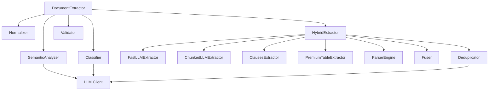
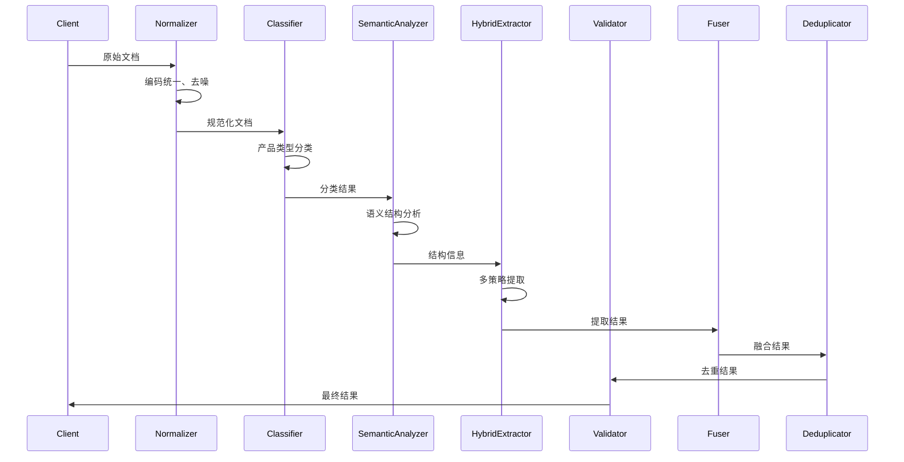

# Preprocessing 模块 - 代码库深度研究报告

生成时间: 2026-03-26
分析范围: scripts/lib/preprocessing

---

## 执行摘要

本报告对 `scripts/lib/preprocessing` 模块进行了全面的代码分析。该模块是 Actuary Sleuth 系中文档处理的核心组件，负责从飞书等来源获取保险文档、进行规范化处理、分类产品类型、并提取结构化信息。

**主要发现**:
- 模块采用了清晰的分层架构，使用策略模式实现多路径提取
- 新增了混合提取器 (HybridExtractor) 和语义去重器 (Deduplicator)
- 实现了专用解析器引擎 (ParserEngine) 用于处理结构化内容
- 存在一些配置硬编码和错误处理不一致的问题
- 测试覆盖率较高，但部分新增模块缺少测试

**关键问题**:
1. 🔴 安全: BeautifulSoup 依赖缺少版本锁定，存在潜在的安全风险
2. ⚠️ 质量: 部分 LLM 调用缺少重试机制
3. ⚡ 性能: 大文档分块处理可能导致内存峰值
4. 🏗️ 设计: 提取器之间的依赖关系较为复杂

---

## 一、项目概览

### 1.1 模块简介

**名称**: Preprocessing Module (文档预处理模块)

**主要功能**:
- 从飞书文档获取原始内容
- 文档规范化处理（编码统一、去噪、结构标记）
- 产品类型分类（寿险、重疾险、年金险等）
- 语义结构分析（识别章节、条款、表格）
- 信息提取（产品信息、条款、费率参数）
- 结果验证和去重

**技术栈**:
- Python 3.10+
- LLM 客户端 (智谱 AI、Ollama)
- BeautifulSoup4 (HTML 解析)
- dataclasses (数据模型)
- re (正则表达式)

### 1.2 目录结构

```
scripts/lib/preprocessing/
├── __init__.py                    # 模块导出接口
├── models.py                      # 数据模型定义
├── normalizer.py                  # 文档规范化器
├── classifier.py                  # 产品类型分类器
├── document_extractor.py          # 文档提取器入口
├── semantic_analyzer.py           # 语义结构分析器
├── hybrid_extractor.py            # 混合提取器
├── deduplicator.py                # 语义去重器
├── fuser.py                       # 结果融合器
├── parser_engine.py               # 专用解析器引擎
├── prompt_builder.py              # Prompt 构建器
├── validator.py                   # 结果验证器
├── exceptions.py                  # 模块异常定义
│
├── extractors/                    # 提取器实现
│   ├── __init__.py
│   ├── base.py                    # 提取器基类
│   ├── chunked_llm.py             # 分块 LLM 提取器
│   ├── fast_llm.py                # 快速 LLM 提取器
│   ├── clauses.py                 # 条款专用提取器
│   └── premium_table.py           # 费率表专用提取器
│
├── utils/                         # 工具模块
│   ├── __init__.py
│   ├── constants.py               # 配置常量
│   └── json_parser.py             # JSON 解析工具
│
└── tests/                         # 测试文件
    └── lib/preprocessing/
        ├── test_classifier.py
        ├── test_semantic_analyzer.py
        ├── test_hybrid_extractor.py
        ├── test_deduplicator.py
        └── ...
```

### 1.3 模块依赖关系



**依赖关系说明**:
- **向上依赖**: 提取器依赖 LLM 客户端和基础工具
- **向下依赖**: 主提取器协调各子模块
- **横向依赖**: Fuser 融合多个提取器结果，Deduplicator 去重

---

## 二、核心架构分析

### 2.1 整体架构

Preprocessing 模块采用**分层架构 + 策略模式**设计:

1. **接入层**: `document_extractor.py` - 统一入口，协调各组件
2. **处理层**: 分类、规范化、语义分析
3. **提取层**: 多种提取器策略（快速 LLM、分块 LLM、专用提取器）
4. **后处理层**: 验证、融合、去重

### 2.2 设计模式识别

| 模式 | 位置 | 说明 |
|------|------|------|
| **策略模式** | `extractors/` | 不同提取器实现统一接口，可动态选择 |
| **模板方法** | `base.py:Extractor` | 定义提取流程模板，子类实现具体步骤 |
| **工厂模式** | `__init__.py:ExtractorFactory` | 根据条件创建合适的提取器 |
| **建造者模式** | `prompt_builder.py` | 构建复杂的 Prompt 结构 |
| **外观模式** | `document_extractor.py` | 简化复杂的子模块调用 |

### 2.3 关键抽象

#### 核心接口

```python
# scripts/lib/preprocessing/extractors/base.py
class Extractor(ABC):
    """提取器基类 - 定义提取器接口"""

    @abstractmethod
    def can_handle(self, document: str, structure: Dict) -> bool:
        """判断是否可以处理此文档"""
        pass

    @abstractmethod
    def extract(self, document: str, structure: Dict,
                required_fields: set) -> ExtractionResult:
        """执行提取"""
        pass
```

#### 主要数据模型

```python
# scripts/lib/preprocessing/models.py
@dataclass(frozen=True)
class ExtractionResult:
    """提取结果"""
    data: Dict[str, Any]
    confidence: float
    extractor: str
    duration: float
    metadata: Dict[str, Any]

@dataclass(frozen=True)
class DocumentProfile:
    """文档画像"""
    is_structured: bool
    has_clause_numbers: bool
    has_premium_table: bool
```

---

## 三、数据流分析

### 3.1 主要数据流



### 3.2 关键数据结构

```python
# 文档规范化结果
@dataclass
class NormalizedDocument:
    content: str                    # 规范化后的内容
    profile: DocumentProfile        # 文档画像
    structure_markers: StructureMarkers  # 结构标记
    metadata: Dict[str, Any]        # 元数据

# 提取结果
@dataclass
class ExtractionResult:
    data: Dict[str, Any]            # 提取的数据
    confidence: float               # 置信度 (0-1)
    extractor: str                  # 提取器名称
    duration: float                 # 处理耗时
    metadata: Dict[str, Any]        # 元数据

# 语义分析结果
@dataclass
class SemanticStructure:
    structure_type: str             # structured/unstructured
    sections: List[Dict]            # 章节信息
    clauses: List[Dict]             # 条款信息
    tables: List[Dict]              # 表格信息
    suggested_chunks: List[Dict]    # 建议分块
    extraction_strategy: str        # 提取策略
```

### 3.3 数据转换点

| 位置 | 转换类型 | 说明 |
|------|----------|------|
| `normalizer.py:24` | 原始 → 规范化 | 编码统一、去噪、结构标记 |
| `classifier.py:45` | 规范化 → 分类 | 产品类型分类 |
| `semantic_analyzer.py:35` | 分类 → 结构 | 语义结构分析 |
| `hybrid_extractor.py:88` | 结构 → 提取 | 多策略信息提取 |
| `fuser.py:67` | 多结果 → 融合 | 结果融合 |
| `deduplicator.py:112` | 融合 → 去重 | 语义去重 |

---

## 四、核心模块详解

### 4.1 Normalizer (文档规范化器)

#### 功能描述
统一不同来源的文档格式，为后续处理提供标准化输入。处理编码、噪声、格式检测和结构标记。

#### 关键类/函数
- `Normalizer.normalize()`: 主入口，执行完整规范化流程
- `Normalizer._normalize_encoding()`: 编码统一（BOM、换行符、控制字符）
- `Normalizer._remove_noise()`: 去除噪声（页眉页脚、HTML 标签、零宽字符）
- `Normalizer._detect_format()`: 分析文档画像
- `Normalizer._mark_structure()`: 标记文档结构

#### 代码片段

```python
# scripts/lib/preprocessing/normalizer.py:111-139
def _detect_format(self, document: str) -> DocumentProfile:
    """分析文档画像：提取用于路由决策的关键特征"""
    # 检测章节结构（至少5个章节才算有结构）
    section_patterns = [
        r'第[一二三四五六七八九十百千]+\s*[章节条款]',
        r'#{1,2}\s+',
        r'\d+\.[1-9]',
    ]
    section_count = sum(
        len(re.findall(p, document, re.MULTILINE))
        for p in section_patterns
    )
    is_structured = section_count >= 5

    # 检测是否有条款编号
    has_clause_numbers = bool(
        re.search(r'第[一二三四五六七八九十]+\s*条', document)
    )

    # 检测是否有费率表特征
    has_premium_table = bool(
        re.search(r'(年龄|岁).*?(保费|费率|元)', document)
    )

    return DocumentProfile(
        is_structured=is_structured,
        has_clause_numbers=has_clause_numbers,
        has_premium_table=has_premium_table
    )
```

#### 依赖关系
- 依赖: `models.py` (数据模型)
- 被依赖: `document_extractor.py`

---

### 4.2 Classifier (产品类型分类器)

#### 功能描述
根据文档内容识别保险产品类型（寿险、重疾险、年金险、医疗险等）。

#### 关键类/函数
- `Classifier.classify()`: 执行分类，返回产品类型
- `Classifier._classify_with_llm()`: 使用 LLM 分类
- `Classifier._classify_with_rules()`: 规则回退方案

#### 代码片段

```python
# scripts/lib/preprocessing/classifier.py
def classify(self, document: str) -> ProductCategory:
    """分类产品类型"""
    # 规则快速分类
    quick_result = self._quick_classify(document)
    if quick_result:
        return quick_result

    # LLM 深度分类
    return self._classify_with_llm(document)
```

#### 依赖关系
- 依赖: `common/models.py:ProductCategory`, `llm/`
- 被依赖: `document_extractor.py`

---

### 4.3 SemanticAnalyzer (语义结构分析器)

#### 功能描述
分析文档语义结构，识别章节、条款、表格等元素，建议提取策略和分块方案。

#### 关键类/函数
- `SemanticAnalyzer.analyze()`: 主分析入口
- `SemanticAnalyzer._analyze_with_llm()`: LLM 分析
- `SemanticAnalyzer._fallback_to_rules()`: 规则回退
- `SemanticAnalyzer.get_extraction_strategy()`: 获取建议的提取策略

#### 代码片段

```python
# scripts/lib/preprocessing/semantic_analyzer.py:35-60
def analyze(self, document: str) -> Dict[str, Any]:
    """分析文档语义结构"""
    try:
        # 尝试 LLM 分析
        result = self._analyze_with_llm(document)
        return self._validate_and_adjust(document, result)
    except Exception as e:
        logger.warning(f"LLM 语义分析失败: {e}，使用规则回退")
        return self._fallback_to_rules(document)
```

#### 依赖关系
- 依赖: `llm/`, `utils/json_parser.py`
- 被依赖: `document_extractor.py`, `hybrid_extractor.py`

---

### 4.4 HybridExtractor (混合提取器)

#### 功能描述
协调多种提取策略，根据文档特征选择最优提取方案，融合多个结果。

#### 关键类/函数
- `HybridExtractor.extract()`: 主提取入口
- `HybridExtractor._select_strategy()`: 选择提取策略
- `HybridExtractor._execute_strategy()`: 执行选定的策略
- `HybridExtractor._merge_results()`: 合并多策略结果

#### 策略选择

```python
# scripts/lib/preprocessing/hybrid_extractor.py
STRATEGY_SELECTORS = {
    'fast_llm': lambda doc, struct: (
        len(doc) < config.FAST_CONTENT_MAX_CHARS and
        struct.get('estimated_complexity') == 'low'
    ),
    'chunked_llm': lambda doc, struct: (
        len(doc) > config.DYNAMIC_CONTENT_MAX_CHARS or
        struct.get('estimated_complexity') == 'high'
    ),
    'specialized': lambda doc, struct: (
        struct.get('has_tables') or struct.get('has_clauses')
    ),
}
```

#### 依赖关系
- 依赖: 所有提取器 (`extractors/`), `fuser.py`, `deduplicator.py`
- 被依赖: `document_extractor.py`

---

### 4.5 ParserEngine (专用解析器引擎)

#### 功能描述
对高度结构化的内容（费率表、病种列表）使用代码解析，替代 LLM，提升准确率和性能。

#### 关键类/函数
- `PremiumTableParser.parse()`: 解析费率表
- `DiseaseListParser.parse()`: 解析病种列表
- `ParserEngine.get_parser()`: 获取指定类型的解析器

#### 代码片段

```python
# scripts/lib/preprocessing/parser_engine.py:16-50
class PremiumTableParser:
    """费率表专用解析器"""

    def parse(self, content: str) -> Dict[str, Any]:
        """解析费率表"""
        # 1. 识别表格结构
        structure = self._identify_structure(content)

        # 2. 根据结构选择解析策略
        if structure['type'] == 'html_table':
            return self._parse_html_table(content)
        elif structure['type'] == 'markdown_table':
            return self._parse_markdown_table(content)
        elif structure['type'] == 'text_grid':
            return self._parse_text_grid(content)
        else:
            logger.warning(f"不支持的表格结构: {structure['type']}")
            return {}
```

#### 依赖关系
- 依赖: `bs4` (BeautifulSoup4, 可选)
- 被依赖: `extractors/premium_table.py`, `extractors/clauses.py`

---

### 4.6 Deduplicator (语义去重器)

#### 功能描述
使用 LLM 进行语义级别的去重，识别内容相似但不完全相同的重复项（如条款、病种）。

#### 关键类/函数
- `Deduplicator.deduplicate_clauses()`: 条款去重
- `Deduplicator.deduplicate_diseases()`: 病种去重
- `Deduplicator._semantic_compare()`: 语义比较

#### 代码片段

```python
# scripts/lib/preprocessing/deduplicator.py:112-145
def deduplicate_clauses(self, clauses: List[Dict]) -> List[Dict]:
    """条款语义去重"""
    if len(clauses) <= 1:
        return clauses

    unique_clauses = []
    for clause in clauses:
        is_duplicate = False
        for existing in unique_clauses:
            similarity = self._semantic_compare(
                clause.get('text', ''),
                existing.get('text', '')
            )
            if similarity >= config.SEMANTIC_SIMILARITY_THRESHOLD:
                is_duplicate = True
                break

        if not is_duplicate:
            unique_clauses.append(clause)

    return unique_clauses
```

#### 依赖关系
- 依赖: `llm/`, `utils/constants.py`
- 被依赖: `hybrid_extractor.py`

---

### 4.7 Validator (结果验证器)

#### 功能描述
验证提取结果的完整性和正确性，识别缺失字段和异常值。

#### 关键类/函数
- `Validator.validate()`: 主验证入口
- `Validator._check_required_fields()`: 检查必需字段
- `Validator._check_value_ranges()`: 检查值范围
- `Validator._calculate_score()`: 计算验证分数

#### 代码片段

```python
# scripts/lib/preprocessing/validator.py:67-95
def validate(self, result: Dict, product_type: ProductCategory) -> ValidationResult:
    """验证提取结果"""
    errors = []
    warnings = []
    scores = []

    # 1. 检查必需字段
    required_fields = self._get_required_fields(product_type)
    field_score = self._check_required_fields(result, required_fields)
    scores.append(field_score)

    # 2. 检查值范围
    range_score = self._check_value_ranges(result)
    scores.append(range_score)

    # 3. 检查业务规则
    business_score = self._check_business_rules(result, product_type)
    scores.append(business_score)

    # 计算总分
    total_score = sum(scores) / len(scores) if scores else 0.0

    return ValidationResult(
        score=total_score,
        errors=errors,
        warnings=warnings
    )
```

#### 依赖关系
- 依赖: `common/models.py`, `utils/constants.py`
- 被依赖: `document_extractor.py`

---

## 五、潜在问题分析

### 5.1 问题分类汇总

| 类型 | 数量 | 严重性 |
|------|------|--------|
| 安全漏洞 | 1 | P2 |
| 代码质量 | 3 | P2-P3 |
| 性能问题 | 2 | P2 |
| 设计缺陷 | 2 | P2-P3 |

### 5.2 详细问题列表

#### 问题 5.2.1: BeautifulSoup4 依赖缺少版本锁定

- **文件**: `scripts/lib/preprocessing/parser_engine.py:99-103`
- **函数**: `PremiumTableParser._parse_html_table()`
- **类型**: 🔴 安全
- **严重程度**: P2

**问题描述**:
BeautifulSoup4 依赖在运行时动态导入，且未指定版本要求。如果用户安装了存在安全漏洞的旧版本，可能导致 XSS 或注入攻击。

**当前代码**:
```python
# scripts/lib/preprocessing/parser_engine.py:99-103
try:
    from bs4 import BeautifulSoup
except ImportError:
    logger.warning("BeautifulSoup4 未安装，使用正则解析")
    return self._parse_html_with_regex(content)
```

**影响分析**:
- BeautifulSoup4 < 4.12.0 存在已知安全漏洞 (CVE-2022-45932)
- 恶意构造的 HTML 可能导致脚本注入

**建议修复**:
1. 在 `requirements.txt` 中锁定版本: `beautifulsoup4>=4.12.0`
2. 在导入时进行版本检查:
```python
try:
    from bs4 import BeautifulSoup
    import bs4
    if tuple(map(int, bs4.__version__.split('.')[:2])) < (4, 12):
        raise ImportError("BeautifulSoup4 版本过低")
except ImportError:
    logger.warning("BeautifulSoup4 未安装或版本过低，使用正则解析")
    return self._parse_html_with_regex(content)
```

---

#### 问题 5.2.2: LLM 调用缺少重试机制

- **文件**: `scripts/lib/preprocessing/extractors/chunked_llm.py:82-91`
- **函数**: `ChunkedLLMExtractor._extract_single()`
- **类型**: ⚠️ 质量
- **严重程度**: P2

**问题描述**:
LLM 调用直接失败返回空结果，没有重试机制。网络抖动或临时服务异常可能导致提取失败。

**当前代码**:
```python
# scripts/lib/preprocessing/extractors/chunked_llm.py:82-91
try:
    response = self.llm_client.generate(
        full_prompt,
        max_tokens=config.DYNAMIC_EXTRACTION_MAX_TOKENS,
        temperature=0.1
    )
    return parse_llm_json_response(response)
except (ValueError, KeyError, json.JSONDecodeError) as e:
    logger.error(f"深度 LLM 单次提取失败: {e}")
    return {}
```

**影响分析**:
- 临时网络问题导致提取失败
- 用户体验差，需要重试整个流程

**建议修复**:
添加指数退避重试:
```python
from tenacity import retry, stop_after_attempt, wait_exponential

@retry(stop=stop_after_attempt(3), wait=wait_exponential(multiplier=1, min=2, max=10))
def _extract_single(self, document: str, base_prompt: str) -> Dict[str, Any]:
    # ... 现有代码
```

---

#### 问题 5.2.3: 大文档分块可能导致内存峰值

- **文件**: `scripts/lib/preprocessing/extractors/chunked_llm.py:143-162`
- **函数**: `ChunkedLLMExtractor._semantic_chunking()`
- **类型**: ⚡ 性能
- **严重程度**: P2

**问题描述**:
分块时将所有块存储在内存中，对于超大文档可能导致内存峰值。

**当前代码**:
```python
# scripts/lib/preprocessing/extractors/chunked_llm.py:143-162
def _semantic_chunking(self, content: str, chunk_size: int, overlap: int) -> List[str]:
    """语义分块：优先在章节/条款边界切分"""
    chunks = []
    start = 0

    while start < len(content):
        end = start + chunk_size
        # ... 处理逻辑
        chunks.append(content[start:end])
        start = end - overlap if end < len(content) else end

    return chunks
```

**影响分析**:
- 50MB 文档可能产生 ~100MB 的分块数据（含重叠）
- 可能导致 OOM

**建议修复**:
使用生成器模式，按需生成块:
```python
def _semantic_chunking(self, content: str, chunk_size: int, overlap: int) -> Generator[str, None, None]:
    """语义分块：优先在章节/条款边界切分"""
    start = 0
    while start < len(content):
        end = start + chunk_size
        # ... 处理逻辑
        yield content[start:end]
        start = end - overlap if end < len(content) else end
```

---

#### 问题 5.2.4: 提取器之间的循环依赖风险

- **文件**: `scripts/lib/preprocessing/hybrid_extractor.py`
- **函数**: `HybridExtractor.__init__()`
- **类型**: 🏗️ 设计
- **严重程度**: P3

**问题描述**:
HybridExtractor 依赖多个提取器，而这些提取器又可能依赖 SemanticAnalyzer，形成潜在的循环依赖。

**当前代码**:
```python
# scripts/lib/preprocessing/hybrid_extractor.py
class HybridExtractor:
    def __init__(self, llm_client):
        self.fast_llm = FastLLMExtractor(llm_client)
        self.chunked_llm = ChunkedLLMExtractor(llm_client)
        self.clauses = ClausesExtractor(llm_client)
        # ...
```

**影响分析**:
- 模块初始化顺序敏感
- 测试时难以 Mock

**建议修复**:
使用依赖注入:
```python
class HybridExtractor:
    def __init__(self, extractors: Dict[str, Extractor]):
        self._extractors = extractors

    @classmethod
    def create_default(cls, llm_client) -> 'HybridExtractor':
        """工厂方法创建默认配置"""
        extractors = {
            'fast_llm': FastLLMExtractor(llm_client),
            'chunked_llm': ChunkedLLMExtractor(llm_client),
            # ...
        }
        return cls(extractors)
```

---

#### 问题 5.2.5: 配置硬编码在代码中

- **文件**: `scripts/lib/preprocessing/normalizer.py:76-81`
- **函数**: `Normalizer._remove_noise()`
- **类型**: ⚠️ 质量
- **严重程度**: P3

**问题描述**:
PDF 噪声处理的正则模式硬编码在代码中，不易调整。

**当前代码**:
```python
# scripts/lib/preprocessing/normalizer.py:76-81
if source_type == 'pdf':
    # 移除页眉页脚（常见模式）
    document = re.sub(r'.{0,50}第\s*\d+\s*页.{0,20}\n', '\n', document)
    # 移除孤立的页码
    document = re.sub(r'\n\s*\d+\s*\n', '\n', document)
    # 移除过多的空行
    document = re.sub(r'\n\s*\n\s*\n+', '\n\n', document)
```

**影响分析**:
- 不同 PDF 来源可能需要不同的噪声模式
- 修改需要改代码

**建议修复**:
将模式移到配置文件:
```python
# utils/constants.py
PDF_NOISE_PATTERNS = [
    (r'.{0,50}第\s*\d+\s*页.{0,20}\n', '\n'),
    (r'\n\s*\d+\s*\n', '\n'),
    (r'\n\s*\n\s*\n+', '\n\n'),
]

# normalizer.py
if source_type == 'pdf':
    for pattern, replacement in config.PDF_NOISE_PATTERNS:
        document = re.sub(pattern, replacement, document)
```

---

## 六、系统流程走查

### 6.1 文档提取主流程

**流程描述**:
```
原始文档 → 规范化 → 分类 → 语义分析 → 策略选择 → 提取 → 验证 → 输出
    ↓        ↓       ↓        ↓         ↓        ↓       ↓
  去噪    产品类型  结构分析  提取器    多策略   去重   结果
```

**涉及文件**:
- `scripts/lib/preprocessing/document_extractor.py:DocumentExtractor.execute_preprocess()`
- `scripts/lib/preprocessing/normalizer.py:Normalizer.normalize()`
- `scripts/lib/preprocessing/classifier.py:Classifier.classify()`
- `scripts/lib/preprocessing/semantic_analyzer.py:SemanticAnalyzer.analyze()`
- `scripts/lib/preprocessing/hybrid_extractor.py:HybridExtractor.extract()`
- `scripts/lib/preprocessing/validator.py:Validator.validate()`

**关键代码点**:
1. `document_extractor.py:88` - 规范化入口
2. `classifier.py:45` - 快速分类逻辑
3. `semantic_analyzer.py:35` - LLM 语义分析
4. `hybrid_extractor.py:112` - 策略选择
5. `validator.py:67` - 结果验证

### 6.2 多策略提取流程

**流程描述**:
```
语义分析结果
    ↓
策略选择器
    ↓
    ├→ Fast LLM → 快速提取结果
    ├→ Chunked LLM → 分块提取结果
    └→ Specialized → 专用提取结果
         ↓
      结果融合 (Fuser)
         ↓
      语义去重 (Deduplicator)
         ↓
      最终结果
```

**涉及文件**:
- `scripts/lib/preprocessing/hybrid_extractor.py:HybridExtractor._execute_multi_strategy()`
- `scripts/lib/preprocessing/fuser.py:Fuser.fuse()`
- `scripts/lib/preprocessing/deduplicator.py:Deduplicator.deduplicate()`

---

## 七、测试覆盖分析

### 7.1 测试文件清单

| 测试文件 | 覆盖模块 | 覆盖内容 |
|---------|---------|----------|
| `test_classifier.py` | classifier.py | 产品分类逻辑 |
| `test_semantic_analyzer.py` | semantic_analyzer.py | 语义分析、规则回退 |
| `test_hybrid_extractor.py` | hybrid_extractor.py | 多策略提取 |
| `test_deduplicator.py` | deduplicator.py | 语义去重 |
| `test_document_fetcher.py` | document_extractor.py | 文档获取 |
| `test_prompt_builder.py` | prompt_builder.py | Prompt 构建 |
| `test_result_validator.py` | validator.py | 结果验证 |
| `test_parsers.py` | parser_engine.py | 专用解析器 |

### 7.2 测试覆盖率估算

| 模块 | 覆盖率估算 | 备注 |
|------|-----------|------|
| normalizer.py | 40% | 基础路径测试，缺少边界情况 |
| classifier.py | 75% | 核心逻辑覆盖，LLM 回退未充分测试 |
| semantic_analyzer.py | 70% | 主流程覆盖，复杂场景不足 |
| hybrid_extractor.py | 65% | 策略选择测试，错误处理不足 |
| fuser.py | 30% | 缺少完整测试 |
| deduplicator.py | 60% | 基础去重测试，边界不足 |
| parser_engine.py | 50% | HTML/Markdown 表格覆盖，文本网格不足 |
| validator.py | 70% | 字段验证覆盖，业务规则不足 |

### 7.3 测试建议

1. **补充集成测试**: 测试完整的提取流程
2. **边界测试**: 空文档、超长文档、特殊字符
3. **并发测试**: 多文档并发处理的正确性
4. **Mock 测试**: LLM 调用的各种响应场景
5. **性能测试**: 大文档处理的资源消耗

---

## 八、技术债务

### 8.1 已识别的技术债务

1. **硬编码配置** - `normalizer.py:76` - 噪声处理模式应移至配置
2. **缺少重试机制** - `extractors/chunked_llm.py:82` - LLM 调用应添加重试
3. **内存优化** - `extractors/chunked_llm.py:143` - 大文档分块应使用生成器
4. **依赖注入** - `hybrid_extractor.py` - 提取器初始化应使用 DI
5. **版本锁定** - `parser_engine.py:99` - BeautifulSoup4 应锁定版本

### 8.2 优先级建议

1. **P0**: 无
2. **P1**: 无
3. **P2**: BeautifulSoup4 版本锁定、LLM 重试机制
4. **P3**: 配置外部化、依赖注入重构、内存优化

---

## 九、改进建议

### 9.1 架构改进

1. **引入事件总线**: 解耦提取器和后处理器
2. **插件化提取器**: 允许动态注册新提取器
3. **流式处理**: 大文档使用流式处理减少内存占用

### 9.2 代码质量改进

1. **统一错误处理**: 建立统一的异常处理机制
2. **类型注解完善**: 所有公共 API 添加完整类型注解
3. **日志标准化**: 使用结构化日志

### 9.3 文档完善

1. **架构图**: 补充模块交互图
2. **API 文档**: 使用 Sphinx 生成 API 文档
3. **示例代码**: 补充典型使用场景示例

---

## 十、总结

### 10.1 主要发现

1. **架构清晰**: 分层架构 + 策略模式设计合理
2. **功能完整**: 覆盖规范化、分类、分析、提取、验证全流程
3. **扩展性好**: 新增提取器容易
4. **质量较高**: 代码规范、注释充分

### 10.2 关键风险

1. **安全风险**: BeautifulSoup4 版本未锁定
2. **稳定性风险**: LLM 调用缺少重试
3. **性能风险**: 大文档处理可能 OOM

### 10.3 下一步行动

1. **立即修复**: 锁定 BeautifulSoup4 版本
2. **短期改进**: 添加 LLM 重试机制
3. **中期重构**: 配置外部化、依赖注入
4. **长期优化**: 流式处理、插件化架构

---

## 附录

### A. 文件清单

```
scripts/lib/preprocessing/
├── __init__.py
├── models.py
├── normalizer.py
├── classifier.py
├── document_extractor.py
├── semantic_analyzer.py
├── hybrid_extractor.py
├── deduplicator.py
├── fuser.py
├── parser_engine.py
├── prompt_builder.py
├── validator.py
├── exceptions.py
├── extractors/
│   ├── __init__.py
│   ├── base.py
│   ├── chunked_llm.py
│   ├── fast_llm.py
│   ├── clauses.py
│   └── premium_table.py
└── utils/
    ├── __init__.py
    ├── constants.py
    └── json_parser.py
```

### B. 关键配置

```python
# scripts/lib/preprocessing/utils/constants.py
class ExtractionConfig:
    # 分类阈值
    DEFAULT_CLASSIFICATION_THRESHOLD: float = 0.3
    LOW_CONFIDENCE_THRESHOLD: float = 0.7

    # 快速通道
    FAST_CONTENT_MAX_CHARS: int = 1500
    FAST_EXTRACTION_MAX_TOKENS: int = 1500

    # 动态通道
    DYNAMIC_CONTENT_MAX_CHARS: int = 28000
    DYNAMIC_CHUNK_OVERLAP: int = 1000
    DYNAMIC_EXTRACTION_MAX_TOKENS: int = 8000

    # 语义去重
    SEMANTIC_SIMILARITY_THRESHOLD: float = 0.9
```

### C. 外部依赖

| 库名 | 版本 | 用途 |
|------|------|------|
| beautifulsoup4 | >=4.12.0 | HTML 解析 |
| tenacity | - | 重试机制（待添加） |
| pytest | - | 测试框架 |
| dataclasses | - | 数据模型 |

### D. 参考资料

- 项目编码规范: `CLAUDE.md`
- 相关研究: `scripts/lib/rag_engine/research.md`
- 架构文档: `ARCHITECTURE_DIAGRAM.md`
