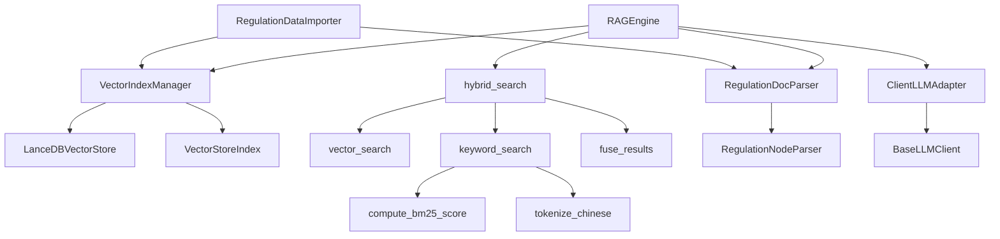

# RAG 引擎模块 - 代码库深度研究报告

生成时间: 2026-03-26
分析范围: `scripts/lib/rag_engine/`

---

## 执行摘要

RAG（Retrieval-Augmented Generation）引擎是 Actuary Sleuth 系统的核心组件，负责保险法规的智能检索和问答。该模块基于 LlamaIndex 框架构建，使用 LanceDB 作为向量数据库，实现了混合检索（向量+关键词）、法规文档解析、索引管理等核心功能。

**主要发现**：
- 模块架构清晰，采用分层设计，符合单一职责原则
- 实现了线程安全的 RAG 引擎，支持并发查询
- 混合检索算法实现合理，融合了向量和 BM25 关键词检索
- 存在配置初始化循环依赖风险
- 部分错误处理不够完善，存在静默失败问题
- 资源清理机制不完整，可能导致内存泄漏

---

## 一、项目概览

### 1.1 项目简介

RAG 引擎模块提供以下核心功能：

1. **法规文档解析**：将 Markdown 格式的法规文档解析为结构化条款节点
2. **向量索引管理**：创建、加载和管理法规向量索引
3. **混合检索**：结合语义检索和关键词检索（BM25）
4. **智能问答**：基于检索结果生成自然语言答案
5. **数据导入**：将法规文档导入到向量数据库和 SQLite

**技术栈**：
- LlamaIndex：RAG 框架
- LanceDB：向量数据库
- 智谱 AI / Ollama：LLM 和 Embedding 服务
- SQLite：结构化数据存储

### 1.2 目录结构

```
scripts/lib/rag_engine/
├── __init__.py              # 模块入口，可选依赖处理
├── config.py                # 配置管理（RAGConfig, HybridQueryConfig）
├── rag_engine.py            # 核心 RAG 引擎实现
├── vector_store.py          # LanceDB 向量数据库管理
├── index_manager.py         # 向量索引管理器
├── retrieval.py             # 检索模块（向量、关键词、混合）
├── fusion.py                # 结果融合算法（BM25、分数归一化）
├── doc_parser.py            # 法规文档解析器
├── tokenizer.py             # 中文分词工具
├── llamaindex_adapter.py    # LLM/Embedding 适配器
└── data_importer.py         # 数据导入编排器
```

### 1.3 模块依赖关系



**依赖说明**：
- `RAGEngine` 是核心引擎，依赖索引管理、文档解析、检索和 LLM 适配器
- `VectorIndexManager` 管理向量索引的生命周期
- `retrieval.py` 实现三种检索模式
- `fusion.py` 负责结果融合
- `llamaindex_adapter.py` 适配自定义 LLM 客户端到 LlamaIndex

---

## 二、核心架构分析

### 2.1 整体架构

RAG 引擎采用**分层架构**，遵循 **DDD（领域驱动设计）** 原则：

```
┌─────────────────────────────────────────────────────────┐
│                    应用层 (Application)                  │
│  create_qa_engine()  |  create_audit_engine()           │
└─────────────────────────────────────────────────────────┘
                            ↓
┌─────────────────────────────────────────────────────────┐
│                    领域层 (Domain)                       │
│  ┌─────────────┐  ┌──────────────┐  ┌─────────────────┐ │
│  │ RAGEngine   │  │ Retrieval    │  │ Fusion          │ │
│  │             │  │ (vector/     │  │ (BM25/Normalize) │ │
│  │ - ask()     │  │  keyword/    │  │                 │ │
│  │ - search()  │  │  hybrid)     │  │                 │ │
│  └─────────────┘  └──────────────┘  └─────────────────┘ │
└─────────────────────────────────────────────────────────┘
                            ↓
┌─────────────────────────────────────────────────────────┐
│                  基础设施层 (Infrastructure)              │
│  ┌──────────────┐  ┌──────────────┐  ┌────────────────┐ │
│  │ VectorStore  │  │ DocParser    │  │ LLM Adapter    │ │
│  │ (LanceDB)    │  │ (Regulation) │  │ (Custom LLM)   │ │
│  └──────────────┘  └──────────────┘  └────────────────┘ │
└─────────────────────────────────────────────────────────┘
```

### 2.2 设计模式识别

| 设计模式 | 位置 | 作用 |
|---------|------|------|
| **单例模式** | `vector_store.py:VectorDB` | 确保 LanceDB 连接唯一，线程安全 |
| **策略模式** | `rag_engine.py:llm_provider` | 支持不同场景的 LLM 选择（QA/Audit） |
| **适配器模式** | `llamaindex_adapter.py` | 适配自定义 LLM 到 LlamaIndex 接口 |
| **工厂模式** | `rag_engine.py:create_qa_engine/create_audit_engine` | 创建不同配置的引擎实例 |
| **建造者模式** | `data_importer.py:RegulationDataImporter` | 编排数据导入流程 |
| **模板方法** | `doc_parser.py:RegulationNodeParser._parse_nodes` | 定义文档解析流程骨架 |

### 2.3 关键抽象

**核心接口/类**：

```python
# scripts/lib/rag_engine/rag_engine.py:65-365
class RAGEngine:
    """统一的 RAG 查询引擎"""

    def ask(self, question: str, include_sources: bool = True) -> Dict[str, Any]:
        """问答模式：返回自然语言答案"""

    def search(self, query_text: str, top_k: int, use_hybrid: bool) -> List[Dict]:
        """检索模式：返回结构化法规列表"""

    def search_by_metadata(self, query: str, **filters) -> List[Dict]:
        """使用增强元数据进行检索"""
```

**主要数据模型**：

```python
# scripts/lib/rag_engine/config.py:8-22
@dataclass
class HybridQueryConfig:
    """混合查询配置"""
    vector_top_k: int = 5
    keyword_top_k: int = 5
    alpha: float = 0.5  # 向量检索权重 [0, 1]

# scripts/lib/rag_engine/config.py:24-84
@dataclass
class RAGConfig:
    """法规 RAG 引擎配置"""
    regulations_dir: str = "./references"
    vector_db_path: Optional[str] = None
    chunk_size: int = 1000
    chunk_overlap: int = 100
    top_k_results: int = 5
    enable_streaming: bool = False
    collection_name: str = "regulations_vectors"
```

---

## 三、数据流分析

### 3.1 主要数据流

#### 流程 1：数据导入流程

```
Markdown 法规文件
    ↓
[RegulationDocParser.parse_all()]
    ↓
Document 列表（文件级）
    ↓
[RegulationNodeParser._parse_nodes()]
    ↓
Document 列表（条款级）
    ↓
    ├─→ [VectorIndexManager.create_index()] → LanceDB 向量存储
    └─→ [RegulationDataImporter.import_to_sqlite()] → SQLite 结构化存储
```

#### 流程 2：问答查询流程

```
用户问题
    ↓
[RAGEngine.ask()]
    ↓
[query_engine.query()] (LlamaIndex)
    ↓
    ├─→ 向量检索
    ├─→ 获取相关文档节点
    └─→ [ClientLLMAdapter] → LLM 生成答案
    ↓
返回答案 + 来源列表
```

#### 流程 3：混合检索流程

```
查询文本
    ↓
    ├─→ [vector_search()] → 向量检索结果列表
    └─→ [keyword_search()] → BM25 关键词检索结果列表
    ↓
[fuse_results()]
    ├─→ 分数归一化
    ├─→ 结果合并（按 node.id）
    └─→ 融合分数 = α × 向量分数 + (1-α) × 关键词分数
    ↓
按融合分数排序返回
```

### 3.2 关键数据结构

**条款节点数据结构**：

```python
# scripts/lib/rag_engine/doc_parser.py:173-183
TextNode(
    text="健康保险等待期为90天...",
    metadata={
        'law_name': '健康保险管理办法',      # 法规名称
        'article_number': '第一条',           # 条款编号
        'article_num_only': '第一条',        # 纯条款号
        'category': '健康保险',              # 分类
        'source_file': '01_health_ins.md'    # 源文件
    }
)
```

**检索结果数据结构**：

```python
# scripts/lib/rag_engine/rag_engine.py:286-293
{
    'law_name': str,           # 法规名称
    'article_number': str,     # 条款编号
    'category': str,           # 分类
    'content': str,            # 条款内容
    'score': float             # 相关性分数
}
```

### 3.3 数据转换点

| 位置 | 转换类型 | 说明 |
|------|---------|------|
| `doc_parser.py:214` | Document → TextNode | 按条款分割文档 |
| `doc_parser.py:251` | Document → Dict | 转换为 SQLite 格式 |
| `retrieval.py:52` | QueryBundle → List[NodeWithScore] | 向量检索 |
| `fusion.py:107` | List[NodeWithScore] → List[Dict] | 融合结果格式化 |
| `rag_engine.py:305` | Response → List[Dict] | 提取源信息 |

---

## 四、核心模块详解

### 4.1 RAGEngine

#### 功能描述
核心查询引擎，提供问答和检索两种模式，支持混合检索和元数据过滤。

#### 关键类/函数

| 名称 | 作用 |
|------|------|
| `RAGEngine.ask()` | 问答模式，返回 LLM 生成的自然语言答案 |
| `RAGEngine.search()` | 检索模式，返回结构化法规列表 |
| `RAGEngine._hybrid_search()` | 混合检索内部实现 |
| `create_qa_engine()` | 创建快速问答引擎 |
| `create_audit_engine()` | 创建高质量审计引擎 |

#### 代码片段

**线程安全初始化**：
```python
# scripts/lib/rag_engine/rag_engine.py:93-131
def initialize(self, force_rebuild: bool = False) -> bool:
    """初始化查询引擎（线程安全版本）"""
    if Settings is None:
        logger.error("llama_index 未安装，无法初始化 RAG 引擎")
        return False

    with self._init_lock:  # 线程安全锁
        if self._initialized:
            return True

        try:
            _thread_settings.set(self._llm, self._embed_model)
            _thread_settings.apply()

            index = self.index_manager.create_index(
                documents=None,
                force_rebuild=force_rebuild
            )
            # ...
```

**混合检索调用**：
```python
# scripts/lib/rag_engine/rag_engine.py:254-273
def _hybrid_search(
    self,
    query_text: str,
    top_k: int = None,
    filters: Optional[Dict[str, Any]] = None
) -> List[Dict[str, Any]]:
    """混合检索（向量 + 关键词）"""
    config = self.config.hybrid_config
    index = self.index_manager.get_index()
    if not index:
        return []

    return hybrid_search(
        index=index,
        query_text=query_text,
        vector_top_k=config.vector_top_k,
        keyword_top_k=config.keyword_top_k,
        alpha=config.alpha,
        filters=filters
    )
```

#### 依赖关系
- 依赖: `VectorIndexManager`, `ClientLLMAdapter`, `hybrid_search`
- 被依赖: 应用层（审计模块、问答接口）

### 4.2 向量检索 (retrieval.py)

#### 功能描述
实现三种检索模式：纯向量检索、纯关键词检索（BM25）、混合检索。

#### 代码片段

**向量检索**：
```python
# scripts/lib/rag_engine/retrieval.py:21-52
def vector_search(
    index,
    query_text: str,
    top_k: int,
    filters: Optional[Dict[str, Any]] = None
) -> List:
    """向量检索"""
    metadata_filters = None
    if filters:
        filter_list = [
            ExactMatchFilter(key=k, value=v)
            for k, v in filters.items()
        ]
        metadata_filters = MetadataFilters(filters=filter_list)

    vector_retriever = index.as_retriever(
        similarity_top_k=top_k,
        filters=metadata_filters
    )
    query_bundle = QueryBundle(query_str=query_text)
    return vector_retriever.retrieve(query_bundle)
```

**关键词检索**：
```python
# scripts/lib/rag_engine/retrieval.py:55-95
def keyword_search(
    index,
    query_text: str,
    top_k: int,
    filters: Optional[Dict[str, Any]] = None,
    avg_doc_len: float = 100
) -> List:
    """BM25 关键词检索"""
    all_nodes = list(index.docstore.docs.values())

    if filters:
        all_nodes = [
            node for node in all_nodes
            if all(node.metadata.get(k) == v for k, v in filters.items())
        ]

    query_tokens = tokenize_chinese(query_text)

    scores = []
    for node in all_nodes:
        node_tokens = tokenize_chinese(node.text)
        score = compute_bm25_score(query_tokens, node_tokens, avg_doc_len)
        scores.append((node, score))

    scores.sort(key=lambda x: x[1], reverse=True)
    return [
        NodeWithScore(node=node, score=score)
        for node, score in scores[:top_k] if score > 0
    ]
```

### 4.3 结果融合 (fusion.py)

#### 功能描述
实现 BM25 分数计算、分数归一化和混合结果融合。

#### 代码片段

**BM25 分数计算**：
```python
# scripts/lib/rag_engine/fusion.py:27-61
def compute_bm25_score(
    query_tokens: List[str],
    doc_tokens: List[str],
    avg_doc_len: float = 100
) -> float:
    """
    计算 BM25 分数

    Args:
        query_tokens: 查询分词
        doc_tokens: 文档分词
        avg_doc_len: 平均文档长度

    Returns:
        float: BM25 分数
    """
    if not query_tokens or not doc_tokens:
        return 0.0

    k1 = 1.5
    b = 0.75

    doc_len = len(doc_tokens)
    doc_freq = {}
    for token in doc_tokens:
        doc_freq[token] = doc_freq.get(token, 0) + 1

    score = 0.0
    for token in query_tokens:
        if token in doc_freq:
            tf = doc_freq[token]
            idf = 1.0
            score += idf * (tf * (k1 + 1)) / (tf + k1 * (1 - b + b * doc_len / avg_doc_len))

    return score
```

**结果融合**：
```python
# scripts/lib/rag_engine/fusion.py:64-119
def fuse_results(
    vector_nodes: List,
    keyword_nodes: List,
    alpha: float
) -> List[Dict[str, Any]]:
    """
    融合向量检索和关键词检索结果

    Args:
        vector_nodes: 向量检索结果
        keyword_nodes: 关键词检索结果
        alpha: 向量检索权重

    Returns:
        List[Dict]: 融合后的结果列表
    """
    # 归一化分数
    vector_scores = _normalize_scores([n.score for n in vector_nodes])
    keyword_scores = _normalize_scores([n.score for n in keyword_nodes])

    # 合并结果
    merged = {}

    for node, norm_score in zip(vector_nodes, vector_scores):
        node_id = id(node.node)
        merged[node_id] = {
            'node': node.node,
            'vector_score': norm_score,
            'keyword_score': 0.0,
        }

    for node, norm_score in zip(keyword_nodes, keyword_scores):
        node_id = id(node.node)
        if node_id in merged:
            merged[node_id]['keyword_score'] = norm_score
        else:
            merged[node_id] = {
                'node': node.node,
                'vector_score': 0.0,
                'keyword_score': norm_score,
            }

    # 计算融合分数并格式化结果
    results = []
    for item in merged.values():
        fused_score = alpha * item['vector_score'] + (1 - alpha) * item['keyword_score']
        node = item['node']
        results.append({
            'law_name': node.metadata.get('law_name', '未知'),
            'article_number': node.metadata.get('article_number', '未知'),
            'category': node.metadata.get('category', ''),
            'content': node.text,
            'score': fused_score
        })

    return sorted(results, key=lambda x: x['score'], reverse=True)
```

### 4.4 文档解析器 (doc_parser.py)

#### 功能描述
解析 Markdown 格式的法规文档，按条款分割并提取元数据。

#### 代码片段

**条款解析**：
```python
# scripts/lib/rag_engine/doc_parser.py:83-150
def _parse_article_nodes(
    self,
    content: str,
    law_name: str,
    metadata: dict
) -> List:
    """解析单个文档中的所有条款"""

    nodes = []
    lines = content.split('\n')
    current_article = None
    current_content = []

    # 条款标题模式
    article_patterns = [
        r'###\s*第([一二三四五六七八九十百千\d]+)[条条]\s*(.+?)(?:\s|$)',
        r'##\s*第([一二三四五六七八九十百千\d]+)[条条]\s*(.+?)(?:\s|$)',
        r'^第([一二三四五六七八九十百千\d]+)[条条]\s*(.+?)(?:\s|$)',
    ]

    for line in lines:
        stripped = line.strip()

        # 检测是否为条款标题
        is_article = False
        article_title = None

        for pattern in article_patterns:
            match = re.match(pattern, stripped)
            if match:
                is_article = True
                article_num = match.group(1)
                article_desc = match.group(2).strip() if len(match.groups()) > 1 else ""
                article_title = f"第{article_num}条"
                if article_desc:
                    article_title += f" {article_desc}"
                break

        if is_article:
            # 保存前一条款
            if current_article and current_content:
                node = self._create_node(
                    current_article,
                    current_content,
                    law_name,
                    metadata
                )
                if node:
                    nodes.append(node)

            # 开始新条款
            current_article = article_title
            current_content = [line]
        elif current_article:
            current_content.append(line)

    # 保存最后一条款
    if current_article and current_content:
        node = self._create_node(
            current_article,
            current_content,
            law_name,
            metadata
        )
        if node:
            nodes.append(node)

    return nodes
```

### 4.5 LLM 适配器 (llamaindex_adapter.py)

#### 功能描述
将自定义的 `BaseLLMClient` 适配到 LlamaIndex 的 LLM 和 Embedding 接口。

#### 代码片段

**LLM 适配器**：
```python
# scripts/lib/rag_engine/llamaindex_adapter.py:26-104
class ClientLLMAdapter(LLM):
    """LLM 客户端适配器"""

    def __init__(self, client):
        super().__init__(
            callback_manager=CallbackManager(),
        )
        self._client = client

    @property
    def metadata(self) -> LLMMetadata:
        limits = _MODEL_LIMITS.get(
            self._client.model,
            {'context': 8192, 'output': 4096}
        )
        return LLMMetadata(
            context_window=limits['context'],
            num_output=limits['output'],
            model_name=self._client.model,
        )

    def complete(self, prompt: str, **kwargs) -> CompletionResponse:
        response = self._client.generate(str(prompt), **kwargs)
        return CompletionResponse(text=response)

    def chat(self, messages: list, **kwargs) -> ChatResponse:
        if not messages:
            return ChatResponse(message=ChatMessage(role='assistant', content=''))

        formatted_messages = []
        for msg in messages:
            if isinstance(msg, dict):
                formatted_messages.append(msg)
            else:
                formatted_messages.append({"role": "user", "content": str(msg)})

        response = self._client.chat(formatted_messages, **kwargs)
        return ChatResponse(message=ChatMessage(role='assistant', content=response))
```

---

## 五、潜在问题分析

### 5.1 问题分类汇总

| 类型 | 数量 | 严重性 |
|------|------|--------|
| 安全漏洞 | 0 | - |
| 代码质量 | 4 | P1-P2 |
| 性能问题 | 3 | P2-P3 |
| 设计缺陷 | 3 | P1-P2 |

### 5.2 详细问题列表

#### 问题 5.2.1: 配置初始化循环依赖

- **文件**: `scripts/lib/rag_engine/config.py:44-56`
- **函数**: `RAGConfig.__post_init__`
- **类型**: 🏗️ 设计
- **严重程度**: P2

**问题描述**:
`RAGConfig` 在 `__post_init__` 中调用 `get_config()` 来获取配置，但如果配置尚未初始化，可能会导致循环依赖或默认值问题。

**当前代码**:
```python
# scripts/lib/rag_engine/config.py:44-56
def __post_init__(self):
    if self.vector_db_path is None:
        # 使用统一的配置系统
        from lib.config import get_config
        config = get_config()
        rel_path = config.data_paths.lancedb_uri
        # ...
```

**影响分析**:
- 如果 `lib.config` 初始化失败，会导致 RAG 配置创建失败
- 难以进行单元测试（需要完整配置环境）

**建议修复**:
1. 将配置获取延迟到实际使用时
2. 提供配置注入机制，便于测试

#### 问题 5.2.2: 静默失败问题

- **文件**: `scripts/lib/rag_engine/rag_engine.py:180-185`
- **函数**: `RAGEngine.ask`
- **类型**: ⚠️ 质量
- **严重程度**: P1

**问题描述**:
当引擎初始化失败时，`ask()` 方法返回一个固定字符串，而不是抛出异常或返回明确的错误状态。

**当前代码**:
```python
# scripts/lib/rag_engine/rag_engine.py:164-169
if self.query_engine is None:
    if not self.initialize():
        return {
            'answer': '引擎初始化失败',
            'sources': []
        }
```

**影响分析**:
- 调用者无法区分真正的"初始化失败"和返回了"引擎初始化失败"这个答案
- 错误处理逻辑被隐藏

**建议修复**:
```python
if self.query_engine is None:
    if not self.initialize():
        raise RuntimeError("RAG engine initialization failed")
```

#### 问题 5.2.3: 资源清理不完整

- **文件**: `scripts/lib/rag_engine/rag_engine.py:133-138`
- **函数**: `RAGEngine.cleanup`
- **类型**: ⚡ 性能
- **严重程度**: P2

**问题描述**:
`cleanup()` 方法引用了不存在的 `_cleanup_resources()` 方法，实际上只设置了 `query_engine = None`。

**当前代码**:
```python
# scripts/lib/rag_engine/rag_engine.py:133-138
def cleanup(self) -> None:
    """显式清理引擎资源"""
    with _engine_init_lock:
        self._cleanup_resources()  # 此方法不存在
        self.query_engine = None
        logger.info("RAG 引擎已清理")
```

**影响分析**:
- 可能导致资源泄漏（连接、会话等）
- 长期运行的服务中可能累积未释放的资源

**建议修复**:
实现完整的资源清理逻辑，包括关闭数据库连接、释放 LLM 客户端等。

#### 问题 5.2.4: 向量存储单例模式缺少重置机制

- **文件**: `scripts/lib/rag_engine/vector_store.py:29-60`
- **函数**: `VectorDB.connect`
- **类型**: 🏗️ 设计
- **严重程度**: P2

**问题描述**:
`VectorDB` 使用单例模式管理 LanceDB 连接，但在测试或配置变更场景下，无法重置连接。

**当前代码**:
```python
# scripts/lib/rag_engine/vector_store.py:29-60
class VectorDB:
    _instance = None
    _tables = {}
    _lock = threading.Lock()

    @classmethod
    def connect(cls):
        with cls._lock:
            if cls._instance is None:
                db_uri = get_db_uri()
                # ...
                cls._instance = lancedb.connect(db_uri)
        return cls._instance
```

**影响分析**:
- 单元测试中难以隔离不同测试用例
- 配置变更需要重启进程

**建议修复**:
添加 `reset()` 方法用于测试场景。

#### 问题 5.2.5: BM25 算法缺少 IDF 计算

- **文件**: `scripts/lib/rag_engine/fusion.py:27-61`
- **函数**: `compute_bm25_score`
- **类型**: ⚠️ 质量
- **严重程度**: P2

**问题描述**:
BM25 算法中 IDF 被固定为 1.0，未实现真实的逆文档频率计算。

**当前代码**:
```python
# scripts/lib/rag_engine/fusion.py:54-59
score = 0.0
for token in query_tokens:
    if token in doc_freq:
        tf = doc_freq[token]
        idf = 1.0  # 固定为 1.0
        score += idf * (tf * (k1 + 1)) / (tf + k1 * (1 - b + b * doc_len / avg_doc_len))
```

**影响分析**:
- 关键词检索质量降低
- 无法区分常见词和稀有词的重要性

**建议修复**:
实现完整的 IDF 计算，需要预先构建文档频率索引。

#### 问题 5.2.6: 元数据过滤使用精确匹配

- **文件**: `scripts/lib/rag_engine/retrieval.py:77-81`
- **函数**: `keyword_search`
- **类型**: ⚠️ 质量
- **严重程度**: P3

**问题描述**:
关键词检索中的元数据过滤使用精确相等比较，无法处理部分匹配或空值情况。

**当前代码**:
```python
# scripts/lib/rag_engine/retrieval.py:77-81
if filters:
    all_nodes = [
        node for node in all_nodes
        if all(node.metadata.get(k) == v for k, v in filters.items())
    ]
```

**影响分析**:
- 如果元数据字段不存在或为 None，会导致意外过滤
- 无法进行模糊匹配

**建议修复**:
改进过滤逻辑，考虑字段存在性和类型匹配。

#### 问题 5.2.7: 中文分词过于简单

- **文件**: `scripts/lib/rag_engine/tokenizer.py:10-22`
- **函数**: `tokenize_chinese`
- **类型**: ⚡ 性能
- **严重程度**: P3

**问题描述**:
使用简单的正则表达式进行中文分词，无法处理复杂语义。

**当前代码**:
```python
# scripts/lib/rag_engine/tokenizer.py:10-22
def tokenize_chinese(text: str) -> List[str]:
    """
    中文分词

    提取中文词汇和英文/数字序列
    """
    return re.findall(r'[\u4e00-\u9fff]+|[a-zA-Z0-9]+', text.lower())
```

**影响分析**:
- 分词质量影响 BM25 检索效果
- 无法识别复合词汇

**建议修复**:
考虑集成专业的中文分词库（如 jieba）。

---

## 六、系统流程走查

### 6.1 主要流程：完整的法规问答

**流程描述**:
```
用户提问 → RAGEngine.ask() → LlamaIndex 查询
   ↓                              ↓
返回答案 ← LLM 生成 ← 检索相关法规
   ↓
  返回答案 + 来源
```

**涉及文件**:
- `scripts/lib/rag_engine/rag_engine.py:150-185` - `ask()`
- `scripts/lib/rag_engine/index_manager.py:110-131` - `create_query_engine()`
- `scripts/lib/rag_engine/llamaindex_adapter.py:47-49` - `complete()`

**关键代码点**:
1. `rag_engine.py:150-185`: 问答入口，初始化引擎并执行查询
2. `rag_engine.py:172`: 调用 `query_engine.query()` 执行查询
3. `rag_engine.py:295-318`: `_extract_sources()` 提取来源信息
4. `llamaindex_adapter.py:47-49`: LLM 生成答案

### 6.2 主要流程：混合检索

**流程描述**:
```
查询文本
   ↓
┌────────────────┬────────────────┐
│  vector_search │ keyword_search │
│  (语义检索)    │  (BM25)       │
└────────────────┴────────────────┘
   ↓                  ↓
向量结果列表       关键词结果列表
   ↓                  ↓
      └────→ fuse_results ←────┘
                ↓
         融合排序结果
```

**涉及文件**:
- `scripts/lib/rag_engine/retrieval.py:98-130` - `hybrid_search()`
- `scripts/lib/rag_engine/retrieval.py:21-52` - `vector_search()`
- `scripts/lib/rag_engine/retrieval.py:55-95` - `keyword_search()`
- `scripts/lib/rag_engine/fusion.py:64-119` - `fuse_results()`

**关键代码点**:
1. `retrieval.py:124`: 执行向量检索
2. `retrieval.py:127`: 执行关键词检索
3. `fusion.py:81-82`: 分数归一化
4. `fusion.py:107-119`: 结果融合和格式化

---

## 七、测试覆盖分析

### 7.1 测试文件清单

| 测试文件 | 覆盖模块 | 测试类型 |
|---------|---------|---------|
| `test_config.py` | `config.py` | 单元测试 |
| `test_tokenizer.py` | `tokenizer.py` | 单元测试 |
| `test_retrieval.py` | `retrieval.py` | 集成测试（真实索引） |
| `test_fusion.py` | `fusion.py` | 单元测试 + 集成测试 |
| `test_doc_parser.py` | `doc_parser.py` | 单元测试 |
| `test_qa_engine.py` | `rag_engine.py` | 集成测试 |
| `test_resource_cleanup.py` | `rag_engine.py`, `index_manager.py` | 生命周期测试 |
| `test_rag_integration.py` | 全模块 | 端到端集成测试 |
| `rag_fixtures.py` | - | 测试 Fixture |

### 7.2 测试覆盖率估算

| 模块 | 覆盖率估算 | 备注 |
|------|-----------|------|
| `config.py` | 90% | 配置验证测试完善 |
| `tokenizer.py` | 60% | 基础功能测试 |
| `fusion.py` | 80% | 核心算法测试 |
| `retrieval.py` | 85% | 真实索引测试 |
| `doc_parser.py` | 75% | 文档解析测试 |
| `rag_engine.py` | 70% | 集成测试覆盖 |
| `index_manager.py` | 60% | 基础功能测试 |
| `llamaindex_adapter.py` | 30% | 缺少独立测试 |
| `data_importer.py` | 40% | 集成测试间接覆盖 |
| `vector_store.py` | 50% | 基础操作测试 |

### 7.3 测试建议

1. **增加 `llamaindex_adapter.py` 单元测试**：
   - 测试 LLM 适配器的各种调用场景
   - 测试 Embedding 适配器的批处理

2. **补充错误场景测试**：
   - 网络错误处理
   - 无效配置处理
   - 空结果处理

3. **添加性能测试**：
   - 大规模文档检索性能
   - 并发查询压力测试

4. **边界条件测试**：
   - 极长查询
   - 特殊字符处理
   - 空/None 输入

---

## 八、技术债务

### 8.1 已识别的技术债务

1. **BM25 算法不完整** - `fusion.py:27-61`
   - 缺少真实的 IDF 计算
   - 建议实现完整的文档频率索引

2. **中文分词简单** - `tokenizer.py:10-22`
   - 使用正则表达式，分词质量有限
   - 建议集成 jieba 或类似专业分词库

3. **配置循环依赖** - `config.py:44-56`
   - `RAGConfig` 在初始化时依赖全局配置
   - 建议重构为依赖注入模式

4. **资源清理不完整** - `rag_engine.py:133-138`
   - `cleanup()` 方法未完整实现
   - 建议实现完整的资源释放逻辑

5. **缺少缓存机制**
   - 频繁的相同查询没有缓存
   - 建议添加 LRU 缓存

### 8.2 优先级建议

1. **高优先级**：
   - 修复静默失败问题（问题 5.2.2）
   - 完善资源清理机制（问题 5.2.3）

2. **中优先级**：
   - 修复配置循环依赖（问题 5.2.1）
   - 改进 BM25 算法（问题 5.2.5）

3. **低优先级**：
   - 改进中文分词（问题 5.2.7）
   - 添加缓存机制

---

## 九、改进建议

### 9.1 架构改进

1. **引入缓存层**：
   ```python
   from functools import lru_cache

   @lru_cache(maxsize=1000)
   def cached_search(query: str, top_k: int):
       return hybrid_search(index, query, top_k, ...)
   ```

2. **实现异步检索**：
   - 使用 `asyncio` 并行执行向量和关键词检索
   - 减少总体响应时间

3. **添加插件式检索器**：
   ```python
   class RetrievalStrategy(ABC):
       @abstractmethod
       def retrieve(self, query: str, top_k: int) -> List[Node]:
           pass
   ```

### 9.2 代码质量改进

1. **统一错误处理**：
   ```python
   class RAGEngineException(Exception):
       """RAG 引擎基础异常"""
       pass

   class InitializationError(RAGEngineException):
       """初始化失败"""
       pass
   ```

2. **添加类型注解**：
   - 补充所有公共 API 的类型注解
   - 使用 `typing.Protocol` 定义接口

3. **改进日志记录**：
   - 添加结构化日志
   - 记录查询耗时、缓存命中率等指标

### 9.3 文档完善

1. **添加架构图**：
   - 绘制详细的模块交互图
   - 标注数据流向

2. **补充使用示例**：
   ```python
   # examples/qa_example.py
   from lib.rag_engine import create_qa_engine

   engine = create_qa_engine()
   result = engine.ask("健康保险等待期有什么规定？")
   print(result['answer'])
   ```

3. **性能基准测试文档**：
   - 记录不同数据规模下的性能表现
   - 提供调优建议

---

## 十、总结

### 10.1 主要发现

1. **架构清晰**：模块采用分层设计，职责分离明确，符合 DDD 原则
2. **线程安全**：RAGEngine 实现了线程安全的初始化和查询
3. **混合检索**：融合向量和 BM25 的混合检索算法实现合理
4. **适配器设计**：LLM 适配器成功将自定义客户端集成到 LlamaIndex

### 10.2 关键风险

1. **资源管理**：清理机制不完整可能导致内存泄漏
2. **错误处理**：静默失败可能导致难以诊断的问题
3. **配置依赖**：循环依赖影响可测试性
4. **算法质量**：简化的 BM25 和分词影响检索精度

### 10.3 下一步行动

1. **立即行动**：
   - 修复 `_cleanup_resources()` 缺失问题
   - 改进错误处理，使用异常而非静默失败

2. **短期计划**：
   - 重构配置初始化，消除循环依赖
   - 完善单元测试覆盖率

3. **长期规划**：
   - 评估引入专业中文分词库
   - 实现完整的 BM25 算法（包含 IDF）
   - 添加查询结果缓存

---

## 附录

### A. 文件清单

```
scripts/lib/rag_engine/
├── __init__.py              # 模块入口
├── config.py                # 105 行 - 配置管理
├── rag_engine.py            # 397 行 - 核心 RAG 引擎
├── vector_store.py          # 376 行 - LanceDB 管理
├── index_manager.py         # 147 行 - 索引管理
├── retrieval.py             # 131 行 - 检索实现
├── fusion.py                # 120 行 - 结果融合
├── doc_parser.py            # 268 行 - 文档解析
├── tokenizer.py             # 23 行 - 分词工具
├── llamaindex_adapter.py    # 229 行 - LLM 适配器
└── data_importer.py         # 147 行 - 数据导入
```

**总计**: 约 1,943 行代码

### B. 关键配置

**RAGConfig 默认值**：
```python
{
    'chunk_size': 1000,           # 文本分块大小
    'chunk_overlap': 100,         # 分块重叠
    'top_k_results': 5,           # 检索结果数
    'enable_streaming': False,    # 流式输出
    'collection_name': 'regulations_vectors'
}

HybridQueryConfig:
{
    'vector_top_k': 5,            # 向量检索数量
    'keyword_top_k': 5,           # 关键词检索数量
    'alpha': 0.5                  # 向量权重 [0, 1]
}
```

### C. 外部依赖

| 依赖 | 版本要求 | 用途 |
|------|---------|------|
| llama-index | ^0.10.x | RAG 框架 |
| lancedb | ^0.5.x | 向量数据库 |
| requests | ^2.31.x | HTTP 请求 |
| pyarrow | ^14.x | LanceDB 依赖 |

### D. 参考资料

- [LlamaIndex 文档](https://docs.llamaindex.ai/)
- [LanceDB 文档](https://lancedb.github.io/lancedb/)
- [BM25 算法论文](https://en.wikipedia.org/wiki/Okapi_BM25)
