# Actuary Sleuth — 4A 架构设计文档

> 版本：2.0
> 日期：2026-04-13
> 状态：待审查
> 框架参考：TOGAF ADM / arc42 / Zachman

---

## 1. 架构愿景与范围

### 1.1 系统定位

Actuary Sleuth 是面向**保险精算领域**的 AI 法规知识平台，核心价值是让精算人员高效获取**可追溯、可信赖**的法规解答，并通过评测-反馈闭环持续提升 RAG 质量。

### 1.2 干系人与关注点

| 干系人 | 角色 | 核心关注 |
|--------|------|---------|
| 精算师 | 终端用户 | 回答准确性、引用可追溯、响应速度 |
| 知识管理员 | 运营 | 知识库更新效率、版本可回滚 |
| 系统架构师 | 研发 | 模块可维护性、LLM 可切换、扩展性 |
| 质量工程师 | 质保 | 评测指标体系、回归能力 |

### 1.3 架构原则

| 编号 | 原则 | 说明 |
|------|------|------|
| AP-01 | 业务驱动 | 技术选型服务于业务能力，不为技术而技术 |
| AP-02 | 质量可度量 | 所有 RAG 能力必须可评测（检索+生成双维度） |
| AP-03 | 反馈即改进 | 用户反馈自动回流为 Badcase，驱动知识库迭代 |
| AP-04 | 模型无关 | LLM 通过抽象层解耦，支持多云/本地切换 |
| AP-05 | 知识可回滚 | 知识库版本化管理，支持快照创建、切换、删除 |
| AP-06 | 简单优先 | 单机部署优先，避免引入分布式复杂性 |

### 1.4 4A 层间关系

```
业务架构 (Business)
    │ 业务能力 + 价值流
    │ ───── 驱动 ─────▼
数据架构 (Data) ←→ 应用架构 (Application)
    │ 数据实体/CRUD      应用组件/接口
    │ ───── 承载于 ─────▼
技术架构 (Technology)
      基础设施 + 平台 + 中间件
```

- 业务架构自顶向下驱动需求和约束
- 数据架构与应用架构**并行设计**、相互支撑（CRUD 矩阵对齐）
- 技术架构自底向上提供能力支撑

---

## 2. 业务架构 (Business Architecture)

### 2.1 业务能力地图

采用 L1-L3 分层，技术无关、相对稳定。

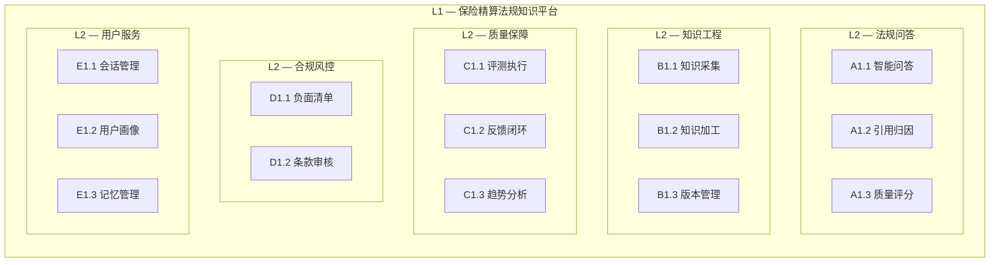

### 2.2 价值流：法规问答端到端

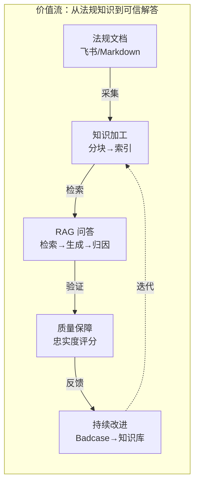

### 2.3 业务能力与应用/数据映射矩阵

> 这是 4A 框架中**最核心的可追溯性制品**，确保每个技术组件都能回溯到业务能力。

| 业务能力 (L2) | 支撑应用组件 | 数据实体 (CRUD) | 关键 API |
|-------------|-------------|-----------------|---------|
| 法规问答 | RAGEngine, LangGraph, LLMClientFactory | messages (C), sessions (CR), traces (C) | POST /api/ask/chat |
| 引用归因 | AttributionEngine, QualityDetector | messages.citations (C) | — (内嵌于问答) |
| 质量评分 | QualityDetector, LLMReranker | feedback (C), traces (C) | — (内嵌于问答) |
| 知识采集 | KnowledgeBuilder | kb_versions (C), references (R) | POST /api/kb/import |
| 知识加工 | ChecklistChunker, VectorIndexManager, BM25Index | LanceDB (C), bm25_index (C) | POST /api/kb/rebuild |
| 版本管理 | KBManager | kb_versions (CRUD) | POST /api/kb-version/create |
| 评测执行 | RetrievalEvaluator, GenerationEvaluator | eval_samples (R), eval_runs (C) | POST /api/eval/evaluations |
| 反馈闭环 | FeedbackRouter, BackgroundTasks | feedback (C), eval_samples (U) | POST /api/feedback |
| 趋势分析 | EvalGuide | eval_runs (R) | POST /api/eval/compare |
| 负面清单 | ComplianceRouter | negative_list (R) | POST /api/compliance/check |
| 会话管理 | AskRouter | sessions (CRUD), messages (CR) | GET /api/ask/sessions |
| 用户画像 | MemoryService, ProfileExtractor | user_profiles (CRU), memory_metadata (CRUD) | GET/PATCH /api/memory/profile |
| 记忆管理 | MemoryService, Mem0AI | memory_metadata (CRUD), LanceDB-mem (CRUD) | — (自动触发) |

> CRUD: C=Create, R=Read, U=Update, D=Delete

### 2.4 核心业务流程

#### 智能问答主流程 (BPMN 简化)

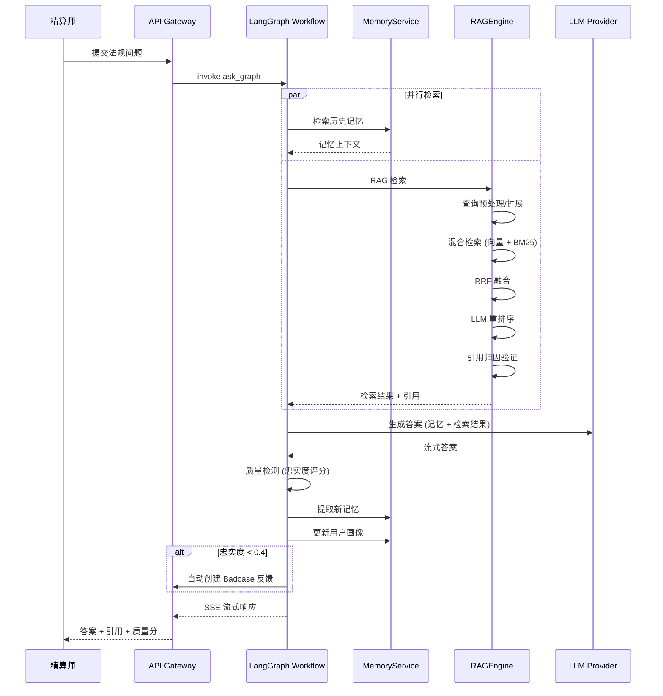

#### 知识库构建流程

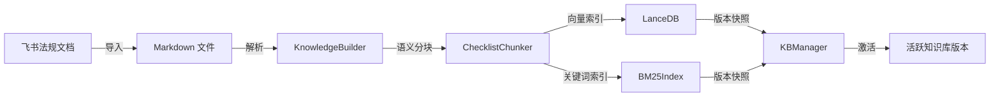

#### 评测-反馈闭环流程

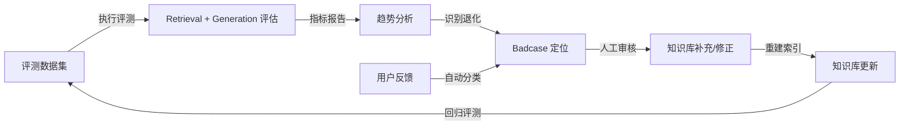

---

## 3. 应用架构 (Application Architecture)

### 3.1 C4 Context — 系统上下文

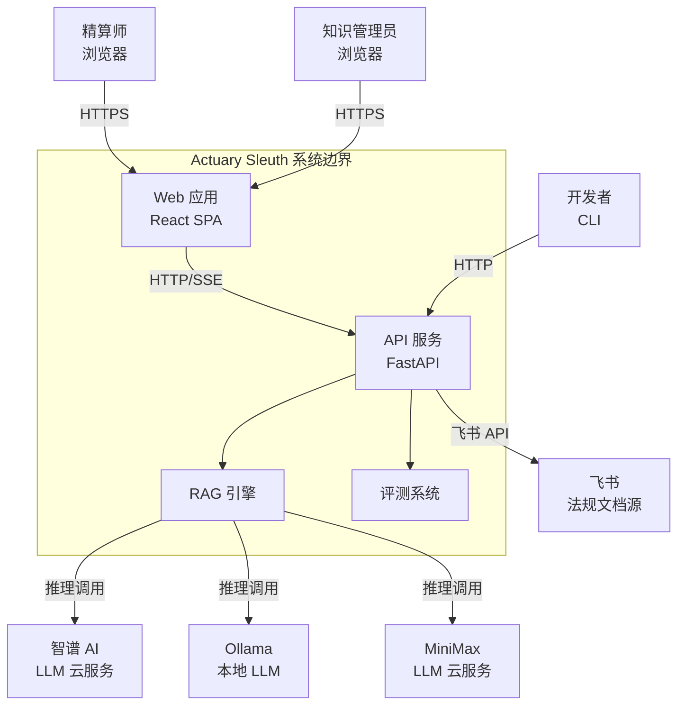

### 3.2 C4 Container — 容器视图

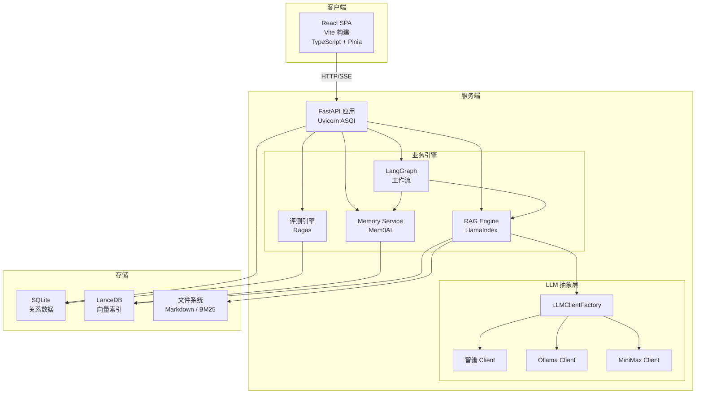

### 3.3 应用组件分解

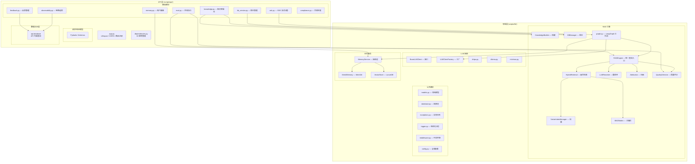

### 3.4 接口目录

| 接口 | 协议 | 消费方 | 提供方 | 说明 |
|------|------|--------|--------|------|
| POST /api/ask/chat | HTTP SSE | React SPA | FastAPI | 流式问答，返回 text/event-stream |
| GET/POST/DELETE /api/ask/sessions | REST | React SPA | FastAPI | 会话 CRUD |
| GET /api/kb/documents | REST | React SPA | FastAPI | 文档列表 |
| POST /api/kb/import | REST (async) | React SPA | FastAPI | 异步文档导入 |
| POST /api/kb/rebuild | REST (async) | React SPA | FastAPI | 异步索引重建 |
| POST /api/eval/evaluations | REST (async) | React SPA | FastAPI | 异步评测执行 |
| POST /api/eval/compare | REST | React SPA | FastAPI | 评测报告对比 |
| POST /api/feedback | REST | React SPA | FastAPI | 提交反馈 |
| GET /api/observability/traces | REST | React SPA | FastAPI | 链路查询 |
| POST /api/kb-version/create | REST | React SPA | FastAPI | 创建版本快照 |
| POST /api/kb-version/activate | REST | React SPA | FastAPI | 切换活跃版本 |
| GET/PATCH /api/memory/profile | REST | React SPA | FastAPI | 用户画像 |
| POST /api/compliance/check | REST | React SPA | FastAPI | 合规检查 |

### 3.5 核心模块职责与接口

| 模块 | 职责 | 公开接口 | 依赖 |
|------|------|---------|------|
| **RAGEngine** | 统一查询入口 | `search()`, `ask()` | VectorIndexManager, BM25Index, LLMClientFactory |
| **KnowledgeBuilder** | 知识构建管道 | `build()` | ChecklistChunker, VectorIndexManager, BM25Index |
| **KBManager** | 版本生命周期 | `create_version()`, `activate_version()`, `delete_version()` | api.database |
| **LLMClientFactory** | 场景化 LLM 创建 | `create(scene)` | zhipu, ollama, minimax |
| **MemoryService** | 记忆抽象层 | `search()`, `add()`, `auto_update_profile()` | Mem0Memory |
| **HybridRetrieval** | 混合检索 | `retrieve()` | VectorIndexManager, BM25Index, fusion |
| **Attribution** | 引用归因验证 | `parse_citations()` | LLMClientFactory |
| **QualityDetector** | 质量评分 | `detect()` | LLMClientFactory |
| **RetrievalEvaluator** | 检索评测 | `evaluate_batch()` | RAGEngine |
| **GenerationEvaluator** | 生成评测 | `evaluate_batch()` | RAGEngine, LangChain adapter |

### 3.6 LangGraph 工作流状态机

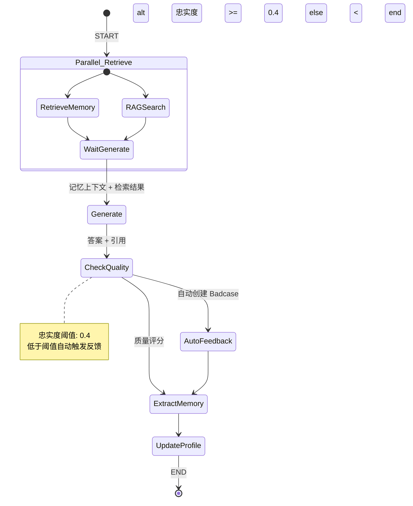

**AskState 状态字段：**

| 字段 | 类型 | 来源 | 说明 |
|------|------|------|------|
| question | str | 用户输入 | 原始问题 |
| mode | str | 用户输入 | 查询模式 |
| user_id | str | 认证 | 用户标识 |
| session_id | str | 会话管理 | 会话标识 |
| search_results | List[Dict] | RAGSearch | 检索结果 |
| memory_context | str | RetrieveMemory | 记忆上下文 |
| answer | str | Generate | LLM 生成的答案 |
| sources | List[Dict] | RAGSearch | 来源文档 |
| citations | List[Dict] | Attribution | 引用归因 |
| unverified_claims | List[str] | QualityDetector | 未验证声明 |
| content_mismatches | List[Dict] | QualityDetector | 内容偏差 |
| faithfulness_score | float | QualityDetector | 忠实度评分 |
| error | str | 任意节点 | 错误信息 |

---

## 4. 数据架构 (Data Architecture)

### 4.1 概念数据模型

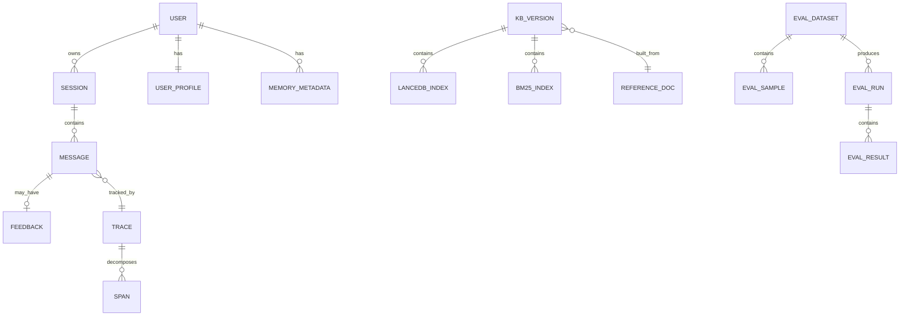

### 4.2 数据实体目录

| 数据实体 | 存储引擎 | 数据特征 | 生命周期 | 数据 Owner |
|---------|---------|---------|---------|-----------|
| sessions | SQLite | 结构化，低频写入 | 用户主动删除 | AskRouter |
| messages | SQLite | 结构化 + JSON(citations) | 随会话删除 | AskRouter |
| feedback | SQLite | 结构化，持续累积 | 永久保留 | FeedbackRouter |
| user_profiles | SQLite | JSON(profile) | 持用户更新 | MemoryService |
| eval_samples | SQLite | 结构化，版本化 | 手动管理 | EvalRouter |
| eval_runs | SQLite | JSON(metrics/config) | 永久保留 | RetrievalEvaluator |
| kb_versions | SQLite | 结构化 | 永久保留 | KBManager |
| traces | SQLite | 结构化 + JSON(metadata) | 定期清理 | trace_span |
| spans | SQLite | 结构化 + JSON(input/output) | 随 trace 清理 | trace_span |
| memory_metadata | SQLite | 结构化，TTL 管理 | 按 TTL 过期 | MemoryService |
| doc_embeddings | LanceDB | 高维向量 | 随版本管理 | VectorIndexManager |
| memory_embeddings | LanceDB | 高维向量 | 按 TTL 过期 | Mem0Memory |
| reference_docs | 文件系统 | Markdown 文本 | 手动管理 | KnowledgeBuilder |
| bm25_index | 文件系统 | 序列化索引 | 随版本管理 | BM25Index |

### 4.3 数据流向图

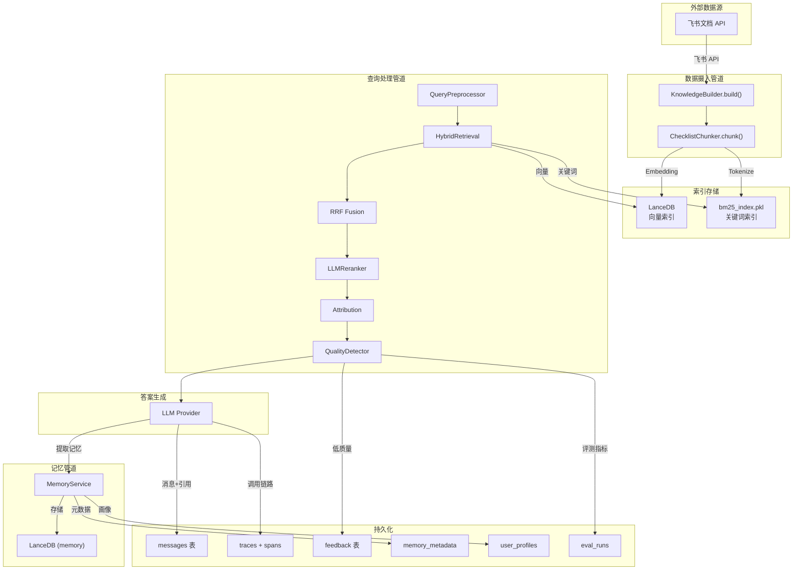

### 4.4 数据生命周期

| 数据类别 | 创建 | 读取 | 更新 | 删除 | 保留策略 |
|---------|------|------|------|------|---------|
| 会话/消息 | 用户提问 | 查看历史 | 编辑消息 | 删除会话 | 用户主动管理 |
| 反馈 | 提交反馈 | 统计分析 | 自动分类 | — | 永久保留 |
| 评测报告 | 执行评测 | 对比分析 | — | — | 永久保留 |
| 知识库版本 | 手动创建 | 激活切换 | — | 删除版本 | 手动管理 |
| 链路追踪 | 每次 API 调用 | 调试分析 | — | 定期清理 | 30 天 |
| 记忆 | 对话提取 | 问答检索 | 更新画像 | TTL 过期 | 7-90 天按类型 |
| 向量索引 | 构建时创建 | 每次检索 | 重建时覆盖 | 随版本删除 | 随版本管理 |

### 4.5 业务能力 × 数据实体 CRUD 矩阵

| 数据实体 | 智能问答 | 知识采集 | 知识加工 | 版本管理 | 评测执行 | 反馈闭环 | 用户画像 | 记忆管理 |
|---------|:-------:|:-------:|:-------:|:-------:|:-------:|:-------:|:-------:|:-------:|
| sessions | **CR** | | | | | | | |
| messages | **C** | | | | | | | |
| feedback | **C** | | | | R | **C** | | |
| user_profiles | R | | | | | | **CRU** | |
| eval_samples | | | | | **R** | U | | |
| eval_runs | | | | | **C** | R | | |
| kb_versions | R | | C | **CRUD** | | | | |
| traces | **C** | | | | | | | |
| spans | **C** | | | | | | | |
| memory_metadata | | | | | | | R | **CRUD** |
| doc_embeddings | R | | **C** | R | R | | | |
| memory_embeddings | R | | | | | | | **CR** |
| reference_docs | R | **C** | R | R | | | | |

---

## 5. 技术架构 (Technology Architecture)

### 5.1 技术标准目录

| 类别 | 技术选型 | 版本 | 用途 | 选型理由 |
|------|---------|------|------|---------|
| **运行时** | Python | 3.x | 后端 | AI/ML 生态最丰富 |
| **Web 框架** | FastAPI | 0.100+ | API 服务 | 异步高性能，Pydantic 原生集成 |
| **ASGI 服务器** | Uvicorn | 0.20+ | HTTP 服务 | 生产级 ASGI 实现 |
| **数据校验** | Pydantic | 2.x | Schema | FastAPI 原生依赖 |
| **向量框架** | LlamaIndex | 0.10+ | RAG | RAG 领域事实标准 |
| **工作流** | LangGraph | 0.2+ | 流程编排 | 状态机 + 并行 + 条件分支 |
| **评测** | Ragas | 0.1+ | RAG 评估 | 学术界 RAG 评测标准框架 |
| **记忆** | Mem0AI | 0.1+ | 用户记忆 | 开源记忆管理方案 |
| **向量数据库** | LanceDB | 0.2+ | 向量存储 | 嵌入式、零配置、列式存储 |
| **关系数据库** | SQLite | 3.x | 业务数据 | 单机零运维，足够当前规模 |
| **前端框架** | React | 18 | SPA | 生态成熟 |
| **前端语言** | TypeScript | 5.x | 类型安全 | 减少运行时错误 |
| **构建工具** | Vite | 5.x | 前端构建 | 快速 HMR |
| **状态管理** | Pinia | 2.x | 前端状态 | Vue 3 官方推荐 |
| **LLM 云端** | 智谱 AI | GLM-4 | 问答/评测 | 中文能力强，性价比高 |
| **LLM 本地** | Ollama | 0.1+ | 本地推理 | 隐私保护，离线可用 |
| **LLM 云端** | MiniMax | — | 备选 | 多模型供应商容灾 |

### 5.2 部署架构

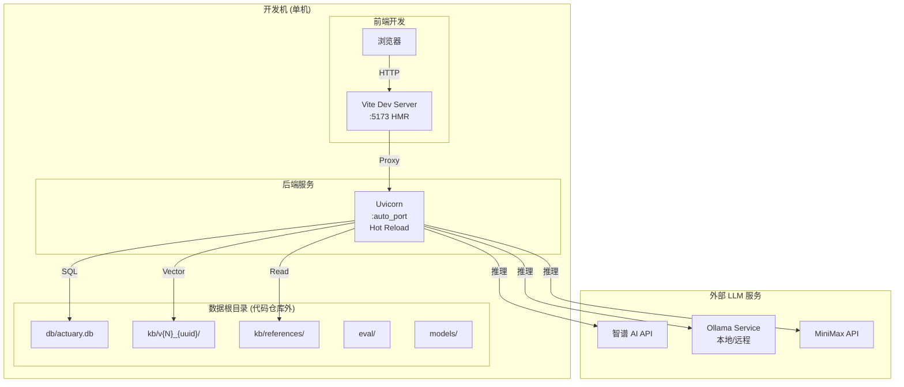

**部署特征：**

| 维度 | 当前状态 | 说明 |
|------|---------|------|
| 部署模式 | 单机开发 | 一台开发机运行全部组件 |
| 进程管理 | run_api.py | 自动分配端口，记录 .run 文件 |
| 前端构建 | Vite dev / build | 开发模式 HMR，生产模式静态文件 |
| 数据隔离 | 数据根目录外置 | settings.json 绝对路径配置 |
| Worktree | 配置自动拷贝 | worktree 独立配置，互不干扰 |
| 热更新 | Uvicorn reload | 代码变更自动重启后端 |

### 5.3 平台分层

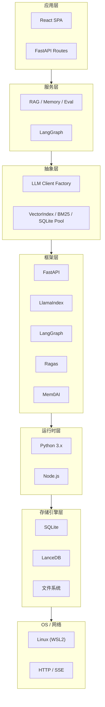

### 5.4 横切关注点

#### 5.4.1 配置管理

```
Config (Singleton, 环境变量驱动)
├── FeishuConfig              # 飞书集成
├── OllamaConfig              # 本地 LLM 端点
├── ZhipuConfig               # 智谱 AI 密钥
├── MinimaxConfig             # MiniMax 密钥
├── LLMConfig                 # 场景化模型配置
│   ├── qa                    # 问答 (LLM_QA_PROVIDER / LLM_QA_MODEL)
│   ├── audit                 # 审核
│   ├── eval                  # 评测
│   ├── embed                 # 向量化
│   ├── name_parser           # 名称解析
│   └── ocr                   # OCR
└── DatabaseConfig            # 数据路径
    ├── sqlite_db
    ├── regulations_dir
    ├── kb_version_dir
    ├── eval_snapshots_dir
    ├── models_dir
    └── tools_dir
```

#### 5.4.2 可观测性

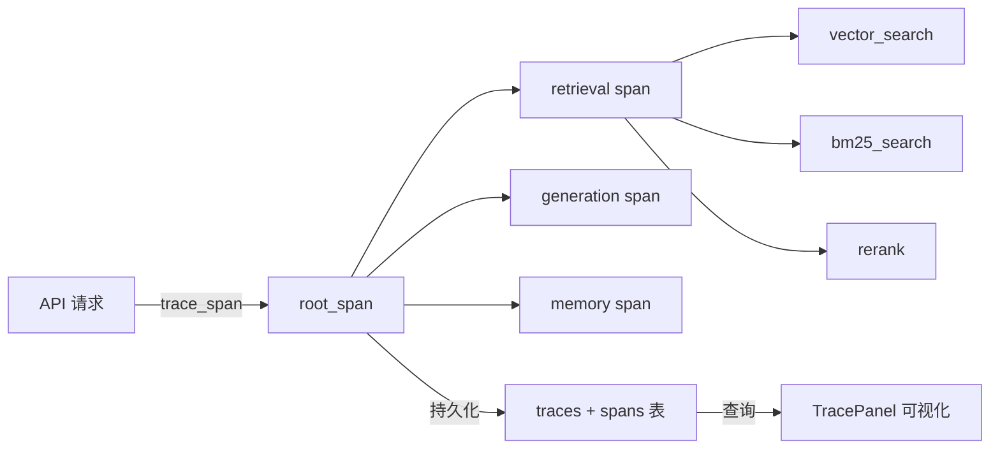

| 追踪维度 | 指标 | 存储位置 |
|---------|------|---------|
| 调用链路 | Span 树 (parent-child) | traces + spans |
| 耗时 | duration_ms per span | spans |
| LLM 调用 | call_count per trace | spans metadata |
| 检索模式 | hybrid / vector-only | spans metadata |
| Reranker 类型 | llm / cross_encoder | spans metadata |
| 错误 | error count + message | spans |

#### 5.4.3 安全与异常处理

| 机制 | 实现 |
|------|------|
| 异常体系 | `ActuarySleuthException` 基类 → 模块级子类（DocumentFetchError, DatabaseError...） |
| 15+ 自定义异常 | 按模块归档到 `lib/*/exceptions.py` |
| 中间件链 | `MiddlewareChain` 统一日志/性能拦截 |
| 结构化日志 | `AuditLogger` 带上下文的结构化输出 |

#### 5.4.4 并发与可靠性

| 机制 | 实现 | 说明 |
|------|------|------|
| 连接池 | SQLite, 5 + 10 overflow | 线程安全 |
| ThreadLocal | LlamaIndex Settings | 线程隔离 |
| 初始化锁 | `_init_lock` | RAG 引擎单次初始化 |
| LLM 缓存 | LLMCache | 响应级缓存 |
| Fail-fast | Reranker 失败直接报错 | 不降级 |

### 5.5 设计模式

| 模式 | 应用场景 | 实现位置 | 目的 |
|------|---------|---------|------|
| 策略模式 | LLM 客户端选型 | `LLMClientFactory` | 运行时切换 LLM 提供商 |
| 工厂模式 | 场景化 LLM 创建 | `LLMClientFactory.create(scene)` | 按场景(qa/eval/embed)创建 |
| 单例模式 | 全局配置、连接池 | `Config`, `ConnectionPool` | 资源统一管理 |
| 仓储模式 | 向量索引管理 | `VectorIndexManager`, `KBManager` | 封装存储细节 |
| 依赖注入 | 服务生命周期 | `api/dependencies.py` | 解耦创建与使用 |
| 模板方法 | LLM 客户端接口 | `BaseLLMClient` | 统一调用约定 |
| 中间件模式 | 日志/性能拦截 | `MiddlewareChain` | 通用横切逻辑 |
| 状态机 | 工作流编排 | `LangGraph ask_graph` | 复杂流程可视化 |

---

## 6. 架构决策记录 (ADR)

### ADR-01: SQLite 单机存储

| 项目 | 内容 |
|------|------|
| 状态 | 已采纳 |
| 上下文 | 当前用户量小，不需要分布式数据库 |
| 决策 | 使用 SQLite 作为关系数据库，LanceDB 作为向量数据库 |
| 理由 | 零运维、嵌入式、事务完整；LanceDB 同样嵌入式，无需独立服务 |
| 后果 | 扩展性受限，但满足当前单机开发场景 |

### ADR-02: LLM 多提供商抽象

| 项目 | 内容 |
|------|------|
| 状态 | 已采纳 |
| 上下文 | LLM 提供商 API 不稳定，需要容灾切换 |
| 决策 | 通过 `BaseLLMClient` + `LLMClientFactory` 抽象，支持智谱/Ollama/MiniMax |
| 理由 | 工厂模式解耦具体实现，场景化配置(qa/audit/eval/embed)灵活选型 |
| 后果 | 新增提供商只需实现接口 + 注册工厂，不影响业务逻辑 |

### ADR-03: 知识库版本化

| 项目 | 内容 |
|------|------|
| 状态 | 已采纳 |
| 上下文 | 知识库更新可能引入质量问题，需要回滚能力 |
| 决策 | 每次构建创建版本快照（向量索引 + BM25 索引），支持激活/切换/删除 |
| 理由 | 类似 Git 的版本管理，配合评测体系确保每次更新可度量 |
| 后果 | 存储开销增加，但换来安全性和可审计性 |

### ADR-04: LangGraph 工作流编排

| 项目 | 内容 |
|------|------|
| 状态 | 已采纳 |
| 上下文 | 问答流程包含并行检索、条件分支、状态传递，传统顺序代码难以管理 |
| 决策 | 使用 LangGraph StateGraph 编排 ask_graph |
| 理由 | 原生支持并行节点、条件边、状态机，可视化流程 |
| 后果 | 引入框架依赖，但大幅降低复杂流程的维护成本 |

---

## 7. 技术债务与风险

| 编号 | 类型 | 描述 | 影响 | 建议 |
|------|------|------|------|------|
| TD-01 | 可扩展性 | SQLite 单机限制，无法水平扩展 | 多用户并发写入瓶颈 | 评估期可接受，上线前考虑 PostgreSQL |
| TD-02 | 可观测性 | 缺少 Metrics 采集（Prometheus 等） | 无法监控运行时性能 | 后续接入 OpenTelemetry |
| TD-03 | 安全性 | 缺少认证/鉴权机制 | API 无访问控制 | 生产环境必须增加 |
| TD-04 | 测试覆盖 | 评测体系 CLI 独立，未集成 API 层 | 端到端测试不完整 | 增加 API 集成测试 |
| R-01 | 风险 | LLM 提供商 API 不稳定 | 服务不可用 | 多提供商容灾（已实现工厂模式） |
| R-02 | 风险 | 法规文档格式变化 | 解析失败 | KnowledgeBuilder 需要格式兼容测试 |

---

## 附录 A：术语表

| 术语 | 英文 | 定义 |
|------|------|------|
| RAG | Retrieval-Augmented Generation | 检索增强生成，结合检索和生成的 AI 问答范式 |
| SSE | Server-Sent Events | 服务端推送事件，用于流式响应 |
| RRF | Reciprocal Rank Fusion | 倒排秩融合，多路检索结果合并算法 |
| BM25 | BM25 | 经典关键词检索算法 |
| CRUD | Create/Read/Update/Delete | 数据操作四类基本操作 |
| Badcase | Bad Case | 问答质量不达标的案例 |
| TTL | Time To Live | 数据存活时间 |
| LLM | Large Language Model | 大语言模型 |
| Embedding | Embedding | 文本向量化表示 |
| Trace | Trace | 分布式追踪中的一次完整调用链 |
| Span | Span | 调用链中的一个逻辑单元 |

## 附录 B：变更记录

| 版本 | 日期 | 变更内容 |
|------|------|---------|
| 1.0 | 2026-04-13 | 初始版本 |
| 2.0 | 2026-04-13 | 重构为标准 4A 框架：增加干系人分析、架构原则、C4 视图、概念数据模型、CRUD 矩阵、数据生命周期、ADR、技术债务 |
