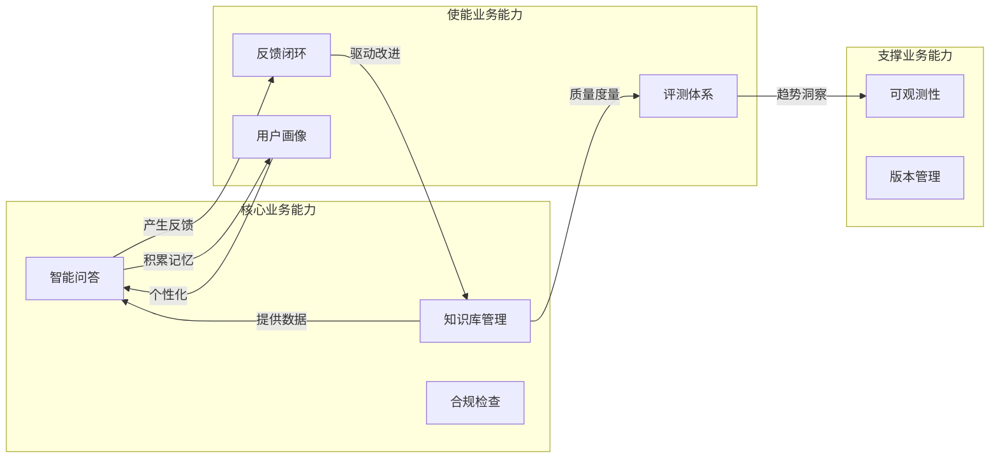
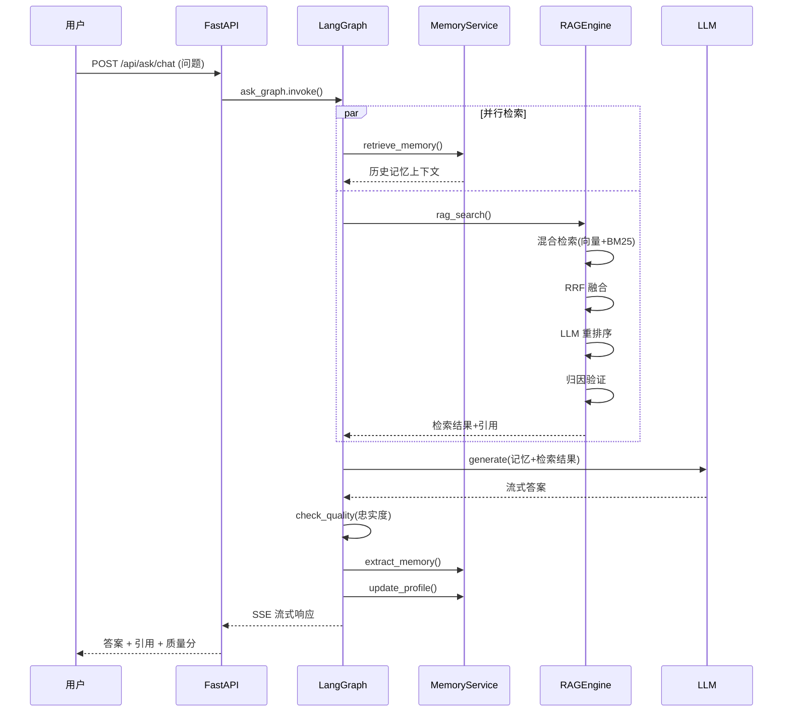
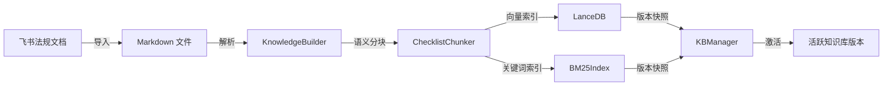
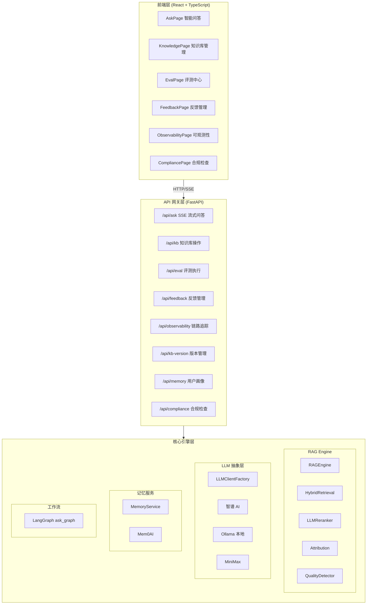
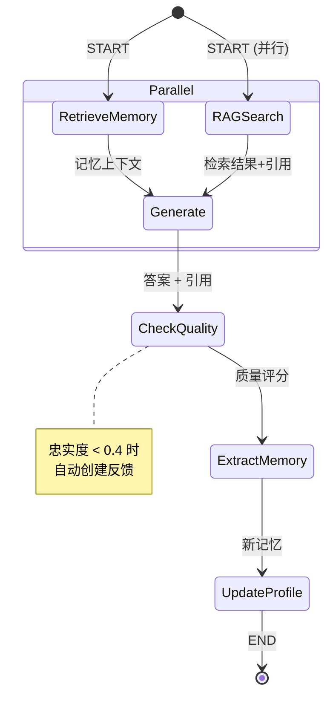
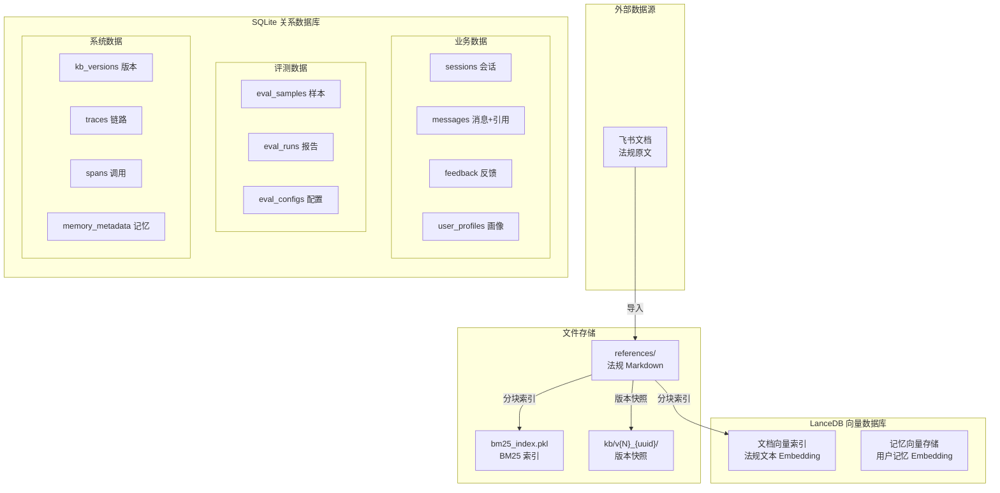
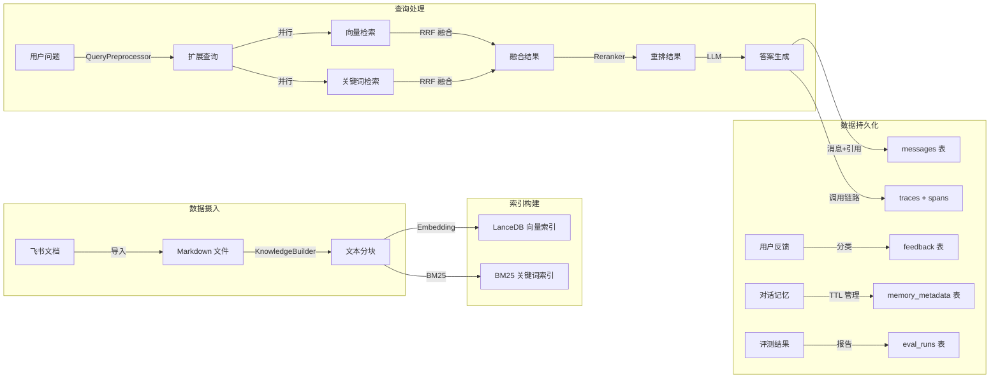
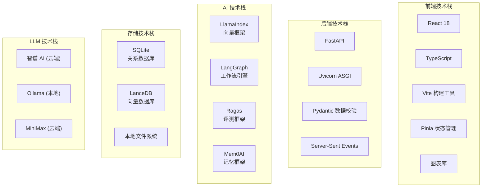
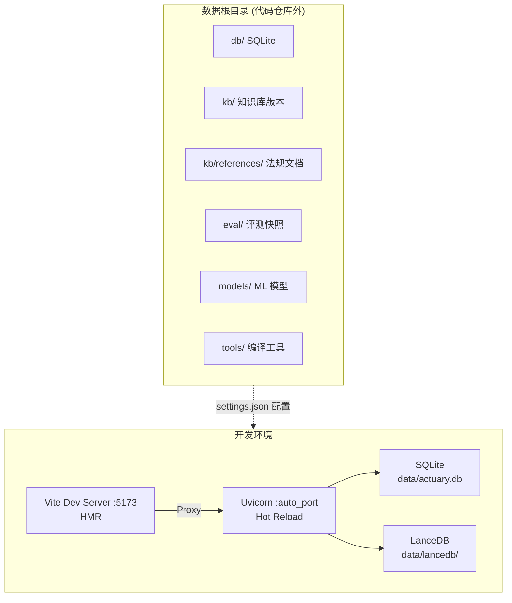
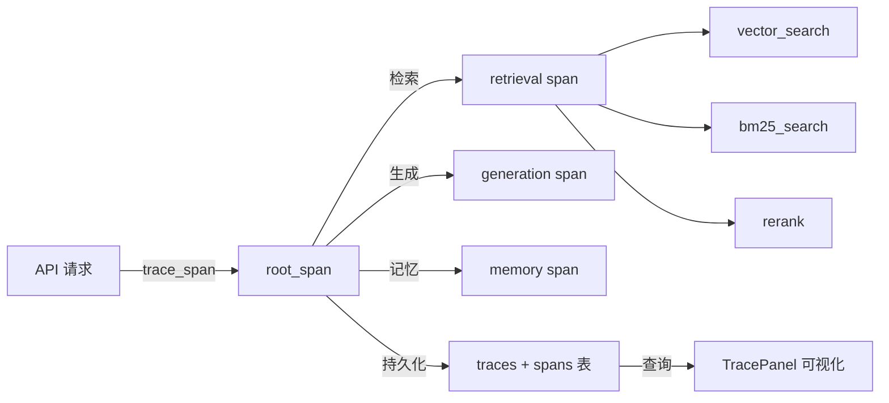

# Actuary Sleuth — 4A 架构设计文档

> 版本：1.0
> 日期：2026-04-13
> 状态：待审查

---

## 1. 架构总览

Actuary Sleuth 是一个面向保险精算领域的 AI 法规知识平台，采用 RAG（检索增强生成）架构，提供法规智能问答、知识库管理、质量评测、反馈闭环等核心能力。

系统采用经典 4A 架构视图进行描述：

```
┌─────────────────────────────────────────────────────┐
│              业务架构 (Business)                      │
│         定义业务能力、价值流、领域边界                   │
├─────────────────────────────────────────────────────┤
│              应用架构 (Application)                    │
│         系统分层、模块划分、交互关系                     │
├─────────────────────────────────────────────────────┤
│              数据架构 (Data)                           │
│         数据模型、存储选型、数据流向                     │
├─────────────────────────────────────────────────────┤
│              技术架构 (Technology)                     │
│         技术选型、基础设施、横切关注点                   │
└─────────────────────────────────────────────────────┘
```

---

## 2. 业务架构 (Business Architecture)

### 2.1 业务能力地图



### 2.2 业务能力详述

| 业务能力 | 描述 | 核心价值 | 关键指标 |
|---------|------|---------|---------|
| **智能问答** | 基于法规知识库的 RAG 问答，支持引用归因与忠实度评分 | 高质量、可追溯的法规解答 | 忠实度 > 0.8，引用准确率 |
| **知识库管理** | 法规 Markdown 文档导入 → 语义分块 → 混合索引 → 版本快照 | 法规知识可持续迭代 | 文档覆盖率、索引构建耗时 |
| **评测体系** | 检索指标 (P@K/MRR/NDCG) + 生成指标 (Faithfulness/Relevancy) | 量化 RAG 质量变化 | 评测通过率、趋势方向 |
| **反馈闭环** | 用户反馈 → Badcase 自动分类 → 趋势分析 → 人工审核 | 数据驱动的持续改进 | 反馈处理率、改进转化率 |
| **合规检查** | 负面清单匹配 + 定价分析 + 条款审核 | 保险产品合规风控 | 检出率、误报率 |
| **用户画像** | 对话记忆 + 偏好提取 + 自动画像更新 | 个性化服务体验 | 记忆命中率、画像完整度 |

### 2.3 核心业务流程

#### 智能问答主流程



#### 知识库构建流程



---

## 3. 应用架构 (Application Architecture)

### 3.1 系统分层总览



### 3.2 前端模块结构

```
scripts/web/src/
├── App.tsx                    # 应用入口 + 路由
├── pages/                     # 页面组件
│   ├── AskPage.tsx            # 智能问答（SSE 流式）
│   ├── KnowledgePage.tsx      # 知识库管理
│   ├── EvalPage.tsx           # 评测中心
│   ├── FeedbackPage.tsx       # 反馈管理
│   ├── ObservabilityPage.tsx  # 可观测性
│   └── CompliancePage.tsx     # 合规检查
├── components/                # 通用组件
│   ├── AppLayout.tsx          # 布局框架
│   ├── ChatPanel.tsx          # 聊天面板
│   ├── MessageBubble.tsx      # 消息气泡
│   ├── CitationTag.tsx        # 引用标签
│   ├── SourcePanel.tsx        # 来源面板
│   ├── TracePanel.tsx         # 追踪面板
│   ├── MetricsChart.tsx       # 指标图表
│   └── FeedbackButtons.tsx    # 反馈按钮
├── stores/                    # Pinia 状态管理
│   ├── askStore.ts            # 问答状态
│   ├── feedbackStore.ts       # 反馈状态
│   └── observabilityStore.ts  # 可观测性状态
├── api/                       # API 客户端
│   ├── client.ts              # HTTP 基础客户端
│   ├── ask.ts                 # 问答 API
│   ├── knowledge.ts           # 知识库 API
│   ├── eval.ts                # 评测 API
│   ├── feedback.ts            # 反馈 API
│   ├── compliance.ts          # 合规 API
│   └── observability.ts       # 可观测性 API
└── utils/                     # 工具函数
    └── evalMetrics.ts         # 评测指标计算
```

### 3.3 后端 API 路由设计

| 路由前缀 | 模块 | 核心端点 | 说明 |
|---------|------|---------|------|
| `/api/ask` | ask.py | `POST /chat`, `GET /sessions`, `DELETE /sessions/{id}` | SSE 流式问答，会话管理 |
| `/api/kb` | knowledge.py | `GET /documents`, `POST /import`, `POST /rebuild` | 知识库文档操作 |
| `/api/eval` | eval.py | `GET /dataset`, `POST /evaluations`, `POST /compare` | 评测数据集与执行 |
| `/api/feedback` | feedback.py | `POST /feedback`, `GET /stats` | 反馈收集与统计 |
| `/api/observability` | observability.py | `GET /traces`, `GET /metrics` | 链路追踪与指标 |
| `/api/kb-version` | kb_version.py | `GET /versions`, `POST /create`, `POST /activate` | 知识库版本管理 |
| `/api/memory` | memory.py | `GET /profile`, `PATCH /profile` | 用户画像管理 |
| `/api/compliance` | compliance.py | `POST /check` | 合规检查 |

### 3.4 核心引擎模块结构

```
scripts/lib/
├── rag_engine/                    # RAG 引擎（50+ 模块）
│   ├── rag_engine.py              # RAGEngine — 统一查询入口
│   ├── config.py                  # RAGConfig / RetrievalConfig / RerankConfig
│   ├── builder.py                 # KnowledgeBuilder — 构建管道
│   ├── kb_manager.py              # KBManager — 版本生命周期
│   ├── index_manager.py           # VectorIndexManager — LanceDB 封装
│   ├── retrieval.py               # HybridRetrieval — 混合检索
│   ├── bm25_index.py              # BM25Index — 关键词索引
│   ├── fusion.py                  # RRF 融合
│   ├── query_preprocessor.py      # 查询预处理/扩展
│   ├── chunker.py                 # ChecklistChunker — 语义分块
│   ├── reranker_base.py           # BaseReranker 抽象接口
│   ├── llm_reranker.py            # LLM 重排序
│   ├── cross_encoder_reranker.py  # CrossEncoder 重排序
│   ├── attribution.py             # 引用归因验证
│   ├── quality_detector.py        # 忠实度/完整性评分
│   ├── evaluator.py               # RetrievalEvaluator / GenerationEvaluator
│   ├── eval_dataset.py            # EvalSample 数据集
│   ├── dataset_validator.py       # 数据集质量审计
│   └── graph.py                   # LangGraph 工作流
│
├── llm/                           # LLM 抽象层
│   ├── base.py                    # BaseLLMClient 抽象接口
│   ├── factory.py                 # LLMClientFactory — 场景化工厂
│   ├── zhipu.py                   # 智谱 AI 实现
│   ├── ollama.py                  # Ollama 本地模型实现
│   ├── minimax.py                 # MiniMax 实现
│   ├── langchain_adapter.py       # LangChain 适配（Ragas 评测用）
│   ├── cache.py                   # LLM 响应缓存
│   ├── trace.py                   # 调用追踪（计数、耗时）
│   └── metrics.py                 # 性能指标收集
│
├── memory/                        # 记忆服务
│   ├── base.py                    # MemoryBase + Mem0Memory 实现
│   ├── service.py                 # MemoryService — 后端无关抽象
│   ├── config.py                  # TTL / 清理 / 活跃度阈值
│   ├── prompts.py                 # 画像提取 Prompt
│   └── vector_store.py            # LanceDB 向量存储
│
├── common/                        # 通用基础设施
│   ├── models.py                  # 领域数据模型
│   ├── database.py                # SQLite 连接池
│   ├── connection_pool.py         # 线程安全连接池
│   ├── exceptions.py              # 15+ 自定义异常
│   ├── logger.py                  # AuditLogger 结构化日志
│   ├── cache.py                   # LRU 缓存装饰器
│   ├── constants.py               # 验证限制/评分常量
│   ├── middleware.py              # 中间件链
│   └── config.py                  # 全局配置单例
│
└── reporting/                     # 报告生成（预留）
```

### 3.5 LangGraph 工作流



**AskState 状态字段：**

| 字段 | 类型 | 说明 |
|------|------|------|
| question | str | 用户问题 |
| mode | str | 查询模式 |
| user_id | str | 用户标识 |
| session_id | str | 会话标识 |
| search_results | List[Dict] | RAG 检索结果 |
| memory_context | str | 记忆上下文 |
| answer | str | 生成的答案 |
| sources | List[Dict] | 来源文档 |
| citations | List[Dict] | 引用归因 |
| unverified_claims | List[str] | 未验证声明 |
| content_mismatches | List[Dict] | 内容偏差 |
| faithfulness_score | float | 忠实度评分 |
| error | str | 错误信息 |

---

## 4. 数据架构 (Data Architecture)

### 4.1 数据存储全景



### 4.2 SQLite 表结构

#### 业务数据表

| 表名 | 核心字段 | 说明 |
|------|---------|------|
| **sessions** | id, user_id, title, created_at, updated_at | 对话会话 |
| **messages** | id, session_id, role, content, citations(JSON), faithfulness_score | 消息+引用+质量分 |
| **feedback** | id, message_id, rating, comment, category, auto_classified | 用户反馈 |
| **user_profiles** | user_id, profile(JSON), updated_at | 用户画像 |

#### 评测数据表

| 表名 | 核心字段 | 说明 |
|------|---------|------|
| **eval_samples** | id, question, expected_answer, expected_sources, tags | 评测样本 |
| **eval_runs** | id, mode, config(JSON), metrics(JSON), created_at | 评测报告 |
| **eval_configs** | id, dataset_id, top_k, reranker, created_at | 评测配置 |

#### 系统数据表

| 表名 | 核心字段 | 说明 |
|------|---------|------|
| **kb_versions** | id, version, path, is_active, created_at | 知识库版本 |
| **traces** | id, trace_id, name, input, output, metadata, created_at | 链路追踪 |
| **spans** | id, trace_id, parent_id, name, duration_ms, input, output | 调用跨度 |
| **memory_metadata** | id, memory_id, user_id, type, ttl, access_count, last_accessed | 记忆元数据 |

### 4.3 数据流向



---

## 5. 技术架构 (Technology Architecture)

### 5.1 技术选型总览



### 5.2 部署架构



### 5.3 横切关注点

#### 5.3.1 配置管理

```
Config (Singleton)
├── FeishuConfig         # 飞书集成配置
├── OllamaConfig         # 本地 LLM 配置
├── ZhipuConfig          # 智谱 AI 配置
├── MinimaxConfig        # MiniMax 配置
├── LLMConfig            # 场景化模型配置
│   ├── qa               # 问答模型
│   ├── audit            # 审核模型
│   ├── eval             # 评测模型
│   ├── embed            # 向量化模型
│   ├── name_parser      # 名称解析
│   └── ocr              # OCR
└── DatabaseConfig       # 数据路径配置
    ├── sqlite_db
    ├── regulations_dir
    ├── kb_version_dir
    ├── eval_snapshots_dir
    ├── models_dir
    └── tools_dir
```

所有配置通过环境变量注入，场景化映射如 `LLM_QA_PROVIDER=zhipu`、`LLM_QA_MODEL=glm-4-flash`。

#### 5.3.2 可观测性



**追踪指标：**
- LLM 调用次数（按 trace）
- Span 耗时（ms）
- 错误计数
- Reranker 类型
- 检索模式（hybrid/vector-only）

#### 5.3.3 记忆管理

| 记忆类型 | TTL | 说明 |
|---------|-----|------|
| Fact | 7 天 | 事实性记忆 |
| Preference | 30 天 | 用户偏好 |
| Audit conclusion | 90 天 | 审核结论 |

**后台任务：**
- 每日清理过期记忆
- 自动分类 Badcase
- 自动更新用户画像

#### 5.3.4 并发与线程安全

| 机制 | 实现 |
|------|------|
| 连接池 | SQLite，5 连接 + 10 溢出，线程安全 |
| ThreadLocal | LlamaIndex Settings 线程隔离 |
| 初始化锁 | `_init_lock` 保护 RAG 引擎单次初始化 |
| 异步任务 | 评测执行、自动分类、记忆清理 |

### 5.4 设计模式

| 模式 | 应用场景 | 实现位置 |
|------|---------|---------|
| **策略模式** | LLM 客户端选型 | `LLMClientFactory` |
| **工厂模式** | 场景化 LLM 创建 | `LLMClientFactory.create()` |
| **单例模式** | 全局配置、连接池 | `Config`, `ConnectionPool` |
| **仓储模式** | 向量索引管理 | `VectorIndexManager`, `KBManager` |
| **依赖注入** | 服务生命周期 | `api/dependencies.py` |
| **构建者模式** | 知识构建管道 | `KnowledgeBuilder` |
| **模板方法** | LLM 客户端接口 | `BaseLLMClient` |
| **中间件模式** | 日志/性能拦截 | `MiddlewareChain` |
| **观察者模式** | SSE 流式推送 | `ask.py` |
| **状态机** | 工作流编排 | `LangGraph ask_graph` |

---

## 6. 架构约束与决策

| 约束 | 说明 |
|------|------|
| 单机部署 | SQLite + 本地文件系统，无需分布式基础设施 |
| 同步为主 | 核心逻辑同步执行，异步仅用于后台任务 |
| 配置外置 | 数据文件存储在代码仓库外，通过 settings.json 绝对路径配置 |
| 模型可切换 | LLM 通过工厂模式支持智谱/Ollama/MiniMax 三类提供商 |
| 知识可回滚 | 知识库版本化管理，支持快照创建、切换、删除 |
| 质量可度量 | 内置 RAGAS 评测框架，支持检索+生成双维度评估 |
| 反馈可闭环 | 用户反馈自动分类为 Badcase，驱动知识库改进 |

---

## 附录 A：技术栈版本

| 技术 | 用途 |
|------|------|
| Python 3.x | 后端运行时 |
| FastAPI | Web 框架 |
| Uvicorn | ASGI 服务器 |
| Pydantic | 数据校验 |
| LlamaIndex | 向量检索框架 |
| LangGraph | 工作流编排 |
| LanceDB | 向量数据库 |
| Mem0AI | 记忆管理 |
| Ragas | RAG 评测 |
| SQLite | 关系数据库 |
| React 18 | 前端框架 |
| TypeScript | 前端语言 |
| Vite | 前端构建 |
| Pinia | 前端状态管理 |
