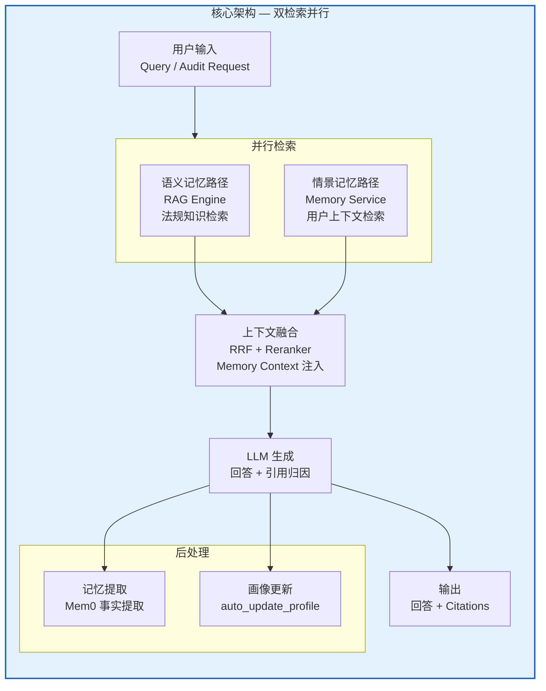
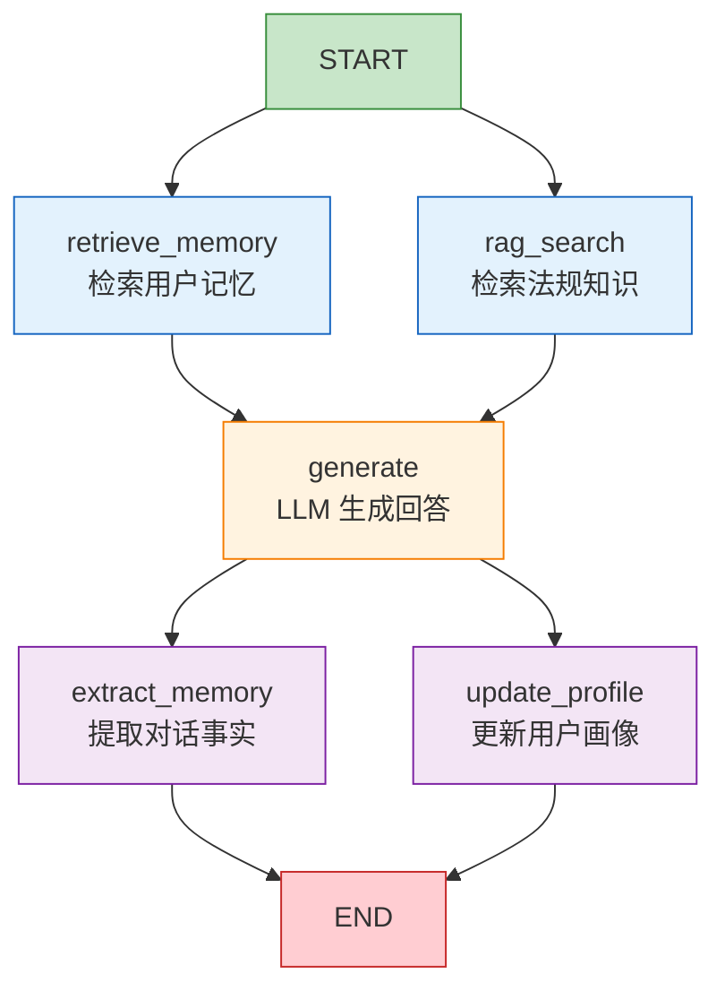
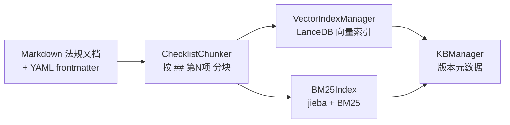
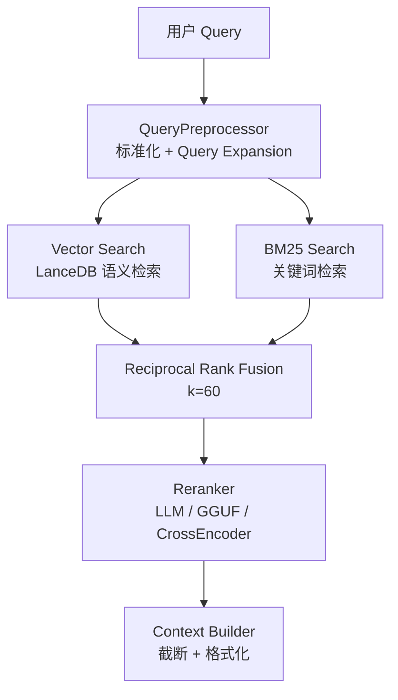
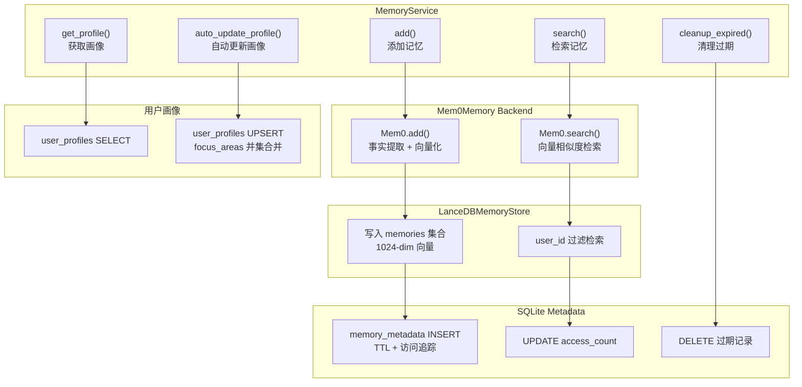
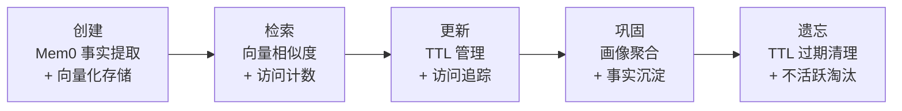
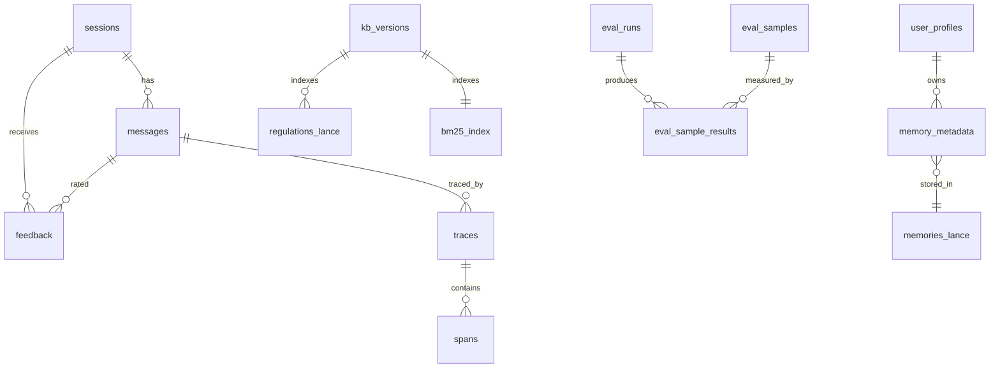
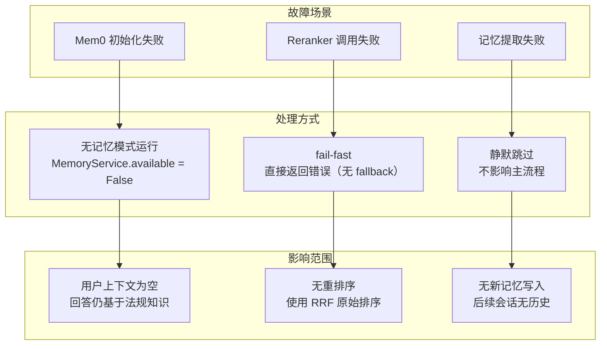

# Actuary Sleuth — 记忆功能架构设计文档

> 版本：1.0
> 日期：2026-04-13
> 状态：待审查
> 参考：[Survey on AI Memory: Theories, Taxonomies, Evaluations, and Emerging Trends](https://github.com/BAI-LAB/Survey-on-AI-Memory)

---

## 1. 概述

Actuary Sleuth 的记忆系统基于 **4W Memory Taxonomy**（When / What / How / Which）构建，覆盖从即时上下文到跨会话长期记忆的完整生命周期。系统采用**双检索并行架构**，将法规知识检索与用户上下文检索解耦，通过上下文融合后注入 LLM 生成回答。

### 1.1 设计原则

- **双层检索**：RAG（共享法规知识）与 Memory（用户个性化记忆）并行，互不阻塞
- **TTL 分级过期**：不同记忆类型设置不同生命周期，每日自动清理
- **优雅降级**：记忆系统故障时静默降级，不影响核心审核流程
- **用户隔离**：所有记忆操作按 `user_id` 隔离

---

## 2. 4W 分类映射

### 2.1 When — 生命周期

| 层级 | 说明 | 存储位置 | 数据 |
|------|------|---------|------|
| **Transient** | 即时处理缓冲 | LLM Context Window / KV Cache | 当前 prompt、检索结果 |
| **Session** | 单次会话工作记忆 | SQLite `sessions` + `messages` | 对话历史、引用归因 |
| **Persistent** | 跨会话长期记忆 | LanceDB `memories` + SQLite | 用户事实、偏好、画像 |

### 2.2 What — 记忆类型

| 类型 | 说明 | 核心组件 | 数据内容 |
|------|------|---------|---------|
| **Declarative** | 事实性知识 | RAG Engine | 保险法规条款、监管文件 |
| **Procedural** | 技能与工作流 | Audit Pipeline | 审核流程、合规检查规则 |
| **Personalized** | 用户偏好与画像 | Memory Service | 关注领域、偏好标签、历史结论 |
| **Metacognitive** | 系统反思与评估 | Tracing + Eval | 调用链追踪、质量评估、反馈分类 |

### 2.3 How — 存储形式

| 存储形式 | 技术 | 用途 |
|---------|------|------|
| **Vector DB** | LanceDB (1024-dim Jina Embedding) | 法规语义检索、用户记忆检索 |
| **BM25 索引** | rank_bm25 + jieba 分词 | 关键词精确匹配（如"180天"） |
| **SQLite** | 结构化表 | 元数据、画像、会话、追踪、评估 |
| **Raw Text** | Markdown + YAML frontmatter | 法规原始文档 |

### 2.4 Which — 信息模态

| 模态 | 说明 |
|------|------|
| **文本模态** | 法规条款、对话历史、审核报告 |
| **结构化数据** | JSON 元数据、用户画像、评估指标 |

---

## 3. 系统架构

### 3.1 架构总览



### 3.2 LangGraph 工作流



**关键文件**：`scripts/lib/rag_engine/graph.py`

### 3.3 上下文融合策略

LLM 生成时的 prompt 构造：

```python
messages = [
    {"role": "system", "content": _SYSTEM_PROMPT},
]
if state.get("memory_context"):
    messages.append({
        "role": "system",
        "content": f"【用户历史信息】\n{state['memory_context']}"
    })
messages.append({"role": "user", "content": user_prompt})
answer = llm.chat(messages)
```

---

## 4. 记忆子系统详解

### 4.1 Declarative Memory — 法规知识库

#### 4.1.1 知识库构建流程



**关键文件**：
- `scripts/lib/rag_engine/builder.py` — `KnowledgeBuilder`
- `scripts/lib/rag_engine/chunker.py` — `ChecklistChunker`
- `scripts/lib/rag_engine/index_manager.py` — `VectorIndexManager`
- `scripts/lib/rag_engine/bm25_index.py` — `BM25Index`
- `scripts/lib/rag_engine/kb_manager.py` — `KBManager`

#### 4.1.2 混合检索



**关键文件**：
- `scripts/lib/rag_engine/rag_engine.py` — `RAGEngine`
- `scripts/lib/rag_engine/retrieval.py` — `vector_search()`
- `scripts/lib/rag_engine/fusion.py` — `reciprocal_rank_fusion()`

#### 4.1.3 知识库版本管理

```sql
CREATE TABLE kb_versions (
    version_id INTEGER PRIMARY KEY,
    created_at TEXT NOT NULL,
    document_count INTEGER,
    chunk_count INTEGER,
    is_active INTEGER DEFAULT 0
);
```

每个版本独立存储：
```
data/kb_versions/
├── v1/
│   ├── lancedb/           # 向量索引
│   └── bm25_index.pkl     # BM25 索引
└── v2/
    ├── lancedb/
    └── bm25_index.pkl
```

### 4.2 Personalized Memory — 用户记忆

#### 4.2.1 Memory Service 架构



**关键文件**：
- `scripts/lib/memory/service.py` — `MemoryService`
- `scripts/lib/memory/base.py` — `Mem0Memory`
- `scripts/lib/memory/vector_store.py` — `LanceDBMemoryStore`
- `scripts/lib/memory/config.py` — `MemoryConfig`
- `scripts/lib/memory/prompts.py` — 提取 prompt

#### 4.2.2 向量存储 Schema

自定义 LanceDB 适配器（解决 LangChain 元数据嵌套问题）：

```python
fields = [
    pa.field("vector", pa.list_(pa.float32(), 1024)),
    pa.field("id", pa.string()),
    pa.field("text", pa.string()),
    pa.field("metadata", pa.string()),    # JSON
    pa.field("user_id", pa.string()),     # 顶级列（非嵌套）
    pa.field("agent_id", pa.string()),
    pa.field("run_id", pa.string()),
]
```

#### 4.2.3 记忆元数据 Schema

```sql
CREATE TABLE memory_metadata (
    mem0_id TEXT PRIMARY KEY,
    user_id TEXT NOT NULL,
    session_id TEXT,
    category TEXT DEFAULT 'fact',     -- fact | preference | audit_conclusion
    created_at TEXT NOT NULL,
    expires_at TEXT,                 -- TTL 过期时间
    last_accessed_at TEXT NOT NULL,
    access_count INTEGER NOT NULL DEFAULT 0,
    is_deleted INTEGER NOT NULL DEFAULT 0
);
```

#### 4.2.4 用户画像 Schema

```sql
CREATE TABLE user_profiles (
    user_id TEXT PRIMARY KEY,
    focus_areas TEXT DEFAULT '[]',      -- JSON: ["重疾险", "医疗险"]
    preference_tags TEXT DEFAULT '[]',  -- JSON: ["等待期", "免责条款"]
    audit_stats TEXT DEFAULT '{}',      -- JSON: 审核统计
    summary TEXT DEFAULT '',            -- LLM 生成画像摘要
    updated_at TEXT NOT NULL
);
```

#### 4.2.5 画像自动更新

每次对话后，LLM 通过 `PROFILE_EXTRACTION_PROMPT` 提取用户画像信息，与已有画像合并（集合取并集）：

```
用户提问 + 系统回答
    → LLM 提取 focus_areas / preference_tags / summary
    → 与现有画像合并（新增字段取并集）
    → UPSERT user_profiles
```

### 4.3 Metacognitive Memory — 系统可观测

#### 4.3.1 Tracing 系统

```sql
-- 追踪根节点
CREATE TABLE traces (
    id INTEGER PRIMARY KEY,
    trace_id TEXT NOT NULL UNIQUE,
    message_id INTEGER,
    session_id TEXT,
    name TEXT,
    status TEXT,              -- ok | error
    total_duration_ms REAL,
    span_count INTEGER,
    llm_call_count INTEGER
);

-- 追踪 span
CREATE TABLE spans (
    id INTEGER PRIMARY KEY,
    trace_id TEXT NOT NULL,
    span_id TEXT NOT NULL,
    parent_span_id TEXT,
    name TEXT NOT NULL,
    category TEXT NOT NULL,    -- retrieval | generation | memory | ...
    input_json TEXT,
    output_json TEXT,
    metadata_json TEXT,
    duration_ms REAL,
    status TEXT,              -- ok | error
    error TEXT
);
```

#### 4.3.2 评估与反馈

```sql
-- 评估运行
CREATE TABLE eval_runs (
    id TEXT PRIMARY KEY,
    mode TEXT,                -- retrieval | generation | full
    status TEXT,              -- pending | running | completed | failed
    config_json TEXT,
    report_json TEXT
);

-- 用户反馈
CREATE TABLE feedback (
    id TEXT PRIMARY KEY,
    message_id INTEGER,
    session_id TEXT,
    rating TEXT,              -- up | down
    reason TEXT,
    correction TEXT,
    auto_quality_score REAL,
    classified_type TEXT,
    status TEXT,              -- pending | classified | fixing | fixed | rejected
    compliance_risk INTEGER
);
```

---

## 5. 记忆生命周期管理

### 5.1 五阶段生命周期



### 5.2 TTL 策略

| 记忆类型 | TTL | 说明 |
|---------|-----|------|
| `fact` | **30 天** | 临时事实，快速过期 |
| `preference` | **90 天** | 用户偏好，中等周期 |
| `audit_conclusion` | **永久** | 审核结论，长期保留 |

### 5.3 清理机制

每日定时执行 `cleanup_expired()`：

1. **TTL 过期清理**：`expires_at < now()` 且 `is_deleted = 0`
2. **不活跃淘汰**：`last_accessed_at` 超过 60 天且 `access_count = 0`
3. **双删**：同时清理 LanceDB 向量和 SQLite 元数据

---

## 6. 存储总览

### 6.1 存储映射

| 记忆类型 | 存储技术 | 位置 | 数据 |
|---------|---------|------|------|
| Declarative (向量) | LanceDB | `data/lancedb/regulations_vectors/` | 法规 chunk (1024-dim) |
| Declarative (关键词) | BM25 | `data/bm25_index.pkl` | 分词语料 + 倒排索引 |
| Declarative (版本) | SQLite | `kb_versions` 表 | 版本元数据 |
| Personalized (记忆) | LanceDB | `data/lancedb/memories/` | 用户事实 (user_id 隔离) |
| Personalized (画像) | SQLite | `user_profiles` 表 | 关注领域、标签、摘要 |
| Personalized (会话) | SQLite | `sessions` + `messages` 表 | 对话历史、引用 |
| Metacognitive (追踪) | SQLite | `traces` + `spans` 表 | 调用链观测数据 |
| Procedural (审核) | SQLite | `compliance_reports` 表 | 审核结果 |
| Procedural (评估) | SQLite | `eval_*` 表 | 评估指标 |

### 6.2 完整 ER 关系



---

## 7. 降级策略



---

## 8. API 接口

### 8.1 记忆管理

| 方法 | 路径 | 说明 |
|------|------|------|
| GET | `/api/memory/list` | 列出用户所有记忆 |
| GET | `/api/memory/search` | 搜索记忆 |
| POST | `/api/memory/add` | 手动添加记忆 |
| DELETE | `/api/memory/{id}` | 删除单条记忆 |
| DELETE | `/api/memory/batch` | 批量删除 |

### 8.2 画像管理

| 方法 | 路径 | 说明 |
|------|------|------|
| GET | `/api/memory/profile` | 获取用户画像 |
| PUT | `/api/memory/profile` | 更新用户画像 |

**关键文件**：`scripts/api/routers/memory.py`

---

## 9. 与 4W 论文的对照分析

### 9.1 三层边界定位

| 层级 | 论文定义 | Actuary Sleuth |
|------|---------|---------------|
| **LLM Memory** | 参数化记忆 + 上下文窗口 | Jina Embedding (1024-dim) + Context Window |
| **Agent Memory** | perception-planning-action loop | LangGraph 工作流 (retrieve → generate → extract) |
| **AI Memory** | 终身演化 + 长期持久化 | 用户画像 + KB 版本管理 + 反馈闭环 |

### 9.2 单智能体架构范式

论文总结的四类范式，Actuary Sleuth 主要属于：

- **Hierarchical Architecture**：RRF 多路检索 + Reranker 分层排序
- **Cognitive-Evolution Architecture**：画像自动更新 + 评估反馈闭环

### 9.3 与论文建议的对照

| 论文建议 | 当前实现 | 差距 |
|---------|---------|------|
| write/read/update/consolidate/forget 五等公民 | 已实现完整生命周期 | - |
| 索引与内容分离 | LanceDB 向量索引 + BM25 关键词索引 | - |
| 多阶段巩固 | 事实提取 → 画像聚合 → 评估反馈 | 缺少显式的 reflection 机制 |
| 记忆与推理层显式分离 | Memory 层独立于 LLM 推理 | - |
| 跨任务经验沉淀 | 历史审核结论持久化 | 未实现审核模式学习 |
| 性能归因可观测 | traces + spans 完整追踪 | - |

### 9.4 潜在改进方向

1. **Memory Evolution**：引入重要性评分（`access_count * recency`），实现基于热度的升降级
2. **历史审核学习**：从历史合规报告中提取违规模式，用于新审核的预警
3. **知识库变更通知**：追踪法规文档版本变更，主动通知关注相关领域的用户
4. **反思机制**：引入 Reflection 节点，让系统从错误回答中学习
5. **跨用户经验共享**：将个体记忆中的通用知识沉淀为共享经验池

---

## 10. 关键文件索引

| 模块 | 文件 | 核心类/函数 |
|------|------|------------|
| 记忆服务 | `scripts/lib/memory/service.py` | `MemoryService` |
| 记忆后端 | `scripts/lib/memory/base.py` | `Mem0Memory` |
| 向量存储 | `scripts/lib/memory/vector_store.py` | `LanceDBMemoryStore` |
| 记忆配置 | `scripts/lib/memory/config.py` | `MemoryConfig` |
| 记忆 Prompt | `scripts/lib/memory/prompts.py` | `PROFILE_EXTRACTION_PROMPT` |
| RAG 引擎 | `scripts/lib/rag_engine/rag_engine.py` | `RAGEngine` |
| 知识构建 | `scripts/lib/rag_engine/builder.py` | `KnowledgeBuilder` |
| 分块器 | `scripts/lib/rag_engine/chunker.py` | `ChecklistChunker` |
| 检索融合 | `scripts/lib/rag_engine/fusion.py` | `reciprocal_rank_fusion()` |
| KB 版本 | `scripts/lib/rag_engine/kb_manager.py` | `KBManager` |
| 工作流图 | `scripts/lib/rag_engine/graph.py` | `retrieve_memory`, `extract_memory` |
| 数据库 | `scripts/api/database.py` | 所有表定义 |
| 记忆 API | `scripts/api/routers/memory.py` | REST endpoints |
| 画像 Schema | `scripts/api/schemas/memory.py` | `UserProfile` |
| 测试 | `scripts/tests/lib/memory/` | `test_service.py`, `test_graph.py` |
